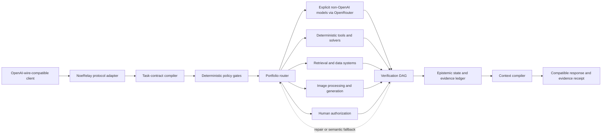

# NoeRelay

[](https://github.com/electrohire/noerelay/actions/workflows/conformance.yml)
[](https://github.com/electrohire/noerelay/actions/workflows/ci.yml)


**Evidence-governed AI orchestration that routes by capability, verifies by policy, and optimizes for the lowest acceptable total cost.**

NoeRelay is a virtual model with an OpenAI-compatible client wire protocol, backed by the **Epistemic Portfolio Runtime (EPR-1)**. Model inference is routed through OpenRouter to explicit non-OpenAI model IDs. Clients interact with one stable model endpoint while NoeRelay can delegate individual steps to different language models, deterministic tools, retrievers, image processors, image generators, formal solvers, or human reviewers.

The generative layer proposes. Deterministic policy, evidence, provenance, and verification layers decide what may execute and what may be released.

> **Provider boundary:** Protocol compatibility is not provider usage. NoeRelay does not use OpenAI-hosted models, rejects the `openai` family and `openai/` model namespace, and disables automatic model selection that could bypass the evaluated portfolio.

> **Project status:** `0.1.0-draft` Rust-authority migration. The repository now contains a compiling Rust core, durable PostgreSQL authority store, Rust OpenAI-wire/OpenRouter gateway, Python bindings, a Go A2A adapter, and the legacy Python conformance oracle. It is not yet a GA production inference-service claim; see the evidence-backed [implementation status](docs/implementation-status.md) and [verification matrix](docs/verification-matrix.md).

The remaining GA program is specified as a single agent-orchestrator input in [docs/ga-completion-orchestrator-plan.md](docs/ga-completion-orchestrator-plan.md).

> **Production implementation decision:** Rust owns the trusted control plane and release authority. Python remains a first-class binding, executable-specification, evaluation, and research-worker boundary; TypeScript serves the console/client layer; Go is limited to justified protocol/operations adapters such as A2A. SQL and operator scripts are used where their native environments provide concrete value. See [ADR-0001](docs/adr/0001-rust-release-authority.md) and the [polyglot boundary ADR](docs/adr/0002-justified-polyglot-boundaries.md).

## What “NoeRelay” means

**Noe** is derived from *noetic*: relating to knowledge, reasoning, and the conditions under which something can be known. **Relay** describes how the system delegates work to the most appropriate model or technology, carries evidence between stages, and invokes explicit fallbacks when a route cannot meet its acceptance contract.

Together, **NoeRelay** means an epistemically governed relay for AI work.

- **NoeRelay** is the application and stable virtual-model identity.
- **EPR-1** is the normative runtime architecture and interoperability contract.
- Governed API model ID: `axiovex-agni`; independent local Sentinel maintenance model: `axiovex-agni-recovery`.
- Release identifiers follow the [AXIOVEX model naming policy](docs/MODEL_NAMING.md).

## Why this exists

A single “best” model is rarely the best system. Models differ by cost, latency, modality, context capacity, tool reliability, data-handling policy, and performance on a specific task cohort. An inexpensive specialist may be sufficient for one step while another requires a stronger model, a deterministic program, an independent verifier, or a human decision.

NoeRelay turns that portfolio into one governed model surface:

1. Compile user intent into typed deliverables and acceptance criteria.
2. Apply hard permission, privacy, capability, risk, budget, and latency constraints.
3. Select the lowest-expected-cost admissible route.
4. Execute through the appropriate model, tool, or multimodal service.
5. Verify through a risk-scaled DAG of deterministic and independent checks.
6. Adjudicate claims against evidence and record every transition in a hash-linked ledger.
7. Release a result only when its acceptance contract is satisfied; otherwise repair, fall back, clarify, abstain, or escalate.

## Architecture



The product baseline is in [docs/requirements.md](docs/requirements.md), with executable release expectations in [docs/verification-matrix.md](docs/verification-matrix.md). The earlier EPR architecture remains a conformance source where it does not conflict with ADR-0001.

The Rust workspace separates `noerelay-core` (policy and authority), `noerelay-store` (PostgreSQL persistence), and `noerelay-gateway` (OpenAI-compatible/OpenRouter transport). `bindings/python` exposes the Rust authority without reimplementing it, while `services/a2a-adapter` is the deliberately narrow Go protocol boundary.

## Core properties

- **Step-level portfolio routing:** choose a model, tool, retriever, image service, verifier, formal solver, human review, clarification, or abstention for each step.
- **Constraint-first optimization:** cost is optimized only after policy, capability, availability, privacy, acceptance, independence, latency, and budget constraints pass.
- **Risk-scaled verification:** deterministic checks run before residual model judgment; high-risk workers cannot be their own sole verifier.
- **Typed epistemic state:** facts, requirements, decisions, assumptions, observations, predictions, preferences, and artifacts have distinct state vocabularies.
- **Four-valued facts:** a fact is `unknown`, `supported`, `refuted`, or `conflicted`; support and refutation are retained separately.
- **Replayable provenance:** accepted outcomes bind route, checks, cost, unresolved claims, artifact hashes, and the ledger head into an evidence receipt.
- **Epistemically safe compaction:** lossy summaries may be regenerated, but authoritative requirements, decisions, failures, evidence handles, and artifact hashes cannot be compacted away.
- **Multimodal separation:** image understanding, image processing, and image generation are modeled as separate capabilities rather than assumed to belong to one model.
- **Fail-closed behavior:** if no admissible route exists, NoeRelay requests clarification or escalation instead of silently lowering the acceptance bar.

## Guarantee boundary

NoeRelay does **not** claim that a language model—or a collection of agreeing models—can guarantee semantic truth. It specifies enforceable process guarantees:

1. Unsupported claims cannot be promoted to verified state.
2. Policy, privacy, permission, capability, and risk constraints are hard filters.
3. Cost is optimized only among routes that meet the acceptance lower bound.
4. High-risk work requires evidence independent of the worker where policy demands it.
5. Context compaction cannot delete authoritative state or its evidence handles.
6. Every accepted result has a replayable evidence receipt and hash-linked ledger position.

## API compatibility

The draft [OpenAPI 3.1 specification](spec/openapi.json) defines the stable compatibility contract:

| Endpoint | Purpose |
|---|---|
| `GET /v1/models` | Lists the stable Agni primary and isolated recovery models. |
| `POST /v1/chat/completions` | OpenAI-compatible chat completions with optional governance metadata. |
| `POST /v1/responses` | OpenAI Responses-compatible execution with optional governance metadata. |
| `GET /v1/noerelay/runs/{run_id}/receipt` | Retrieves the signed evidence receipt for an accepted run. |
| `GET /v1/noerelay/reports/costs` | Reports token and integer micro-USD usage by organization, project, and user. |
| `POST /v1/noerelay/governance/release-gate` | Evaluates requirement-to-test-to-observed-evidence traceability. |

Standard request fields pass through. An optional `governance` object can specify project identity, risk class, cost and latency ceilings, required acceptance probability, data policy, retention class, and evidence-receipt behavior.

OpenAI compatibility in this section describes request and response shapes only. The backend model gateway is OpenRouter, and deterministic policy blocks OpenAI model families, namespaces, and upstream endpoints. No `OPENAI_API_KEY` is used.

The legacy Python reference server exposes additional authenticated operational routes for administration, analytics, benchmarks, configuration, secrets, and ledger inspection. Those historical routes are documented in [docs/api-reference.md](docs/api-reference.md); they are not part of the current Rust gateway contract and may evolve during the draft phase.

Example request against a future conforming gateway:

```bash
curl "$NOERELAY_BASE_URL/v1/responses" \
  -H "Authorization: Bearer $NOERELAY_API_KEY" \
  -H "Content-Type: application/json" \
  -d '{
    "model": "axiovex-agni",
    "input": "Implement and verify the requested change.",
    "governance": {
      "project_id": "example-project",
      "risk_class": "high",
      "max_cost_usd": 2.00,
      "max_latency_ms": 120000,
      "required_acceptance_probability": 0.95,
      "data_policy": "no_training",
      "retention_class": "project",
      "return_evidence_receipt": true
    }
  }'
```

## Repository contents

```text
docs/
  requirements.md                 Authoritative product outcomes and invariants
  verification-matrix.md          Requirement-to-test and release evidence gates
  implementation-status.md        Implemented, partial, and externally blocked gates
  adr/0001-rust-release-authority.md
  architecture.md                 Normative architecture and invariants
  benchmarking.md                 Hugging Face acquisition and evaluation policy
  environment.md                  Local and GitHub test credentials
  quickstart.md                   Five-minute local and Compose setup
  production-deployment.md        Security and operations deployment checklist
  research-basis.md               Research and standards basis
examples/
  candidate-actions.json          Candidate portfolio actions
  context-capsule.json            Compaction-safe active context
  high-risk-coding-contract.json  Typed high-risk task contract
crates/
  noerelay-core/                  Rust release-authority domain kernel
  noerelay-gateway/               Rust OpenAI-compatible/OpenRouter service
bindings/python/                  PyO3 bindings to the same Rust authority functions
services/a2a-adapter/             Narrow Go A2A v1.0 protocol adapter
reference/
  demo.py                         Deterministic routing demonstration
  epr/                            Dependency-free Python reference kernel
spec/
  openapi.json                    OpenAI-compatible API contract
  routing-policy.json             Deterministic lexicographic route policy
  verification-state-machine.json Fail-closed execution lifecycle
  benchmark-manifest*.json        Evaluation and promotion contracts
  schemas/                        JSON Schema 2020-12 domain contracts
tests/
  test_spec.py                    Executable conformance tests
.github/workflows/
  conformance.yml                 Secret-free pull request and main-branch CI
  test-environment-smoke.yml      Main-guarded, manual credential smoke check
```

## Quick start

For the shortest end-to-end path, use the [five-minute quick start](docs/quickstart.md).

### Requirements

- Rust stable (1.85 minimum; CI uses current stable)
- Python 3.12 for building the PyO3 binding; Python 3.11+ for legacy conformance tests
- Go 1.26+ only when building the optional A2A adapter
- Docker for the supported local container path
- Optional: `jsonschema` for standards-level legacy schema validation tests

### Run the Rust authority tests

```powershell
cargo test --workspace --locked
cargo clippy --workspace --all-targets -- -D warnings
```

### Run the conformance tests

```powershell
python -m unittest discover -s tests -v
```

Install the optional schema validator to enable every test:

```powershell
python -m pip install jsonschema
python -m unittest discover -s tests -v
```

### Run the route-selection demo

```powershell
python reference/demo.py
```

The example demonstrates deterministic selection of the least-cost admissible worker plus an independent provider-family verifier. Cheaper candidates below the acceptance floor are retained in the audit as rejected rather than selected.

### Run the gateway locally

```powershell
$env:NOERELAY_API_KEY = "replace-with-at-least-32-characters"
$env:NOERELAY_OPENROUTER_MODE = "stub"
$env:NOERELAY_ORGANIZATION_ID = "local-org"
$env:NOERELAY_PROJECT_ID = "local-project"
$env:NOERELAY_CANDIDATES_JSON = '[{"candidate_id":"stub","openrouter_model_id":"anthropic/claude-test","provider":"anthropic","available":true,"capabilities":["text"],"maximum_data_class":"confidential","cost":{"inference_microusd":1,"tools_microusd":0,"verification_microusd":0,"expected_retry_microusd":0,"expected_fallback_microusd":0,"infrastructure_microusd":0,"expected_human_review_microusd":0},"latency_p95_ms":1,"acceptance_lcb_ppm":999999,"supports_independent_verification":true}]'
cargo run -p noerelay-gateway
```

Then run the portable smoke test from Git Bash, Linux, or macOS:

```bash
bash examples/curl-test.sh
```

The gateway authenticates every inference/model request with `NOERELAY_API_KEY`; only health/readiness are public. Stub mode is rejected when `NOERELAY_PRODUCTION_MODE=1`. See the [production deployment guide](docs/production-deployment.md) before exposing it.

### Run the optional A2A adapter

The adapter uses the official A2A Go SDK and delegates all policy, routing, and release authority to the Rust gateway. Configure a distinct `NOERELAY_A2A_BEARER_KEY`, retain the gateway service key in `NOERELAY_API_KEY`, then run:

```powershell
Push-Location services/a2a-adapter
go test ./...
go run .
Pop-Location
```

### Configure live inference and benchmarks

Offline conformance tests require no API keys. Live model tests use `OPENROUTER_API_KEY`; Hugging Face benchmark acquisition uses `HF_TOKEN` when authentication is needed. Do not commit either value and do not configure `OPENAI_API_KEY`. See [docs/environment.md](docs/environment.md) and [docs/benchmarking.md](docs/benchmarking.md).

## What the tests cover

- Parsing every JSON artifact in the repository.
- JSON Schema validation of task contracts, candidate actions, context capsules, and benchmark manifests.
- Four-valued epistemic adjudication.
- Lowest-cost admissible routing with independent verification.
- Rejection of cheaper candidates below the acceptance lower bound.
- Fail-closed escalation when no independent verifier is available.
- Clarification when high-risk acceptance criteria are missing.
- Detection of hash-ledger tampering.
- Preservation of authoritative state during context compaction.
- Rejection of OpenAI model families and `openai/` model IDs even if a task attempts to allow them.

## Routing and fallback semantics

NoeRelay distinguishes two fallback classes:

- **Provider fallback:** transport failure, timeout, rate limit, or provider outage.
- **Semantic fallback:** an executed route fails quality, evidence, or acceptance checks.

Candidate plans are ordered lexicographically only after hard filtering. Expected total cost includes model and tool calls, verification, retries, fallback probability, infrastructure, and expected human review—not merely input/output token price.

## Epistemic memory

The memory design has four levels:

- **L0 — Event log:** immutable actions, inputs, outputs, costs, and hashes.
- **L1 — Artifact graph:** canonical requirements, architecture, decisions, code, tests, evidence, and trace links.
- **L2 — Active state:** current constraints, risks, contradictions, failed checks, and acceptance gates.
- **L3 — Narrative cache:** disposable prose optimized for model consumption.

Only L3 may be lossy. Context is compiled by graph reachability from the active task rather than transcript recency alone, and compaction is itself a ledgered activity.

## Research basis

[docs/research-basis.md](docs/research-basis.md) records the current primary research, standards, and preprints supporting portfolio routing, calibration, verification, provenance, agent evaluation, and context management. Research results are evidence for design choices, not production guarantees; relevant claims must be reproduced against NoeRelay's own task and risk cohorts.

The implementation sequence, v1 completion definition, launch gates, and future deep-analysis/adaptation hooks are specified in [docs/product-completion-plan.md](docs/product-completion-plan.md).

To resume this work on another machine or with another coding agent, start with [docs/continuation-handoff.md](docs/continuation-handoff.md). It records the current branch/PR, locked decisions, environment-variable names, governance constraints, verification commands, and the next implementation sequence.

## Security and responsible disclosure

This ElectroHire repository is publicly visible. Do not place production credentials, customer data, proprietary model prompts, regulated evidence, or other non-public material in examples, commits, issues, or test fixtures. Report suspected vulnerabilities privately to the repository maintainers; see [SECURITY.md](SECURITY.md).

## Development and contribution

Changes to normative behavior require corresponding schemas, examples, tests, and research or standards rationale. See [CONTRIBUTING.md](CONTRIBUTING.md) for the expected workflow and release-note template, and [CHANGELOG.md](CHANGELOG.md) for user-visible changes.

## Roadmap

- Build the production OpenAI-wire-compatible gateway backed exclusively by explicit non-OpenAI models through OpenRouter.
- Add provider and capability registries for text, vision, image generation, tools, retrieval, and local execution.
- Implement durable W3C PROV-compatible storage and in-toto-aligned artifact attestations.
- Add an evaluation harness for cost, latency, acceptance probability, calibration, and cohort regressions.
- Implement governed context compilation over project requirements, architecture, decisions, tests, and evidence.
- Add canary policy/model promotion, observability, budgets, and human authorization workflows.
- Fine-tune or distill a minimal front-facing contract compiler while retaining deterministic release authority.

## Ownership and license

Copyright © 2026 ElectroHire. All rights reserved.

This repository is publicly visible and proprietary. Public access does not make it open source and grants no permission to copy, redistribute, sublicense, or use the software outside authorized ElectroHire work. See [LICENSE](LICENSE).
