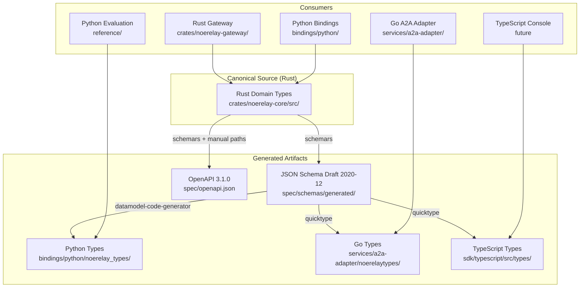
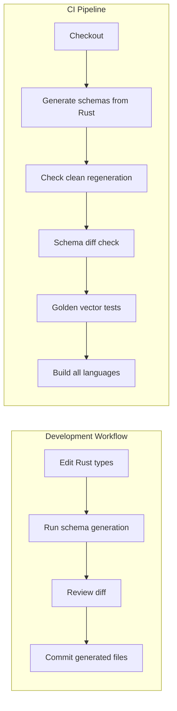
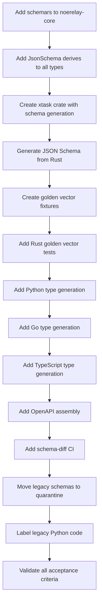

# FND-02 Schema Lineage and Generation Pipeline

**Document status:** Architecture design — awaiting code-mode implementation  
**Work package:** `FND-02` — Establish one versioned cross-language schema lineage  
**Baseline revision:** `5a24249a9098a6c468da45d27a449fab380863b5` on branch `main`  
**Profile ID:** `single-region-org-v1-local-test`  
**Created:** 2026-08-21T16:00:00Z  
**Authority:** This document defines the canonical schema lineage for NoeRelay. Rust domain types in `crates/noerelay-core/src/` are the single source of truth. All other language types and JSON Schema/OpenAPI artifacts are generated from them.

---

## 1. Current State Audit

### 1.1 Rust Domain Types (Canonical Authority)

The following types in `crates/noerelay-core/src/` are **canonical authority types**. They are the source of truth for all cross-language schema generation.

| Module | Type | Kind | Schema-Relevant | Notes |
|--------|------|------|-----------------|-------|
| `types.rs` | `RiskClass` | enum | Yes | `low`, `medium`, `high`, `critical` |
| `types.rs` | `DataClass` | enum | Yes | `public`, `internal`, `confidential`, `restricted` |
| `types.rs` | `IdentityScope` | struct | Yes | 5 identifier fields, validated |
| `types.rs` | `MessageRole` | enum | Yes | `system`, `developer`, `user`, `assistant`, `tool` |
| `types.rs` | `Message` | struct | Yes | role, content, optional name/tool_call_id |
| `types.rs` | `CanonicalRequest` | struct | Yes | Top-level request envelope |
| `contract.rs` | `TaskContract` | struct | Yes | Compiled contract with hash |
| `routing.rs` | `Candidate` | struct | Yes | Model candidate with cost/latency/capabilities |
| `routing.rs` | `Constraints` | struct | Yes | Routing constraints |
| `routing.rs` | `RejectionReason` | enum | Yes | 10 rejection variants |
| `routing.rs` | `CandidateRejection` | struct | Yes | Rejection record |
| `routing.rs` | `RouteDecision` | struct | Yes | Selected route + rejections |
| `runtime.rs` | `PreparedRun` | struct | Yes | Prepared run state |
| `runtime.rs` | `RunReceipt` | struct | Yes | Unsigned receipt |
| `runtime.rs` | `Completion` | struct | Yes | Run completion outcome |
| `runtime.rs` | `UsageMeasurement` | struct | Yes | Cost/token measurement |
| `runtime.rs` | `GovernanceSnapshot` | struct | Yes | Snapshot for persistence |
| `receipt.rs` | `SignedRunReceipt` | struct | Yes | Ed25519-signed receipt |
| `budget.rs` | `BudgetReservation` | struct | Yes | Reservation record |
| `budget.rs` | `BudgetAccount` | struct | Yes | Budget state (private `reservations` field) |
| `context.rs` | `NodeKind` | enum | Yes | 9 context node kinds |
| `context.rs` | `ContextNode` | struct | Yes | Context node with salience |
| `context.rs` | `ContextManifest` | struct | Yes | Compiled context manifest |
| `epistemic.rs` | `EpistemicState` | enum | Yes | `neither`, `supported`, `refuted`, `both` |
| `epistemic.rs` | `EvidencePolarity` | enum | Yes | `supports`, `refutes` |
| `epistemic.rs` | `ClaimKind` | enum | Yes | 8 claim kinds |
| `epistemic.rs` | `Claim` | struct | Yes | Epistemic claim with evidence lists |
| `ledger.rs` | `LedgerEventKind` | enum | Yes | 11 ledger event kinds |
| `ledger.rs` | `LedgerEvent` | struct | Yes | Hash-linked ledger event |
| `ledger.rs` | `Ledger` | struct | Yes | Event collection (private `events` field) |
| `verification.rs` | `CheckKind` | enum | Yes | 5 verification check kinds |
| `verification.rs` | `VerificationCheck` | struct | Yes | Check definition with dependencies |
| `verification.rs` | `CheckStatus` | enum | Yes | `passed`, `failed`, `not_run`, `claimed` |
| `verification.rs` | `CheckResult` | struct | Yes | Check result with evidence |
| `verification.rs` | `ReleaseOutcome` | enum | Yes | `accepted`, `repair_required`, `escalation_required`, `human_approval_required` |
| `usage.rs` | `CostBreakdown` | struct | Yes | 7 cost component fields |
| `usage.rs` | `UsageDimensions` | struct | Yes | 8 dimension fields |
| `usage.rs` | `UsageRecord` | struct | Yes | Usage record with dimensions |
| `usage.rs` | `UsageTotals` | struct | Yes | Aggregated totals |
| `usage.rs` | `UsageRollup` | struct | Yes | Rollup by org/project/user |
| `tools.rs` | `ToolRevision` | struct | Yes | Tool policy revision |
| `tools.rs` | `ToolProposal` | struct | Yes | Tool invocation proposal |
| `tools.rs` | `ToolContext` | struct | Yes | Tool authorization context |
| `tools.rs` | `ToolDecision` | enum | Yes | 10 tool decision variants |
| `traceability.rs` | `Requirement` | struct | Yes | Requirement with architecture refs |
| `traceability.rs` | `TestCase` | struct | Yes | Test case with requirement links |
| `traceability.rs` | `EvidenceStatus` | enum | Yes | `observed_pass`, `observed_fail`, `not_run`, `claimed` |
| `traceability.rs` | `Evidence` | struct | Yes | Evidence record |
| `recommendation.rs` | `ModelObservation` | struct | Yes | Observation for recommendation |
| `recommendation.rs` | `Recommendation` | struct | Yes | Recommendation result |

**Total canonical types:** 47 (30 structs, 17 enums)

**Non-schema types (internal logic, not serialized):**
- `ContractCompiler`, `Router`, `ContextCompiler`, `GovernanceRuntime`, `ReceiptSigner`, `ReceiptVerifier`, `VerificationDag`, `TraceGraph`, `Recommender`, `ToolAuthorization` — these are behavioral/logic types, not data types. They do not appear in schemas.
- Error types (`ContractError`, `RuntimeError`, `BudgetError`, etc.) — internal only, not serialized across boundaries.

### 1.2 Existing JSON Schema Files (`spec/schemas/`)

There are **10 hand-written JSON Schema files** in `spec/schemas/`. They use JSON Schema Draft 2020-12 and share a common `$id` prefix of `https://electrohire.example/epr/schemas/`.

| File | Title | Alignment with Rust | Status |
|------|-------|---------------------|--------|
| `common.schema.json` | Common definitions | **Partial** — defines `identifier`, `sha256`, `timestamp`, `money`, `actor`, `calibrated_probability` | **Legacy** — hand-written, not generated from Rust |
| `task-contract.schema.json` | EPR Task Contract | **Conflicting** — uses `task_id`, `goal`, `task_kind`, `governance` with `max_cost_usd` (float) vs Rust `TaskContract` with `request_id`, `outcome`, `max_cost_microusd` (integer) | **Conflicting handwritten authority** |
| `candidate-action.schema.json` | EPR Candidate Action | **Conflicting** — uses `action_kind`, `provider_family`, `roles`, `data_policies`, `acceptance` (calibrated_probability), `costs` with `_usd` float fields vs Rust `Candidate` with `openrouter_model_id`, `capabilities`, `maximum_data_class`, `acceptance_lcb_ppm`, `cost` with `_microusd` integer fields | **Conflicting handwritten authority** |
| `route-decision.schema.json` | EPR Route Decision | **Conflicting** — uses `decision_id`, `task_id`, `status`, `selected_plan`, `fallback_plans`, `candidate_audit` vs Rust `RouteDecision` with `selected_candidate_id`, `selected_openrouter_model_id`, `expected_total_cost_microusd`, `rejections` | **Conflicting handwritten authority** |
| `claim.schema.json` | EPR Typed Claim | **Conflicting** — uses `created_at`, `created_by`, `scope`, `confidence`, `artifact_hash`, `valid_from`, `valid_until`, `supersedes`, `premise_claim_ids` vs Rust `Claim` with `claim_id`, `kind`, `statement`, `state`, `supporting_evidence`, `refuting_evidence` | **Conflicting handwritten authority** |
| `context-capsule.schema.json` | EPR Context Capsule | **Conflicting** — uses `capsule_id`, `task_id`, `generated_at`, `source_ledger_head_hash`, `active_requirement_ids`, `approved_decision_ids`, `unresolved_claim_ids`, `failed_mandatory_check_ids`, `evidence_handles`, `artifact_hashes`, `narrative`, `invariants` vs Rust `ContextManifest` with `budget_tokens`, `used_tokens`, `included`, `omitted_node_ids`, `manifest_hash` | **Conflicting handwritten authority** |
| `evidence.schema.json` | EPR Evidence Record | **Conflicting** — uses `kind`, `produced_at`, `producer`, `activity_id`, `content_hash`, `location`, `strength`, `test_metadata`, `prov` vs Rust `Evidence` with `evidence_id`, `test_id`, `source_revision`, `artifact_hash`, `status` | **Conflicting handwritten authority** |
| `evidence-receipt.schema.json` | EPR Outcome Evidence Receipt | **Conflicting** — uses `receipt_id`, `run_id`, `task_id`, `status`, `issued_at`, `policy_version`, `route_decision_id`, `verification_results`, `unresolved_claim_ids`, `total_cost`, `trace_id`, `ledger_head_hash`, `signature` vs Rust `SignedRunReceipt` with `receipt`, `algorithm`, `signing_key_id`, `public_key_base64`, `signature_base64` | **Conflicting handwritten authority** |
| `ledger-event.schema.json` | EPR Hash-Linked Ledger Event | **Conflicting** — uses `event_id`, `run_id`, `sequence`, `timestamp`, `actor`, `event_type`, `subject_id`, `payload`, `previous_event_hash`, `event_hash` vs Rust `LedgerEvent` with `sequence`, `occurred_at_unix_ms`, `organization_id`, `project_id`, `run_id`, `kind`, `payload`, `previous_hash`, `event_hash` | **Conflicting handwritten authority** |
| `signed-run-receipt.schema.json` | NoeRelay signed run receipt | **Aligned** — matches Rust `SignedRunReceipt` and `RunReceipt` structure closely | **Aligned but hand-written** — should be generated |

**Summary:** 9 of 10 schema files are **conflicting handwritten authority types** that diverge from the Rust canonical types. Only `signed-run-receipt.schema.json` is aligned. All are hand-written, none are generated.

### 1.3 OpenAPI Specification (`spec/openapi.json`)

The OpenAPI 3.1.0 spec defines the HTTP API surface. It is **hand-written** and **partially aligned** with Rust types:

- `governance` schema: uses `max_cost_usd` (float) and `required_acceptance_probability` (float 0-1) — conflicts with Rust `max_cost_microusd` (integer) and `acceptance_lcb_ppm` (integer 0-1_000_000)
- `chatRequest`/`chatResponse`/`responseRequest`/`responseObject`: OpenAI-wire-compatible, intentionally permissive (`additionalProperties: true`) — these are **wire compatibility types**, not canonical domain types
- `eprMetadata`: uses `total_cost_usd` (float) — conflicts with Rust integer micro-USD
- `model`: simple model list, aligned with gateway behavior

**Status:** Hand-written, partially conflicting. The OpenAPI spec should be **generated** from Rust types for the governance/extension schemas, while the OpenAI-wire compatibility schemas remain hand-maintained (they are external interface contracts, not internal domain types).

### 1.4 Python Reference Types (`reference/gateway/`)

The `reference/gateway/contracts.py` module contains **hand-written Python validation logic** that duplicates the Rust `ContractCompiler` behavior. It validates against `spec/schemas/task-contract.schema.json` (the conflicting schema). This is **legacy reference code** per ADR-0002 and must not be treated as canonical.

### 1.5 Go A2A Adapter (`services/a2a-adapter/`)

The Go adapter uses `map[string]any` for JSON payloads and does not define its own domain types. It is an **untrusted caller** of the Rust gateway. No conflicting types here, but it would benefit from generated Go types for the NoeRelay API.

### 1.6 Python Bindings (`bindings/python/`)

The PyO3 bindings expose Rust functions directly. They use `serde_json` for serialization and do not define their own types. No conflicting types, but Python consumers would benefit from generated Python type stubs.

---

## 2. Canonical Schema Source Hierarchy



### 2.1 Hierarchy Rules

1. **Rust types are the single source of truth.** No other language may define conflicting authority types.
2. **JSON Schema is the intermediate representation.** All cross-language generation flows through JSON Schema.
3. **OpenAPI is derived from JSON Schema + hand-written path definitions.** The OpenAPI `components/schemas` section is generated; the `paths` section is hand-maintained (it describes HTTP semantics, not data types).
4. **Generated files are never hand-edited.** They carry a `// Code generated by ... DO NOT EDIT.` header.
5. **Legacy schemas are quarantined.** The existing `spec/schemas/*.schema.json` files are moved to `spec/schemas/legacy/` and marked as deprecated.

---

## 3. Generation Toolchain Selection

### 3.1 Rust → JSON Schema: `schemars`

**Selected:** `schemars` v0.8 (or latest compatible)

**Justification:**
- Native Rust derive macro integration (`#[derive(JsonSchema)]`)
- Supports `serde` attributes (`rename_all`, `deny_unknown_fields`, `skip_serializing_if`)
- Generates JSON Schema Draft 2020-12 compatible output
- Actively maintained, widely used in the Rust ecosystem
- Can be integrated into a Cargo build script or xtask

**Alternatives considered:**
- `typify` — generates Rust types from JSON Schema (wrong direction)
- `serde_json` manual schema writing — error-prone, no type safety
- `openapi` crate — less mature, fewer features

### 3.2 JSON Schema → Python: `datamodel-code-generator`

**Selected:** `datamodel-code-generator` (latest)

**Justification:**
- Generates Pydantic v2 models from JSON Schema
- Supports Python 3.11+ type hints
- Handles `$ref` resolution across schema files
- Can generate `TypedDict` or Pydantic models; Pydantic preferred for validation
- Active maintenance, good JSON Schema Draft 2020-12 support

**Alternatives considered:**
- `quicktype` — less control over Pydantic-specific features
- `pydantic` manual definition — violates single-source-of-truth

### 3.3 JSON Schema → Go: `quicktype`

**Selected:** `quicktype` (latest)

**Justification:**
- Generates idiomatic Go structs with `json` tags
- Handles JSON Schema `$ref` and definitions
- Can generate Go types from multiple schema files
- Supports custom type mappings (e.g., `uint64` for `integer` with `minimum: 0`)

**Alternatives considered:**
- `oapi-codegen` — OpenAPI-focused, less flexible for pure JSON Schema
- `go-jsonschema` — less mature, fewer features

### 3.4 JSON Schema → TypeScript: `quicktype`

**Selected:** `quicktype` (latest)

**Justification:**
- Generates TypeScript interfaces with proper optional fields
- Handles JSON Schema `$ref` and definitions
- Can generate both runtime-validated and pure-type outputs
- Same tool as Go generation reduces toolchain complexity

**Alternatives considered:**
- `json-schema-to-typescript` — good but less actively maintained
- `openapi-typescript` — OpenAPI-focused

### 3.5 OpenAPI Generation: `schemars` + manual paths

**Selected:** `schemars` for component schemas + hand-written `paths` section

**Justification:**
- The OpenAPI `paths` section describes HTTP semantics (methods, status codes, parameters) that are not derivable from Rust types alone
- The `components/schemas` section can be generated from Rust types via `schemars`
- A post-processing script merges generated schemas into the hand-written OpenAPI template

---

## 4. Build Integration Plan

### 4.1 Overview



### 4.2 Cargo xtask for Schema Generation

Create a new `xtask` crate at `xtask/` with a `schema` subcommand:

```bash
cargo xtask schema generate    # Generate all schemas and language types
cargo xtask schema check       # Verify generated files are up-to-date (CI)
cargo xtask schema diff        # Show schema diff against baseline
cargo xtask schema golden      # Run golden vector round-trip tests
```

**Why xtask:**
- Standard Rust pattern for build automation
- No external build script dependencies
- Can depend on `noerelay-core` directly for type access
- Easy to run locally and in CI

### 4.3 Generation Pipeline Steps

1. **Rust → JSON Schema** (`xtask/src/schema.rs`):
   - Use `schemars::schema_for!` on each canonical type
   - Write to `spec/schemas/generated/{module}/{type}.schema.json`
   - Generate a `spec/schemas/generated/index.json` manifest

2. **JSON Schema → Python** (`xtask/src/python.rs` or shell script):
   - Run `datamodel-code-generator` on `spec/schemas/generated/`
   - Output to `bindings/python/noerelay_types/`
   - Generate `__init__.py` with re-exports

3. **JSON Schema → Go** (`xtask/src/go.rs` or shell script):
   - Run `quicktype` on `spec/schemas/generated/`
   - Output to `services/a2a-adapter/noerelaytypes/`
   - Generate `doc.go` with package documentation

4. **JSON Schema → TypeScript** (`xtask/src/typescript.rs` or shell script):
   - Run `quicktype` on `spec/schemas/generated/`
   - Output to `sdk/typescript/src/types/`
   - Generate `index.ts` with re-exports

5. **OpenAPI Assembly** (`xtask/src/openapi.rs`):
   - Read `spec/openapi.template.json` (hand-written paths)
   - Inject generated schemas into `components/schemas`
   - Write `spec/openapi.json`

### 4.4 CI Integration

Add a new `schema` job to `.github/workflows/ci.yml`:

```yaml
schema:
  runs-on: ubuntu-latest
  steps:
  - uses: actions/checkout@v4
  - name: Install Rust stable
    run: rustup toolchain install stable --profile minimal
  - name: Install Python and Node
    uses: actions/setup-python@v5
    with:
      python-version: '3.12'
  - uses: actions/setup-node@v4
    with:
      node-version: '20'
  - name: Install generation tools
    run: |
      pip install datamodel-code-generator
      npm install -g quicktype
  - name: Generate schemas
    run: cargo xtask schema generate
  - name: Check clean regeneration
    run: |
      git diff --exit-code spec/schemas/generated/ || (echo "Generated schemas are stale"; exit 1)
      git diff --exit-code bindings/python/noerelay_types/ || (echo "Generated Python types are stale"; exit 1)
      git diff --exit-code services/a2a-adapter/noerelaytypes/ || (echo "Generated Go types are stale"; exit 1)
      git diff --exit-code sdk/typescript/src/types/ || (echo "Generated TypeScript types are stale"; exit 1)
      git diff --exit-code spec/openapi.json || (echo "Generated OpenAPI is stale"; exit 1)
  - name: Schema diff check
    run: cargo xtask schema diff --baseline origin/main
  - name: Golden vector tests
    run: cargo xtask schema golden
```

---

## 5. Golden Vector Fixture Design

### 5.1 Purpose

Golden vectors are canonical JSON payloads that round-trip through all languages identically. They prove that:
- Rust serialization matches JSON Schema validation
- Python/Go/TypeScript deserialization produces equivalent values
- No precision loss (e.g., `u64` integers stay integers, not floats)
- No field name mismatches

### 5.2 Fixture Location

`tests/golden-vectors/` with one JSON file per canonical type:

```
tests/golden-vectors/
├── canonical-request.json
├── task-contract.json
├── candidate.json
├── constraints.json
├── route-decision.json
├── run-receipt.json
├── signed-run-receipt.json
├── context-manifest.json
├── claim.json
├── ledger-event.json
├── verification-check.json
├── check-result.json
├── cost-breakdown.json
├── usage-record.json
├── tool-revision.json
├── tool-proposal.json
├── tool-context.json
├── requirement.json
├── test-case.json
├── evidence.json
├── model-observation.json
├── recommendation.json
└── manifest.json
```

### 5.3 Fixture Format

Each fixture file contains:
```json
{
  "$schema": "https://json-schema.org/draft/2020-12/schema",
  "description": "Golden vector for CanonicalRequest",
  "version": "1.0.0",
  "rust_type": "noerelay_core::types::CanonicalRequest",
  "json_schema_ref": "spec/schemas/generated/types/canonical-request.schema.json",
  "payload": { ... }
}
```

### 5.4 Round-Trip Test Matrix

| Language | Test | Command |
|----------|------|---------|
| Rust | Deserialize → Serialize → Compare | `cargo test -p noerelay-core --test golden_vectors` |
| Python | Deserialize → Serialize → Compare | `pytest tests/golden_vectors/test_python.py` |
| Go | Deserialize → Serialize → Compare | `go test ./services/a2a-adapter/noerelaytypes/...` |
| TypeScript | Deserialize → Serialize → Compare | `npm test --prefix sdk/typescript` |

### 5.5 Cross-Language Hash Verification

For each golden vector, compute a SHA-256 hash of the canonical JSON serialization (sorted keys, no whitespace). All languages must produce the same hash.

```rust
fn canonical_json_hash(value: &serde_json::Value) -> String {
    let canonical = serde_json::to_string(&value).unwrap();
    hex::encode(Sha256::digest(canonical.as_bytes()))
}
```

---

## 6. Schema-Diff CI Design

### 6.1 Breaking Change Detection

The schema-diff CI step compares the generated JSON Schema against the baseline (previous commit on `main`) and classifies changes:

| Change | Classification | Action |
|--------|---------------|--------|
| New optional field | Non-breaking | Allow |
| New enum variant | Non-breaking | Allow |
| New schema file | Non-breaking | Allow |
| Removed field | Breaking | Require version bump |
| Removed enum variant | Breaking | Require version bump |
| Changed field type | Breaking | Require version bump |
| Changed field name | Breaking | Require version bump |
| Added required field | Breaking | Require version bump |
| Changed `additionalProperties` from `true` to `false` | Breaking | Require version bump |
| Changed `pattern` constraint | Breaking | Require version bump |
| Changed `minimum`/`maximum` | Breaking | Require version bump |

### 6.2 Implementation

Use `json-schema-diff` (or a custom Rust implementation in `xtask`) to compare schemas:

```bash
cargo xtask schema diff --baseline origin/main --current HEAD
```

Output format:
```
BREAKING: task-contract.schema.json
  - Removed field: task_id
  - Changed type: max_cost_usd (number → integer)

NON-BREAKING: candidate.schema.json
  - Added optional field: new_field

VERSION BUMP REQUIRED: 1.0.0 → 2.0.0
```

### 6.3 Enforcement

- If breaking changes are detected without a version bump in `spec/schemas/version.json`, CI fails
- If generated files are stale (not regenerated after Rust type changes), CI fails
- If golden vector hashes mismatch across languages, CI fails

---

## 7. Versioning and Deprecation Policy

### 7.1 Schema Versioning

Each generated schema file carries a `version` field in its root:

```json
{
  "$schema": "https://json-schema.org/draft/2020-12/schema",
  "$id": "https://noerelay.dev/schemas/task-contract/v1/task-contract.schema.json",
  "version": "1.0.0",
  ...
}
```

**Version numbering:** Semantic versioning (`MAJOR.MINOR.PATCH`)

- **MAJOR:** Breaking changes (field removal, type change, required field addition)
- **MINOR:** Non-breaking additions (new optional fields, new enum variants)
- **PATCH:** Documentation changes, description updates

### 7.2 Version Manifest

A single `spec/schemas/version.json` tracks the current schema version:

```json
{
  "schema_version": "1.0.0",
  "rust_crate_version": "0.1.0",
  "generated_at": "2026-08-21T16:00:00Z",
  "baseline_revision": "5a24249a9098a6c468da45d27a449fab380863b5"
}
```

### 7.3 Deprecation Rules

1. **Deprecation notice:** A field or enum variant is marked with `"deprecated": true` and `"x-deprecation-notice": "Use X instead"` in the schema
2. **Deprecation period:** Deprecated fields remain for at least one MINOR version cycle
3. **Removal:** Deprecated fields are removed only in a MAJOR version bump
4. **Migration guide:** Each MAJOR version bump requires a `docs/migrations/schema-v{N}-to-v{N+1}.md` guide

### 7.4 Migration Compatibility Policy

| Change Type | Migration Required | Example |
|-------------|-------------------|---------|
| Add optional field | No | Add `new_field?: string` |
| Add enum variant | No | Add `new_variant` to enum |
| Remove optional field | Yes | Remove `old_field` — consumers must stop sending it |
| Remove enum variant | Yes | Remove `old_variant` — consumers must handle new set |
| Change field type | Yes | `string` → `integer` — consumers must convert |
| Rename field | Yes | `old_name` → `new_name` — consumers must update |
| Add required field | Yes | New required field — consumers must provide it |
| Change validation | Yes | Relax `pattern` — may accept previously invalid data |

---

## 8. Conflicting Handwritten Authority Types

### 8.1 Types to Remove or Label Legacy

The following files contain **conflicting handwritten authority types** that must be removed or clearly labeled as legacy:

| File | Conflict | Action |
|------|----------|--------|
| `spec/schemas/task-contract.schema.json` | Uses `task_id`, `goal`, `task_kind`, `governance` with float `max_cost_usd` vs Rust `TaskContract` with `request_id`, `outcome`, integer `max_cost_microusd` | **Move to `spec/schemas/legacy/`** |
| `spec/schemas/candidate-action.schema.json` | Uses `action_kind`, `provider_family`, `roles`, `data_policies`, float `acceptance` vs Rust `Candidate` with `openrouter_model_id`, `capabilities`, `maximum_data_class`, integer `acceptance_lcb_ppm` | **Move to `spec/schemas/legacy/`** |
| `spec/schemas/route-decision.schema.json` | Uses `decision_id`, `task_id`, `status`, `selected_plan`, `fallback_plans` vs Rust `RouteDecision` with `selected_candidate_id`, `rejections` | **Move to `spec/schemas/legacy/`** |
| `spec/schemas/claim.schema.json` | Uses `created_at`, `created_by`, `scope`, `confidence`, `artifact_hash`, `valid_from`, `valid_until`, `supersedes` vs Rust `Claim` with `claim_id`, `kind`, `statement`, `state`, `supporting_evidence`, `refuting_evidence` | **Move to `spec/schemas/legacy/`** |
| `spec/schemas/context-capsule.schema.json` | Uses `capsule_id`, `task_id`, `generated_at`, `source_ledger_head_hash`, `active_requirement_ids`, `approved_decision_ids`, `unresolved_claim_ids`, `failed_mandatory_check_ids`, `evidence_handles`, `artifact_hashes`, `narrative`, `invariants` vs Rust `ContextManifest` with `budget_tokens`, `used_tokens`, `included`, `omitted_node_ids`, `manifest_hash` | **Move to `spec/schemas/legacy/`** |
| `spec/schemas/evidence.schema.json` | Uses `kind`, `produced_at`, `producer`, `activity_id`, `content_hash`, `location`, `strength`, `test_metadata`, `prov` vs Rust `Evidence` with `evidence_id`, `test_id`, `source_revision`, `artifact_hash`, `status` | **Move to `spec/schemas/legacy/`** |
| `spec/schemas/evidence-receipt.schema.json` | Uses `receipt_id`, `run_id`, `task_id`, `status`, `issued_at`, `policy_version`, `route_decision_id`, `verification_results`, `unresolved_claim_ids`, `total_cost`, `trace_id`, `ledger_head_hash`, `signature` vs Rust `SignedRunReceipt` with `receipt`, `algorithm`, `signing_key_id`, `public_key_base64`, `signature_base64` | **Move to `spec/schemas/legacy/`** |
| `spec/schemas/ledger-event.schema.json` | Uses `event_id`, `run_id`, `sequence`, `timestamp`, `actor`, `event_type`, `subject_id`, `payload`, `previous_event_hash`, `event_hash` vs Rust `LedgerEvent` with `sequence`, `occurred_at_unix_ms`, `organization_id`, `project_id`, `run_id`, `kind`, `payload`, `previous_hash`, `event_hash` | **Move to `spec/schemas/legacy/`** |
| `spec/schemas/common.schema.json` | Defines `identifier`, `sha256`, `timestamp`, `money`, `actor`, `calibrated_probability` — some concepts exist in Rust but with different names/structures | **Move to `spec/schemas/legacy/`** |
| `reference/gateway/contracts.py` | Hand-written Python validation duplicating Rust `ContractCompiler` | **Label as legacy** — add deprecation header, do not use for new development |

### 8.2 Aligned but Hand-Written

| File | Status | Action |
|------|--------|--------|
| `spec/schemas/signed-run-receipt.schema.json` | Aligned with Rust `SignedRunReceipt` | **Replace with generated version** — keep as reference until generated version is validated |

### 8.3 Non-Conflicting (External Interface)

| File | Status | Action |
|------|--------|--------|
| `spec/openapi.json` | Hand-written, partially conflicting | **Split** — generate `components/schemas` from Rust, hand-maintain `paths` |
| `spec/routing-policy.json` | Configuration, not a type schema | **Keep as-is** — this is a policy configuration file, not a domain type |
| `spec/verification-state-machine.json` | State machine definition | **Keep as-is** — this is a behavioral specification, not a data type |
| `spec/benchmark-manifest.schema.json` | Benchmark configuration | **Keep as-is** — evaluation-specific, not core domain |

---

## 9. File-by-File Implementation Plan

### 9.1 New Files to Create

| File | Purpose | Owner |
|------|---------|-------|
| `xtask/Cargo.toml` | xtask crate manifest | `ROLE-RUST` |
| `xtask/src/main.rs` | xtask CLI entry point | `ROLE-RUST` |
| `xtask/src/schema.rs` | Schema generation logic | `ROLE-RUST` |
| `xtask/src/python.rs` | Python type generation | `ROLE-RUST` |
| `xtask/src/go.rs` | Go type generation | `ROLE-RUST` |
| `xtask/src/typescript.rs` | TypeScript type generation | `ROLE-RUST` |
| `xtask/src/openapi.rs` | OpenAPI assembly | `ROLE-RUST` |
| `xtask/src/diff.rs` | Schema diff logic | `ROLE-RUST` |
| `xtask/src/golden.rs` | Golden vector test runner | `ROLE-RUST` |
| `spec/schemas/version.json` | Schema version manifest | `ROLE-RUST` |
| `spec/openapi.template.json` | Hand-written OpenAPI paths template | `ROLE-ARCH` |
| `tests/golden-vectors/manifest.json` | Golden vector manifest | `ROLE-RUST` |
| `tests/golden-vectors/*.json` | Golden vector fixtures (22 files) | `ROLE-RUST` |
| `crates/noerelay-core/tests/golden_vectors.rs` | Rust golden vector tests | `ROLE-RUST` |
| `bindings/python/noerelay_types/__init__.py` | Generated Python types package | `ROLE-RUST` |
| `services/a2a-adapter/noerelaytypes/doc.go` | Generated Go types package | `ROLE-RUST` |
| `sdk/typescript/src/types/index.ts` | Generated TypeScript types | `ROLE-RUST` |
| `docs/migrations/schema-v1-to-v2.md` | Migration guide template | `ROLE-ARCH` |

### 9.2 Files to Modify

| File | Change | Owner |
|------|--------|-------|
| `Cargo.toml` | Add `xtask` to workspace members | `ROLE-RUST` |
| `crates/noerelay-core/Cargo.toml` | Add `schemars` dependency | `ROLE-RUST` |
| `crates/noerelay-core/src/types.rs` | Add `#[derive(JsonSchema)]` to all types | `ROLE-RUST` |
| `crates/noerelay-core/src/contract.rs` | Add `#[derive(JsonSchema)]` to `TaskContract` | `ROLE-RUST` |
| `crates/noerelay-core/src/routing.rs` | Add `#[derive(JsonSchema)]` to all types | `ROLE-RUST` |
| `crates/noerelay-core/src/runtime.rs` | Add `#[derive(JsonSchema)]` to all types | `ROLE-RUST` |
| `crates/noerelay-core/src/receipt.rs` | Add `#[derive(JsonSchema)]` to `SignedRunReceipt` | `ROLE-RUST` |
| `crates/noerelay-core/src/budget.rs` | Add `#[derive(JsonSchema)]` to `BudgetReservation`, `BudgetAccount` | `ROLE-RUST` |
| `crates/noerelay-core/src/context.rs` | Add `#[derive(JsonSchema)]` to all types | `ROLE-RUST` |
| `crates/noerelay-core/src/epistemic.rs` | Add `#[derive(JsonSchema)]` to all types | `ROLE-RUST` |
| `crates/noerelay-core/src/ledger.rs` | Add `#[derive(JsonSchema)]` to all types | `ROLE-RUST` |
| `crates/noerelay-core/src/verification.rs` | Add `#[derive(JsonSchema)]` to all types | `ROLE-RUST` |
| `crates/noerelay-core/src/usage.rs` | Add `#[derive(JsonSchema)]` to all types | `ROLE-RUST` |
| `crates/noerelay-core/src/tools.rs` | Add `#[derive(JsonSchema)]` to all types | `ROLE-RUST` |
| `crates/noerelay-core/src/traceability.rs` | Add `#[derive(JsonSchema)]` to all types | `ROLE-RUST` |
| `crates/noerelay-core/src/recommendation.rs` | Add `#[derive(JsonSchema)]` to all types | `ROLE-RUST` |
| `.github/workflows/ci.yml` | Add `schema` job | `ROLE-RUST` |
| `spec/openapi.json` | Replace with generated version | `ROLE-RUST` |

### 9.3 Files to Move (Legacy Quarantine)

| Source | Destination | Reason |
|--------|-------------|--------|
| `spec/schemas/task-contract.schema.json` | `spec/schemas/legacy/task-contract.schema.json` | Conflicting handwritten authority |
| `spec/schemas/candidate-action.schema.json` | `spec/schemas/legacy/candidate-action.schema.json` | Conflicting handwritten authority |
| `spec/schemas/route-decision.schema.json` | `spec/schemas/legacy/route-decision.schema.json` | Conflicting handwritten authority |
| `spec/schemas/claim.schema.json` | `spec/schemas/legacy/claim.schema.json` | Conflicting handwritten authority |
| `spec/schemas/context-capsule.schema.json` | `spec/schemas/legacy/context-capsule.schema.json` | Conflicting handwritten authority |
| `spec/schemas/evidence.schema.json` | `spec/schemas/legacy/evidence.schema.json` | Conflicting handwritten authority |
| `spec/schemas/evidence-receipt.schema.json` | `spec/schemas/legacy/evidence-receipt.schema.json` | Conflicting handwritten authority |
| `spec/schemas/ledger-event.schema.json` | `spec/schemas/legacy/ledger-event.schema.json` | Conflicting handwritten authority |
| `spec/schemas/common.schema.json` | `spec/schemas/legacy/common.schema.json` | Conflicting handwritten authority |
| `spec/schemas/signed-run-receipt.schema.json` | `spec/schemas/legacy/signed-run-receipt.schema.json` | Aligned but hand-written; replaced by generated |

### 9.4 Files to Label as Legacy

| File | Action |
|------|--------|
| `reference/gateway/contracts.py` | Add deprecation header: `# LEGACY: This module is a conformance oracle only. Use generated types from noerelay_types instead.` |

---

## 10. Acceptance Criteria Validation

| Acceptance Criterion | How Verified | Evidence |
|---------------------|-------------|----------|
| Cross-language golden vectors round-trip identically | `cargo xtask schema golden` runs Rust, Python, Go, TypeScript round-trip tests | Golden vector test output, artifact hashes |
| Conflicting handwritten authority types are removed or clearly labeled legacy | All 9 conflicting schemas moved to `spec/schemas/legacy/`; `reference/gateway/contracts.py` labeled | `git diff` showing moves, deprecation headers |
| Breaking changes require a version and migration | Schema-diff CI detects breaking changes and fails without version bump | CI output, `spec/schemas/version.json` |
| Evidence: schema-generation command | `cargo xtask schema generate` | Command output, generated file list |
| Evidence: clean regeneration diff | `git diff --exit-code` on generated files | CI output showing no diff |
| Evidence: contract fixtures | `tests/golden-vectors/*.json` | Fixture files with hashes |
| Evidence: artifact hashes | SHA-256 hashes of generated artifacts recorded in `spec/schemas/version.json` | Hash manifest |

---

## 11. Dependencies and Risks

### 11.1 Dependencies

| Dependency | Status | Notes |
|-----------|--------|-------|
| `schemars` crate | Not yet added | Must be added to `crates/noerelay-core/Cargo.toml` |
| `datamodel-code-generator` | Not yet installed | Python package, installed in CI |
| `quicktype` | Not yet installed | npm package, installed in CI |
| `xtask` crate | Not yet created | New workspace member |

### 11.2 Risks

| Risk | Severity | Mitigation |
|------|----------|------------|
| `schemars` does not support all `serde` attributes used | Medium | Audit attributes; use `#[schemars(skip)]` or custom `JsonSchema` impls where needed |
| `datamodel-code-generator` produces non-idiomatic Python | Low | Review generated code; use Pydantic v2 output mode |
| `quicktype` produces non-idiomatic Go/TypeScript | Low | Review generated code; use `--lang go` and `--lang typescript` with appropriate flags |
| Golden vector tests are flaky due to floating-point | Low | Use integer-only types in canonical schemas; avoid `f64` in domain types |
| Legacy schemas are still referenced by external consumers | Medium | Communicate deprecation in CHANGELOG; provide migration guide |

---

## 12. Implementation Sequence



---

*End of FND-02 Schema Lineage Architecture Document*
