# NoeRelay GA Completion Plan for a Multi-Agent Orchestrator

**Document status:** Execution directive  
**Target:** NoeRelay v1 general availability for the named organizational deployment profile  
**Repository root:** `C:\Users\trist\Development\ElectroHire\norelay`  
**Authority boundary:** Rust  
**Primary inference plane:** OpenRouter with explicit NoeRelay-selected model IDs  
**Method:** architecture -> requirement -> implementation -> test -> observed evidence -> independent approval -> release  
**Truth rule:** This plan is complete only when every mandatory gate has observed evidence. A plan item, code change, generated test, model statement, or passing unit suite is not by itself a GA claim.

---

## 0. Directive to the main agent orchestrator

You are the main NoeRelay completion orchestrator. Execute this document as a dependency-aware program. Create bounded implementation tasks for worker agents, reserve an independent verifier for every work package, and keep the Rust release authority as the only component permitted to accept a run or mutate authoritative policy. Do not collapse engineering evidence, organizational approval, and legal/compliance judgment into one status.

Your responsibilities are to:

1. Read the source-of-truth documents in the precedence order below.
2. Establish the exact baseline revision and named deployment profile before dispatching implementation.
3. Maintain the work-package and evidence ledgers defined here.
4. Dispatch only work whose dependencies and start gates are satisfied.
5. Prevent agents from editing overlapping files concurrently unless an explicit integration owner coordinates them.
6. Require an independent verification agent to inspect the diff, run the required tests, and record observed evidence.
7. Reject self-attestation, claimed test results, fabricated approvals, and evidence without a source revision and artifact hash.
8. Stop and request human authority for product, legal, privacy, risk, hosting, identity, retention, billing, or pilot decisions that cannot safely be inferred.
9. Keep the system fail-closed when a provider, tool, agent, verifier, price, policy, identity, or evidence source is unavailable or untrusted.
10. Declare GA only after `REL-04` produces a signed release record for the exact source revision and immutable artifact digests.

This document assumes four concurrent agent slots as a useful default: one orchestrator, two implementation workers, and one verifier/integration agent. With more slots, increase parallelism only across the collision-safe lanes in Section 5. Never increase parallelism by allowing two agents to own the same authority module or database migration sequence.

---

## 1. Source precedence and non-negotiable invariants

When documents conflict, use this order:

1. `docs/requirements.md` — frozen normative v1 requirements.
2. `docs/adr/0001-rust-release-authority.md` — trusted authority boundary.
3. `docs/adr/0002-justified-polyglot-boundaries.md` — language ownership rules.
4. `docs/verification-matrix.md` — mandatory verification and evidence gates.
5. This execution plan — decomposition, dependencies, and orchestration.
6. `docs/implementation-status.md` — current observed status, updated as evidence changes.
7. Other design and legacy-reference documents.

The following invariants may not be weakened by a worker agent:

- Rust owns authentication decisions, canonical request state, contracts, policy, routing, budgets, tool authorization, verification orchestration, epistemic state, ledger writes, release decisions, and the public gateway.
- Python is restricted to PyO3 bindings, evaluation, data analysis, model-specific research workers, and tooling that cannot accept runs or mutate authoritative policy.
- Go is restricted to justified protocol/operations adapters, initially A2A. A Go service is an untrusted caller of Rust authority.
- SQL owns relational invariants and migrations; JSON Schema/OpenAPI own language-neutral contract artifacts; TypeScript may own the browser console and generated SDK; PowerShell/POSIX shell may own operator automation.
- A new language requires an ADR proving concrete value, a bounded interface, generated/shared schemas, operational ownership, security review, and no duplicated authority logic.
- NoeRelay selects an explicit admissible OpenRouter model. Upstream automatic routing cannot replace NoeRelay policy.
- Cost optimization happens only after privacy, permission, capability, availability, verification, risk, latency, and budget constraints pass.
- Models and agents propose. Deterministic Rust policy authorizes. Independent evidence verifies.
- Every accepted result binds scope, input, contract, policy/registry revisions, context manifest, route, attempts, artifacts, checks, claims, measured/estimated costs, and ledger head into a signed receipt.
- Context compaction cannot discard protected requirements, decisions, contradictions, approvals, evidence handles, unresolved claims, or active tool state.
- Hidden reasoning and secrets are never required release artifacts. Store concise decisions, evidence, provenance, and rationale instead.
- No online learner may directly mutate an active policy, acceptance threshold, tool grant, or route constraint.
- Legal compliance is never inferred from software behavior. The system produces versioned evidence mappings and gaps for qualified reviewers.

Any proposed change to these invariants is a human-owned architecture decision and blocks dependent work until an ADR is approved.

---

## 2. Starting baseline and truthful target

### 2.1 Baseline already present

The repository currently contains an architecture-correct vertical slice:

- Rust core authority modules for identity types, contracts, routing, budgets, context manifests, tools, verification DAGs, epistemic states, recommendations, usage, hash-linked ledgering, runtime transitions, and Ed25519 receipts.
- Rust Axum gateway with authenticated `/v1/models`, text Chat/Responses paths, explicit OpenRouter forwarding, development stub mode, receipt retrieval, cost rollups, and a requirement/test/evidence release gate.
- PostgreSQL migrations and a Rust authority store with forced tenant RLS, versioned snapshots, append-only ledger rows, receipts, usage records, and model observations.
- PyO3 bindings that call Rust authority functions.
- Authenticated Go inbound A2A adapter using the official A2A Go SDK.
- Rust/Go container images, Compose topology, Kubernetes templates, CI, requirements, ADRs, schemas, and tests.

Treat this baseline as implemented only at the boundaries proven in `docs/implementation-status.md`. Do not assume legacy Python capabilities exist in the Rust production path.

### 2.2 Named v1 deployment profile

GA targets one explicitly named profile:

- Single-region, highly available Rust gateway and Rust worker deployment.
- PostgreSQL as the authoritative database, with tested backups and point-in-time recovery.
- S3-compatible immutable/content-addressed artifact storage.
- Transactional PostgreSQL outbox and durable queue/lease mechanism. Redis may accelerate delivery but is never authoritative.
- OpenRouter accessed through restricted HTTPS egress and explicit model/provider policy.
- External OIDC identity provider and/or NoeRelay-issued scoped API keys through one canonical identity port.
- External KMS/HSM/secret manager for signing and operational secrets.
- Identity-aware TLS ingress, network policies, resource limits, pod security, and least-privilege service identities.
- Optional Python evaluation workers and Go A2A adapter with separate identities and no authority privileges.
- TypeScript operator console served as a separate least-privilege client of the Rust administration API.

The orchestrator must replace placeholders with the approved region, infrastructure provider, identity provider, object store, queue choice, KMS, retention defaults, SLO, RPO/RTO, and pilot cohort in `DEC-01` before production validation.

### 2.3 GA outcome

GA means all `MUST` requirements in `docs/requirements.md` pass their linked tests and have observed evidence for the exact release revision. It does not mean universal regulatory certification, universal provider/tool support, zero future vulnerabilities, or fitness for every organization.

---

## 3. Multi-agent operating protocol

### 3.1 Agent roles

| Role ID | Agent role | Authority and responsibility |
|---|---|---|
| `ROLE-ORCH` | Main orchestrator | Owns program state, dispatch, dependency resolution, integration order, evidence index, and escalation. Cannot fabricate human approvals. |
| `ROLE-ARCH` | Rust architecture owner | Reviews authority-boundary changes, canonical schemas, state machines, transaction boundaries, and ADR compliance. |
| `ROLE-RUST` | Rust implementation worker | Implements core, gateway, store, worker, provider, policy, and verification packages within assigned files. |
| `ROLE-PROTO` | Protocol worker | Implements OpenAI-wire, OpenRouter, MCP, A2A, and generated-schema adapters without owning authority decisions. |
| `ROLE-DATA` | Data/migration worker | Owns ordered PostgreSQL migrations, RLS, object-storage metadata, reconciliation queries, and restore tooling. |
| `ROLE-PY-EVAL` | Python evaluation worker | Builds benchmark/evaluation/data pipelines through Rust bindings and signed manifests; cannot promote policy. |
| `ROLE-WEB` | TypeScript console worker | Builds generated client, onboarding/admin/run/evidence/cost/approval UX against Rust APIs. |
| `ROLE-SEC` | Security worker | Threat modeling, adversarial tests, IAM review, sandbox review, dependency/container/IaC scans, and finding tracking. |
| `ROLE-SRE` | Reliability worker | Telemetry, SLOs, load/soak/fault tests, deployment validation, backup/PITR/DR, alerts, and runbooks. |
| `ROLE-COMP` | Compliance/privacy evidence worker | Data inventory, versioned control mappings, retention/residency/deletion/legal-hold/export behavior, and reviewer-ready evidence. |
| `ROLE-VERIFY` | Independent verifier | Reviews diff and requirements, runs tests independently, verifies artifacts/hashes, records evidence, and rejects incomplete work. Must not be the implementing agent for high-risk work. |
| `ROLE-HUMAN` | Authorized human owner | Makes product, risk, legal/privacy, security acceptance, operations, evaluation, and final release decisions. |

One agent may perform multiple worker roles sequentially, but the same agent may not both implement and independently approve the same high-risk or release-critical package.

### 3.2 Work isolation and collision control

- Give every worker one work package, an explicit file/path allowlist, a branch or isolated worktree, and a baseline commit.
- Only `ROLE-DATA` owns the next migration number. Other workers submit schema needs to that agent.
- Only `ROLE-ARCH` or a designated integration agent changes shared canonical schemas, root workspace dependencies, root CI, or cross-language generated types.
- Do not let concurrent agents edit `Cargo.toml`, `Cargo.lock`, `spec/openapi.json`, shared migrations, or the same Rust module without a named integration owner.
- Preserve unrelated dirty changes. Before editing, record `git status --short` and a hash of any user-owned mutable state that tests may touch.
- Merge in dependency order. Rebase/retest a package after any dependency changes its public schema or state machine.
- Generated artifacts must be reproducible from checked-in sources. Never hand-edit generated files.

### 3.3 Work-package state machine

```text
proposed
  -> ready          dependencies and decisions satisfied
  -> assigned       worker, verifier, baseline, paths, and budget recorded
  -> implementing
  -> review_ready   deliverables and worker evidence submitted
  -> verifying      independent verifier reproduces evidence
  -> accepted       Rust/domain gate plus verifier evidence passes
  -> integrated     merged revision passes affected and global gates
  -> released       included in a signed release record

Any state may move to blocked, rejected, or superseded with a reason.
```

No package reaches `accepted` with uncommitted evidence, skipped required tests, unexplained warnings, unresolved security findings, or a worker's prose assertion in place of observed output.

### 3.4 Required task packet sent to every worker

```yaml
work_package_id: "RUN-02"
objective: "One measurable terminal outcome"
baseline_revision: "full commit SHA"
requirements: ["NR-EXEC-001", "NR-EXEC-002"]
verification_ids: ["T-EXEC-001"]
dependencies: ["RUN-01"]
allowed_paths: ["exact repository paths"]
forbidden_paths: ["authority or user-owned paths outside scope"]
architecture_invariants: ["relevant invariants from Section 1"]
deliverables: ["code, migration, schemas, docs, runbooks"]
mandatory_tests: ["exact reproducible commands"]
negative_tests: ["fail-closed and adversarial cases"]
evidence_required: ["logs, reports, hashes, screenshots only when needed"]
worker_budget: {time_or_turns: "bounded", external_spend_usd: 0}
stop_conditions: ["conditions requiring orchestration or human input"]
verifier_agent: "different agent identity"
```

### 3.5 Evidence envelope

Each automated or manual gate produces a machine-readable record stored under an immutable release-candidate evidence bundle:

```json
{
  "evidence_version": "1.0.0",
  "evidence_id": "uuid",
  "work_package_id": "RUN-02",
  "requirement_ids": ["NR-EXEC-001"],
  "test_ids": ["T-EXEC-001"],
  "status": "observed_pass",
  "source_revision": "full commit SHA",
  "artifact_digests": {"container": "sha256:..."},
  "environment_profile": "staging-single-region-v1",
  "command": "exact command or manual procedure identifier",
  "started_at": "RFC3339",
  "finished_at": "RFC3339",
  "runner_identity": "workload or human identity",
  "independent_verifier_identity": "different identity where required",
  "result_artifact_sha256": "sha256",
  "logs_artifact_sha256": "sha256",
  "exceptions": [],
  "notes": "concise, non-secret rationale"
}
```

Allowed evidence statuses are `claimed`, `observed_pass`, `observed_fail`, `inferred`, `contradicted`, `accepted`, and `rejected`. Only observed evidence may satisfy an automated release gate. Human gates additionally require a signed approval tied to exact source and artifact digests.

### 3.6 Global stop conditions

Stop affected work and escalate when:

- a request would move authority out of Rust or duplicate authority in Python, Go, TypeScript, SQL procedures, or a model prompt;
- a migration could destroy or irreversibly transform user data without an approved backup/rollback procedure;
- a live provider/security test needs credentials, paid spend, external messaging, production data, or an account authorization not already supplied;
- a worker discovers a cross-tenant disclosure, signature bypass, ledger corruption, duplicate side effect, secret exposure, or open critical/high vulnerability;
- a required product/legal/privacy/risk decision is absent;
- test evidence cannot be reproduced at the recorded revision;
- an API behavior conflicts with the frozen compatibility profile;
- a worker proposes lowering an acceptance threshold to make a test pass;
- release evidence is incomplete, stale, signed by the implementer where independence is required, or tied to mutable tags instead of immutable digests.

---

## 4. Human decisions and program initialization

### `DEC-01` — Freeze the supported profile

Before Wave 1, `ROLE-HUMAN` must approve and record:

1. Hosting platform, region, residency commitment, and availability zones.
2. OIDC provider and whether organization-issued API keys are also supported at GA.
3. Default and configurable retention for prompts, outputs, artifacts, telemetry, evidence, and audit events.
4. Deletion SLA, tombstone policy, legal-hold behavior, and backup-erasure limitations.
5. Approved OpenRouter model/provider portfolio by modality, data class, region, and risk cohort.
6. Initial read-only tools, side-effecting tools, MCP servers, and A2A trust roots.
7. Sandbox technology and allowed filesystem/network/resource profiles.
8. Verified streaming policy by risk class: buffered, provisional with revocation semantics, or post-verification replay.
9. Object store, queue/outbox implementation, KMS/HSM, secret manager, telemetry backend, and SIEM destination.
10. Billing/chargeback mode, currency/rounding policy, price-source precedence, and invoice reconciliation cadence.
11. Pilot cohort, representative private evaluation suites, spend ceiling, and support/on-call owners.
12. SLO, RPO/RTO, data-loss/error budgets, support promise, deprecation policy, and incident notification commitments.

If an answer is missing, use a local/test-only default and keep production work blocked. Do not silently convert a planning default into a customer commitment.

### `FND-01` — Capture baseline and requirement freeze

**Owner:** `ROLE-ORCH` + `ROLE-ARCH`  
**Dependencies:** none  
**Deliverables:** baseline commit, dirty-state inventory, requirements version, named profile ID, non-goals, approved decision record, and initial risk register.  
**Acceptance:** all requirement IDs are unique; each mandatory requirement maps to at least one verification ID and work package; no placeholder such as “TBD” appears in an active release gate.  
**Evidence:** `T-SPEC-001` traceability output and signed scope approval.

### `FND-02` — Establish one schema lineage and generation pipeline

**Owner:** `ROLE-ARCH`  
**Dependencies:** `FND-01`  
**Deliverables:** canonical Rust/domain schemas, OpenAPI/JSON Schema sources, migration compatibility policy, generated Python/Go/TypeScript types where appropriate, schema-diff CI, and deprecation/versioning rules.  
**Acceptance:** cross-language golden vectors round-trip identically; conflicting handwritten authority types are removed or clearly labeled legacy; breaking changes require a version and migration.  
**Evidence:** schema-generation command, clean regeneration diff, contract fixtures, artifact hashes.

### `FND-03` — Make evidence collection executable

**Owner:** `ROLE-ORCH` + `ROLE-RUST`  
**Dependencies:** `FND-01`, `FND-02`  
**Deliverables:** evidence-envelope schema, test-run recorder, revision/environment capture, artifact hashing, evidence-bundle validator, requirement coverage report, and release-gate CLI/API integration.  
**Acceptance:** a claimed result cannot pass; orphaned requirements/tests/evidence fail; tampered logs or artifacts invalidate the bundle; implementer identity cannot satisfy an independence-required gate.  
**Evidence:** `T-SPEC-001`, `T-LED-001`, and negative evidence fixtures.

---

## 5. Dependency graph, waves, and parallel lanes

### 5.1 Critical path

```mermaid
flowchart LR
    F["FND: scope, schemas, evidence"] --> I["IAM: canonical identity and tenancy"]
    F --> R["RUN: durable runs, outbox, leases"]
    I --> A["API: compatibility and idempotency"]
    R --> P["Provider registry and OpenRouter"]
    A --> P
    P --> X["Tools, MCP, A2A, multimodal"]
    R --> X
    X --> V["Verification, repair, approvals"]
    V --> M["Memory, context, ledger replay"]
    M --> E["Evaluation, learning, cost intelligence"]
    E --> H["Security, operations, compliance hardening"]
    H --> L["Load, fault, DR, external review"]
    L --> Pilot["Seven-day controlled pilot"]
    Pilot --> GA["Signed GA release"]
```



### 5.2 Execution waves

| Wave | Entry condition | Parallel lanes | Exit condition |
|---|---|---|---|
| `W0` Program control | Repository baseline available | Decisions, schema lineage, evidence automation | `FND-01..03` accepted |
| `W1` Authority foundation | `W0` complete | IAM/data lane; durable runtime lane; artifact/ledger lane | Canonical scoped run is durable, idempotent, auditable, and recoverable |
| `W2` Compatible model plane | `W1` core schemas stable | API/stream lane; registry/OpenRouter lane; cost-metering lane | Live capped text/tool-compatible requests pass compatibility, failure, and accounting gates |
| `W3` Governed interoperability | `W2` execution contract stable | Tool/sandbox/MCP lane; A2A lane; multimodal lane | One governed tool and one governed specialist agent complete with cancellation and receipt |
| `W4` Epistemic verification | `W3` artifacts/events stable | Verification/repair lane; project-memory/context lane; ledger/export lane | High-risk work releases only with independent observed evidence and lossless authoritative recovery |
| `W5` Intelligence and product | `W4` outcome semantics stable | Evaluation/recommendation lane; cost analytics lane; admin API/console lane | Pilot operators can onboard, inspect, approve, audit, and understand recommendations/costs |
| `W6` Production hardening | Feature freeze | Security lane; SRE/DR lane; compliance/privacy lane; supply-chain lane | All automated beta gates pass; no critical/high findings remain |
| `W7` Release validation | Production-like staging and immutable RC | Load/soak/chaos; external reviews; docs/support exercises | Signed beta release record and approved pilot plan |
| `W8` Pilot and GA | `W7` complete | Monitored pilot; regression fixes only; final evidence audit | Seven clean consecutive pilot days and `REL-04` signed |

### 5.3 Collision-safe lanes

The orchestrator may run these concurrently after their entry gates:

- IAM Rust/API work and durable-run SQL/state-machine work, provided canonical scope types are frozen.
- OpenAI-wire fixture development and OpenRouter registry/import work, provided the canonical request/response IR is frozen.
- Go A2A adapter work and Rust MCP/tool sandbox work, provided delegation/tool contracts are frozen.
- Python evaluation harness and TypeScript console work, provided administration/evidence APIs are versioned.
- SRE telemetry/load harness and compliance mapping work, provided event/data inventories are stable.
- Documentation/runbooks and automated implementation, provided docs are tested against current immutable artifacts before release.

Do not parallelize ordered database migrations, root dependency upgrades, canonical schema edits, ledger canonicalization changes, receipt format changes, or release-bundle signing.

---

## 6. Master work-package catalog

| ID | Outcome | Primary requirements | Dependencies | Primary owner |
|---|---|---|---|---|
| `FND-01` | Freeze profile, scope, baseline, and risks | `NR-REL-003` | — | `ROLE-ORCH` |
| `FND-02` | One versioned cross-language schema lineage | architectural invariants | `FND-01` | `ROLE-ARCH` |
| `FND-03` | Executable observed-evidence pipeline | `NR-SPEC-002`, `005`, `006` | `FND-01..02` | `ROLE-ORCH` |
| `GOV-01` | Immutable architecture/requirement/test/policy/work-order registry and impact graph | `NR-SPEC-001..006` | `FND-02..03`, `IAM-03` | `ROLE-RUST`, `ROLE-ARCH` |
| `IAM-01` | Canonical organizations/projects/environments/principals/roles/quotas/policies | `NR-API-004`, `NR-IAM-001` | `FND-02` | `ROLE-RUST`, `ROLE-DATA` |
| `IAM-02` | Production API-key lifecycle and rate limiting | `NR-IAM-002` | `IAM-01` | `ROLE-RUST`, `ROLE-SEC` |
| `IAM-03` | OIDC/service identity port and deny-default RBAC | `NR-IAM-003..004` | `IAM-01` | `ROLE-RUST`, `ROLE-SEC` |
| `IAM-04` | Tenant lifecycle, retention, deletion, legal hold, export | `NR-IAM-005`, `NR-COMP-002` | `IAM-01`, `ART-01` | `ROLE-DATA`, `ROLE-COMP` |
| `RUN-01` | Normalized durable run/step/attempt/work-item state machines | `NR-EXEC-001` | `FND-02`, `IAM-01` | `ROLE-RUST`, `ROLE-DATA` |
| `RUN-02` | Transactional outbox, leases, retries, circuit breakers | `NR-EXEC-001..002` | `RUN-01` | `ROLE-RUST` |
| `RUN-03` | Scoped idempotency, cancellation, resume, exactly-once effect protocol | `NR-API-005`, `NR-EXEC-001`, `004` | `RUN-01..02` | `ROLE-RUST` |
| `RUN-04` | Multi-replica conflict recovery and failover | `NR-EXEC-001`, `NR-OPS-001` | `RUN-01..03` | `ROLE-RUST`, `ROLE-SRE` |
| `ART-01` | S3-compatible content-addressed artifact plane | `NR-LED-002`, `NR-COMP-002` | `FND-02`, `IAM-01` | `ROLE-DATA` |
| `API-01` | Frozen compatibility profiles and official-client fixture matrix | `NR-API-001`, `003`, `006` | `FND-02`, `IAM-01` | `ROLE-PROTO` |
| `API-02` | Complete supported Chat Completions behavior | `NR-API-001..003` | `API-01`, `RUN-01` | `ROLE-RUST`, `ROLE-PROTO` |
| `API-03` | Complete supported Responses behavior | `NR-API-001..003` | `API-01`, `RUN-01` | `ROLE-RUST`, `ROLE-PROTO` |
| `API-04` | Governed incremental streaming, resume, backpressure, disconnect cancellation | `NR-API-002`, `NR-EXEC-001` | `API-02..03`, `RUN-03` | `ROLE-RUST` |
| `API-05` | Stable admin/run/evidence/cost interfaces and generated SDK | `NR-API-006`, `NR-LED-003` | `FND-02`, `IAM-03` | `ROLE-RUST`, `ROLE-WEB` |
| `REG-01` | Versioned model/provider/agent/tool registry and quarantine | `NR-ROUTE-001`, `NR-EXEC-003`, `007` | `FND-02`, `IAM-01` | `ROLE-RUST`, `ROLE-DATA` |
| `PROV-01` | Production OpenRouter adapter and explicit provider controls | `NR-ROUTE-005` | `REG-01`, `RUN-02`, `API-02..03` | `ROLE-RUST` |
| `PROV-02` | Bounded transport/capability/semantic/epistemic/specification fallbacks | `NR-ROUTE-008`, `NR-VER-003` | `PROV-01`, `VER-01` | `ROLE-RUST` |
| `MEDIA-01` | Vision and image-processing routes | `NR-ROUTE-001..005` | `REG-01`, `PROV-01`, `ART-01` | `ROLE-RUST`, `ROLE-PROTO` |
| `MEDIA-02` | Explicit image generation/editing routes | `NR-ROUTE-001..005` | `MEDIA-01`, `TOOL-01` | `ROLE-RUST`, `ROLE-PROTO` |
| `TOOL-01` | Versioned tool registry, schemas, grants, credentials, approvals, egress | `NR-EXEC-003..004` | `REG-01`, `IAM-03`, `RUN-03` | `ROLE-RUST`, `ROLE-SEC` |
| `TOOL-02` | Bounded code/tool sandbox and egress broker | `NR-EXEC-005` | `TOOL-01`, `ART-01` | `ROLE-RUST`, `ROLE-SEC` |
| `MCP-01` | Isolated MCP host, authorization, sessions, and reconciliation | `NR-EXEC-003..006` | `TOOL-01..02`, `RUN-03` | `ROLE-RUST`, `ROLE-PROTO` |
| `A2A-01` | Agent registry, outbound Rust dispatcher, trust roots, durable mapping | `NR-EXEC-007..008` | `REG-01`, `RUN-01..03`, `IAM-03` | `ROLE-RUST`, `ROLE-PROTO` |
| `A2A-02` | Depth/fan-out/cycle/replay/cancel/reconnect/budget/conformance gates | `NR-EXEC-007..008` | `A2A-01`, `VER-01` | `ROLE-PROTO`, `ROLE-SEC` |
| `VER-01` | Persistent risk-scaled verification DAG and verifier independence | `NR-VER-001..002` | `RUN-01`, `ART-01`, `REG-01` | `ROLE-RUST` |
| `VER-02` | Bounded repair/fallback/clarification/rejection/escalation state machines | `NR-VER-003` | `VER-01`, `PROV-02` | `ROLE-RUST` |
| `VER-03` | Human approval and signed external-attestation APIs | `NR-VER-002..003`, `NR-SPEC-006` | `VER-01`, `IAM-03`, `API-05` | `ROLE-RUST`, `ROLE-WEB` |
| `MEM-01` | Durable typed project/user/session epistemic graph | `NR-CTX-001`, `004`, `005` | `RUN-01`, `ART-01`, `IAM-04` | `ROLE-RUST`, `ROLE-DATA` |
| `CTX-01` | Retrieval, provenance summaries, protected-node compaction, tokenizer accounting | `NR-CTX-001..003`, `006` | `MEM-01`, `REG-01` | `ROLE-RUST`, `ROLE-PY-EVAL` |
| `LED-01` | Concurrent append/replay, artifact binding, signed exports, key rotation | `NR-LED-001..003` | `RUN-01`, `ART-01`, `IAM-03` | `ROLE-RUST`, `ROLE-DATA` |
| `COST-01` | Attempt-level measured/estimated/provider/billed cost ledger | `NR-COST-001`, `003` | `RUN-01..03`, `REG-01`, `PROV-01` | `ROLE-RUST`, `ROLE-DATA` |
| `COST-02` | Complete scoped rollups, invoices, tradeoffs, and route regret | `NR-COST-002`, `004`, `005` | `COST-01`, `EVAL-01` | `ROLE-RUST`, `ROLE-WEB` |
| `EVAL-01` | Versioned cohort/benchmark/harness registry and signed results | `NR-ROUTE-006..007`, `NR-COST-004..005` | `VER-01`, `MEM-01`, `COST-01` | `ROLE-PY-EVAL`, `ROLE-RUST` |
| `REC-01` | Advisory recommendations with uncertainty/freshness/coverage/reasons | `NR-ROUTE-006..007` | `EVAL-01`, `COST-02` | `ROLE-RUST`, `ROLE-PY-EVAL` |
| `REC-02` | Shadow/canary/promotion/drift/rollback controls | `NR-ROUTE-006..007`, `NR-OPS-002` | `REC-01`, `OPS-02` | `ROLE-RUST`, `ROLE-PY-EVAL` |
| `UI-01` | Operator console for onboarding, runs, evidence, cost, approvals, policy | `NR-API-006`, `NR-LED-003`, `NR-COST-002` | `API-05`, `VER-03`, `COST-02` | `ROLE-WEB` |
| `OPS-01` | Liveness/readiness/metrics/traces/logs/events and SLO dashboards | `NR-OPS-001` | `RUN-04`, `API-04` | `ROLE-SRE`, `ROLE-RUST` |
| `OPS-02` | Scoped kill switches and safe rollback | `NR-OPS-002` | `IAM-03`, `REG-01`, `RUN-02` | `ROLE-RUST`, `ROLE-SRE` |
| `OPS-03` | Backup, PITR, restore, artifact reconciliation, DR exercises | `NR-OPS-003` | `ART-01`, `LED-01`, `RUN-04` | `ROLE-SRE`, `ROLE-DATA` |
| `SEC-01` | Threat-model-driven application/API/tenant/sandbox hardening | `NR-SEC-001..002` | `IAM`, `RUN`, `TOOL`, `MCP`, `A2A` packages | `ROLE-SEC` |
| `SEC-02` | SBOM, licenses, dependency/container/IaC scans, provenance and signing | `NR-SEC-003` | Immutable build pipeline, `FND-03` | `ROLE-SEC`, `ROLE-SRE` |
| `COMP-01` | Versioned framework mappings, evidence/gaps/owners/review dates | `NR-COMP-001` | `FND-03`, `LED-01` | `ROLE-COMP` |
| `COMP-02` | Data inventory and tested retention/residency/deletion/hold/export | `NR-COMP-002`, `NR-IAM-005` | `IAM-04`, `ART-01`, `OPS-03` | `ROLE-COMP`, `ROLE-DATA` |
| `REL-01` | Quantitative load/soak/fault/chaos/SLO evidence | `NR-REL-001` | Feature freeze, `OPS-01..03`, `SEC-01` | `ROLE-SRE` |
| `REL-02` | Independent security/privacy/legal/product/evaluation/ops review | `NR-REL-002` | All beta gates | `ROLE-HUMAN` |
| `REL-03` | Seven-consecutive-day controlled pilot | `NR-REL-001..003` | `REL-01..02` | `ROLE-ORCH`, `ROLE-HUMAN` |
| `REL-04` | Immutable GA bundle, approvals, deployment and rollback | `NR-REL-001..003` | `REL-03` | `ROLE-ORCH`, `ROLE-HUMAN` |

---

## 7. Detailed execution requirements by workstream

### 7.0 Governance registry

#### `GOV-01` — Immutable V-model governance registry

Persist immutable revisions for architecture decisions/components, requirements/acceptance criteria, threats/controls, tests/harnesses, policies/risk classifications, work orders, implementation artifacts, required evidence, and release baselines. Maintain bidirectional links and a queryable impact graph. Runs pin exact revisions and never read a moving `latest` pointer. Use the lifecycle `draft -> proposed -> reviewed -> approved -> active -> superseded`, with a separate rejected state. Changing an active requirement creates a new revision and marks dependent unexecuted or incompatible evidence stale; it never edits the historical requirement that governed an earlier run.

Agents may implement architecture -> requirements -> code -> tests branches, but the implementing identity cannot activate its own high-risk acceptance revision or satisfy its own independent evidence gate. The Rust release gate remains the final automated authority.

Exit: `T-SPEC-001` proves immutable revision pinning, impact analysis, orphan/cycle rejection, stale-evidence invalidation, historical replay, and denial of unauthorized activation/supersession.

### 7.1 IAM, tenancy, and data lifecycle

#### `IAM-01` — Canonical tenancy and policy scope

Implement normalized organizations, projects, environments, principals, memberships, roles, permissions, quotas, policy bindings, and service identities in PostgreSQL and Rust. Scope must be derived from authenticated identity and server-side bindings, never trusted from arbitrary caller headers. Apply and force RLS to every tenant-bearing table, including caches, streams, outbox rows, artifacts, reports, and derived recommendation data.

Required tests:

- Full role x route x tenant x project allow/deny matrix.
- Direct-ID, list, pagination, search, timing, cache-key, stream-resume, export, webhook, and error-message enumeration attacks.
- RLS tests using distinct database roles and pooled-connection scope reset.
- Quota concurrency and policy precedence property tests.
- Audit attribution for every successful and denied administration action.

Exit: `T-IAM-001` and the cross-tenant end-to-end scenario produce zero disclosure/write/enumeration findings.

#### `IAM-02` — API keys

Implement one-time key issuance; versioned prefix plus high-entropy secret; Argon2id or approved keyed-hash storage; constant-time verification; organization/project/environment/role scopes; expiry; immediate revocation; atomic rotation; per-key rate and concurrency limits; last-used metadata; and immutable audit events. Never log or return the secret after creation.

Exit: `T-IAM-002` passes creation, hash-at-rest, rotation, revocation, expiry, concurrent use, brute-force throttling, and compromised-key exercise.

#### `IAM-03` — OIDC, service identities, and RBAC

Define a versioned Rust identity-provider port. Validate issuer, audience, signature, time claims, nonce where applicable, and explicit claim-to-scope mapping. Support workload identities separately from humans. Map every administrative route and mutation to an explicit permission; unmapped routes deny. Step-up approval must bind the approver identity, scope, action hash, expiry, and separation-of-duties rule.

Exit: OIDC/provider contract tests, token confusion/replay fixtures, complete route-permission coverage, and independent security review pass.

#### `IAM-04` / `COMP-02` — Lifecycle

Create a data inventory covering authoritative rows, prompts, outputs, artifacts, caches, traces, logs, backups, receipts, recommendation features, exports, and third-party provider copies. Implement versioned lifecycle policies, legal hold, deletion jobs, cryptographic deletion where appropriate, export, tombstones, and reconciliation. Document what cannot be deleted immediately from immutable audit proofs or backups and why.

Exit: seeded canary records are removed or retained exactly according to policy across every store and derived view; backup expiry and legal-hold behavior are independently verified.

### 7.2 Durable execution and artifacts

#### `RUN-01` — Persistent state machines

Replace whole-project snapshots as the only execution representation with normalized append-friendly entities: run, step, attempt, work item, dependency, reservation, approval, tool effect, provider call, verification check, artifact, and terminal outcome. Keep snapshot/replay projections if useful, but make invariants transactional and explicitly versioned. Define legal transitions in Rust and database constraints.

Exit: restart at every transition boundary reconstructs the same admissible next actions and never regenerates completed work from prose.

#### `RUN-02` — Outbox, leases, retries, and circuit breakers

Write authority state and an outbox event in one PostgreSQL transaction. Workers claim jobs with bounded leases, heartbeats, fencing tokens, attempt limits, and poison-message quarantine. Classify failures as transport, rate/quota, capability, semantic, epistemic, policy, specification, cancellation, or permanent. Retry policy must be operation-specific and budget-aware. Circuit breakers are scoped by provider/model/agent/tool and produce audit events.

Exit: kill workers before, during, and after provider/tool calls; duplicate and reorder deliveries; expire leases; fail the database; and prove convergence to one valid terminal state.

#### `RUN-03` — Idempotency, cancellation, and side effects

Bind external idempotency keys to principal scope, endpoint compatibility profile, normalized request hash, and policy revision. Store response/terminal references durably. Propagate cancellation through run DAGs, provider streams, tools, MCP, A2A, and reservations. Use an effect-intent/effect-result protocol with stable effect IDs, downstream idempotency where supported, reconciliation where not, and explicit `unknown_effect_state` escalation.

Exit: `T-API-003` and `T-EXEC-001` prove same-key replay, conflict on changed input, no duplicate visible effect, and budget release/reconciliation after cancellation.

#### `RUN-04` / `ART-01` — HA and artifact durability

Add optimistic-conflict reload/retry, leader-free work claiming where possible, graceful drain, database failover behavior, and multi-replica stream ownership. Store large inputs/outputs/media/test logs in a content-addressed object store with scope metadata, encryption, retention, integrity hashes, malware/content checks where applicable, and receipt binding. The database remains the authority for artifact identity and authorization.

Exit: multi-replica contention, object-store outage, corrupt object, database failover, and rolling-deployment suites pass without split-brain acceptance.

### 7.3 OpenAI-wire compatibility and governed streaming

Use the current official OpenAI Chat Completions and Responses references as compatibility inputs, but freeze a supported NoeRelay profile instead of claiming every current and future field. Generate positive and negative fixtures for each supported field and explicitly reject every unsupported field with stable OpenAI-shaped errors.

#### `API-01..03` — Profiles, Chat, and Responses

Support the frozen text, structured output, tools/function calls, multimodal input/output, usage, metadata, error, and cancellation behaviors chosen for v1. Normalize both public APIs into one internal Rust request IR and project terminal results back into the requested profile. Never pass an unknown field through with altered meaning. Run official SDKs in at least Python, TypeScript, and one additional client language against the compatibility suite.

Exit: `T-API-001` passes all golden and negative fixtures; the support matrix is generated from tests and published.

#### `API-04` — Streaming

Implement a durable stream event model with monotonic sequence IDs, bounded buffers, backpressure, heartbeats, resume cursors where promised, disconnect cancellation, and terminal receipt linkage. Define risk-class behavior:

- low risk may stream verified-safe increments if policy permits;
- medium/high/critical output is buffered or explicitly provisional until required checks pass;
- a terminal accepted event is impossible before durable verification and receipt commit;
- rejected output is not leaked through earlier chunks;
- provider SSE is parsed into canonical events and never treated as authority.

Exit: `T-API-002` passes event ordering, slow clients, disconnects, resumption, provider truncation, duplicate chunks, malformed frames, cancellation, and high-risk non-leakage.

### 7.4 Registry, OpenRouter, fallbacks, and multimodality

#### `REG-01`

Persist immutable model/provider/agent/tool revisions with provenance, fetched-at/valid-at times, explicit OpenRouter IDs, modalities, tool/structured-output support, context/output limits, price snapshots, data policies, regions, health, benchmark/harness versions, and allowed roles. Quarantine incomplete, stale, contradictory, or unevaluated entries. Activation points to a signed revision; it never edits history.

#### `PROV-01`

Implement live OpenRouter adapters with explicit selected model/provider policy, restricted base URL, DNS/IP/redirect protections, TLS validation, connection and overall timeouts, body/stream limits, rate-limit handling, sanitized errors, usage capture, and bounded metadata. Test Chat and, if retained, upstream Responses independently because the NoeRelay canonical IR must not depend on one provider's beta semantics.

Remote tests use protected non-production credentials, synthetic prompts, allowlisted models, deterministic request IDs, and an explicit spend ceiling. Never run paid tests implicitly.

#### `PROV-02`

Implement separate bounded paths for endpoint transport fallback, provider fallback, capability fallback, semantic repair/fallback, epistemic escalation, specification clarification, rejection, and human escalation. Each path has its own attempt count, cost reservation, latency budget, evidence requirements, and terminal codes. No fallback may weaken data policy, verifier independence, or acceptance criteria.

Exit: provider failure end-to-end scenario proves complete attempt costing and distinct failure events.

#### `MEDIA-01..02`

Treat vision understanding, deterministic image processing, image generation, and image editing as separate capabilities with separate artifacts, policies, provenance, costs, and safety/verification steps. Keep binary media outside JSON/database rows; bind content type, size, dimensions, transformation/generation parameters, provider/model revision, hashes, and retention policy.

Exit: supported modality fixtures pass size/type/decompression-bomb, unsupported-media, corrupt-artifact, provenance, cost, and release tests.

### 7.5 Tools, sandbox, MCP, and A2A

#### `TOOL-01`

Create immutable tool revisions with input/output JSON Schema, risk class, side-effect class, required permissions, credential grants, egress allowlist, resource profile, timeout, idempotency semantics, approval policy, and verifier requirements. A model-visible description grants no authority. Rust validates the proposal and mints a narrowly scoped, expiring execution grant.

#### `TOOL-02`

Select and threat-model a sandbox appropriate to the named platform. Enforce CPU, memory, process, wall-clock, filesystem, network, DNS, output, artifact, and secret limits. Mount only declared inputs; default-deny egress; broker credentials without placing them in prompts/environment dumps; isolate tenants and runs; collect deterministic execution evidence.

Exit: escape, SSRF, DNS rebinding, metadata-service, fork/process bomb, disk/memory exhaustion, output flood, symlink/path traversal, secret access, and cross-run contamination suites fail closed.

#### `MCP-01`

Implement one isolated stateful MCP client connection per server/principal scope, explicit capability negotiation, server allowlisting, audience-bound authorization, token non-forwarding, schema revision pinning, bounded resource reads, cancellation, session cleanup, and reconciliation. MCP capabilities are translated into tool proposals and still require Rust authorization.

Exit: `T-EXEC-002` passes token confusion, advertised-capability escalation, cross-session access, malicious schemas/content, reconnect, and cancellation fixtures.

#### `A2A-01..02`

Retain the narrow Go inbound adapter, but place outbound delegation selection, trust policy, data envelope, contract binding, budgets, lineage, and acceptance in Rust. Add an immutable agent registry with pinned/signed Agent Card metadata where available and configured trust roots where signing is absent. Persist local/remote task mapping before sending. Enforce depth, fan-out, total descendants, TTL, lineage cycle detection, per-branch budgets, data-class limits, cancellation, replay protection, and independent verification.

Run the official A2A conformance kit plus malicious-card, loop, flood, foreign-tenant, reconnect, lost-message, poisoned-artifact, and verifier-collusion suites. Do not treat A2A messages as durable authority.

Exit: `T-A2A-001` and the governed delegation end-to-end scenario pass.

### 7.6 Verification, epistemic memory, context, ledger, and approvals

#### `VER-01..03`

Persist verification DAG definitions, check revisions, inputs, outputs, evidence, verifier identity/family, independence constraints, attempts, and terminal state. Run deterministic checks before probabilistic review. Implement bounded repair cycles with unchanged acceptance criteria and explicit value/cost limits. Provide clarification, abstention, rejection, and human approval states. Human and external attestations are signed, scoped, expiring, replay-protected, and bound to the exact action/artifact hash.

Exit: `T-VER-001` proves every failure path remains non-accepted, high/critical independence, critical human approval, bounded repair, and replayable ordering.

#### `MEM-01` / `CTX-01`

Persist typed facts, requirements, decisions, assumptions, observations, predictions, preferences, artifacts, evidence edges, support/refutation edges, source handles, uncertainty, retention, and revisions. Preserve four-valued states: supported, refuted, both, neither. Extract candidate claims without accepting them; corroboration and contradiction remain evidence operations.

Compile context from durable graph state and the active contract. Use model-specific tokenizer accounting, retrieval driven by active requirements/unresolved claims, provenance-carrying summaries, protected nodes, deterministic priority, and an auditable inclusion/omission manifest. A summary never overwrites sources. Deletion and residency policies apply to graph nodes, embeddings, indexes, and caches.

Exit: `T-CTX-001` property/differential tests prove token bounds, protected-node recovery, contradiction preservation, provenance expansion, deletion behavior, and clarification/abstention under insufficient evidence.

#### `LED-01`

Extend the ledger for concurrent scoped append, canonicalization versioning, artifact hashes, key rotation, public-key history, offline verification, replay, signed exports, and redacted audit views. Store signing keys in the approved KMS/HSM. Make scope/filter completeness testable without storing chain-of-thought or secrets.

Exit: `T-LED-001` detects mutation, deletion, reorder, duplicate, splice, artifact tamper, receipt tamper, key substitution, and scope leakage, including after restore.

### 7.7 Cost, evaluation, recommendation learning, and product UX

#### `COST-01..02`

Record immutable attempt-level token/request/tool/verifier/artifact/infrastructure/human-review quantities. Preserve expected, estimated, provider-reported, and billed sources separately with currency, pricing revision, rounding rule, and reconciliation status. Reserve worst-case admissible cost before each attempt and reconcile atomically. Support rollups by organization, project, environment, user, API key, run, model, provider, agent, tool, cohort, and time.

Compute quality/cost/latency comparisons and route regret only against candidates admissible at that historical decision using the pinned registry/policy/features. Feedback types remain distinct: preference, deterministic outcome, environment outcome, verifier judgment, and human authorization.

Exit: `T-COST-001` passes concurrency, overflow, rounding, aggregation conservation, late billing, correction, refund, currency, retry/fallback, and invoice reconciliation fixtures.

#### `EVAL-01`

Build the evaluation plane primarily in Python where its ecosystem adds value, through immutable manifests and Rust-controlled promotion APIs. Version dataset/cohort, task, metric, harness, prompt/scaffold, model, provider, tool, verifier, environment, seed, and code revision. Store signed result artifacts and uncertainty/calibration metrics. Use hidden/mutation/adversarial suites to resist gaming. A model name without its tested harness is not a transferable result.

#### `REC-01..02`

In Rust, compute advisory recommendations from scoped versioned observations. Report cohort coverage, sample size/effective sample size, lower confidence bound, uncertainty, freshness, drift, cost, latency, and reasons for abstention. Keep hard constraints first. Implement shadow decisions, deterministic canary allocation, spending/risk envelopes, signed promotion, rollback, and automatic disable triggers for policy violations, unsafe accepts, tenant leaks, duplicate effects, calibration breaches, unexplained cost spikes, or evidence failures.

Exit: `T-ROUTE-002` proves cohort isolation, sparse/stale abstention, anti-feedback-gaming, advisory-only behavior, promotion independence, canary bounds, and rollback.

#### `API-05` / `UI-01`

Create versioned Rust administration APIs and a TypeScript console for tenant/project onboarding, key metadata and rotation, policies/quotas, registry status, runs/steps/attempts, evidence/receipts, costs, route reasons/regret, approvals, recommendations, audit exports, kill switches, deletion/export requests, and operational status. Generate the TypeScript client from OpenAPI. The console never owns authority and never receives secrets after creation.

Exit: role-scoped browser/API end-to-end tests, accessibility checks, secret-redaction tests, pagination/export tests, and pilot usability tasks pass.

### 7.8 Operations, security, supply chain, and compliance

#### `OPS-01`

Expose separate liveness and dependency-aware readiness; Prometheus-compatible metrics; OpenTelemetry traces; structured redacted logs; sanitized audit/security events; request/run/trace correlation; queue/lease/provider/tool/verifier/cost/ledger health; and SLO/error-budget dashboards. Prompt/output content is disabled by default and may be captured only through explicit redacted tenant policy.

#### `OPS-02`

Implement audited kill switches globally and by tenant, project, provider, model, agent, tool, policy, and capability. Switches stop new and cached work, propagate to workers, define handling of in-flight work, and roll back by activating a previous signed revision rather than editing history.

#### `OPS-03`

Automate encrypted backups, PITR, object-store versioning/replication as approved, restore into a clean environment, reconciliation, ledger/receipt verification, queue/outbox recovery, and key-availability procedures. Run scheduled drills and record measured RPO/RTO.

#### `SEC-01`

Maintain a data-flow and trust-boundary threat model covering public APIs, OpenRouter, PostgreSQL, object store, queue, OIDC, KMS, tools/sandbox, MCP, A2A, Python workers, console, CI/CD, telemetry, and operators. Run adversarial auth/authz, parser, injection, SSRF, egress, tenant crossover, quota, ledger, artifact, sandbox, agent, stream, and secret-redaction suites. Track every finding with severity, owner, remediation, retest, and acceptance. GA permits no open critical/high finding.

#### `SEC-02`

Pin dependencies and base images; scan source, secrets, dependencies, licenses, containers, and IaC; generate SPDX/CycloneDX SBOMs; build reproducibly where practical; produce SLSA/in-toto provenance; sign images, binaries, wheels, manifests, and release bundles; verify signatures at deployment; publish multi-architecture artifacts; and separate untrusted pull-request workflows from protected credentials.

#### `COMP-01..02`

Create versioned, profile-specific control mappings that list framework/control version, applicability, implementation, observed evidence, gaps, owner, reviewer, and next review date. Include SOC 2/ISO 27001/privacy mappings only when selected by authorized reviewers. Never print “certified” or “compliant” solely from a passing automated check. Complete privacy/legal review, vendor/subprocessor inventory, data processing terms, retention/residency/deletion decisions, incident commitments, and customer-responsibility disclosures.

Exit: `T-OPS-001`, `T-SEC-001`, and `T-COMP-001` pass; independent reviewers sign the named profile.

---

## 8. Mandatory integration and end-to-end evidence

The following scenarios are release-blocking and must execute against immutable release-candidate artifacts in production-like staging:

1. **Cheapest admissible coding route:** standard client request -> scoped contract -> protected context -> explicit route -> OpenRouter -> verification -> simple response -> usage/cost -> signed receipt, all inspectable without client-specific code.
2. **Architecture to tests:** vague build request -> architecture/requirements -> linked tests -> bounded worker/agent implementation -> observed independent verification -> Rust release gate. Generated prose claiming success must fail.
3. **Ambiguous high-risk request:** clarification/approval occurs before provider/tool execution; missing acceptance criteria cannot be invented.
4. **Tool side effect:** model proposal -> deterministic grant/scope/budget/approval -> retry/cancel -> exactly one externally visible effect -> reconciliation and ledger evidence.
5. **Context pressure:** long-lived project compacts below a fixed model token limit while requirements, decisions, contradictions, evidence handles, approvals, and active tool state remain verbatim or retrievable.
6. **Provider failure:** transport/provider fallback follows an allowlisted path; semantic repair/fallback remains separate; every attempt and reservation is costed.
7. **Recommendation learning:** versioned outcomes update a cohort recommendation with uncertainty; active policy remains unchanged until independent signed promotion; drift triggers rollback.
8. **Cross-tenant attack:** direct IDs, caches, pagination, stream resume, exports, timing, webhooks, artifacts, recommendation features, and A2A/MCP sessions remain non-enumerating and isolated.
9. **Ledger/artifact tamper:** offline event and object mutations identify the first invalid boundary; key substitution and cross-run splice fail.
10. **Disaster recovery:** restore database/artifacts/config/key references into a clean environment; resume/reconcile work; verify all sampled receipts inside declared RPO/RTO.
11. **A2A + MCP interruption:** approved specialist uses approved MCP tool, stream disconnects, durable mapping resumes, cancellation/reconciliation works, and acceptance still requires independent evidence.
12. **Production fail-closed:** remove OIDC metadata, KMS access, database, queue, object store, registry revision, policy signature, or egress policy one at a time; readiness drops and unsafe work never starts.

Every scenario needs a unique test/run ID, source revision, immutable environment manifest, bounded external spend, artifacts/log hashes, verifier identity, and cleanup/reconciliation evidence.

---

## 9. Quantitative release objectives and stage gates

### 9.1 Initial objectives

- Monthly availability: at least 99.9% for the named service boundary, with upstream exclusions explicitly defined.
- Gateway admission: p99 at most 10 ms for a 1,000-candidate in-memory registry snapshot.
- Gateway non-stream setup overhead: p95 at most 25 ms and p99 at most 75 ms at 100 concurrent requests, excluding provider time; if the approved profile uses the broader 250 ms control-path objective, reconcile the two documents and record one frozen metric before testing.
- Receipt availability: p99 at most 2 seconds after terminal state.
- Durable recovery after worker termination: 100% across the fault suite.
- Duplicate externally visible side effects under retry: zero observed.
- RPO at most 5 minutes and RTO at most 60 minutes for the named single-region profile.
- Cross-scope disclosures or writes: zero known.
- Ledger and stored-artifact verification: 100% for accepted-run release sampling.
- Provider token reconciliation: exact integer equality; billed currency reconciliation within the provider's declared rounding unit.
- Security: zero open critical/high findings; every medium finding has a named owner and explicit release disposition.
- Evaluation: zero observed unsafe accepts in critical launch suites, with confidence bounds and explicit limits on interpretation.
- Pilot: seven consecutive days with no unresolved launch blocker and within the approved spend/error budget.

Targets are not evidence. `REL-01` must publish measured methodology, environment, raw results, summaries, regressions, and artifact hashes.

### 9.2 Gate ladder

| Gate | Required state | Release authority |
|---|---|---|
| `G0 Architecture` | `FND-01..03`; invariants and profile approved | Architecture + product human owners |
| `G1 Walking system` | IAM, durable run, idempotency, artifact, ledger foundations pass | Rust authority tests + verifier |
| `G2 Live core` | Frozen API profile, live capped OpenRouter, streaming, usage/cost, fallback pass | Engineering + evaluation verifier |
| `G3 Interoperability` | Tool sandbox, MCP, outbound/inbound A2A, media paths pass adversarial and conformance tests | Security + protocol verifier |
| `G4 Governed intelligence` | Verification/repair/approval, memory/context, replay, evaluation/recommendation pass | Evaluation + architecture owners |
| `G5 Beta` | Console/admin, telemetry, kill switches, DR, security, supply chain, compliance mappings pass | Product, security, operations |
| `G6 Release candidate` | Load/soak/fault objectives and external reviews pass; immutable artifacts signed | Cross-functional human approvals |
| `G7 Pilot` | Seven consecutive approved days; blockers closed and regression suite rerun | Pilot owner + operations + product |
| `G8 GA` | Complete evidence bundle and exact artifact/source approvals | `REL-04` signed release record |

No later gate compensates for an earlier failure.

---

## 10. Required test commands and evidence classes

The orchestrator must refine these into environment-specific scripts without weakening coverage:

```text
Rust quality:        cargo fmt --all -- --check
Rust lint:           cargo clippy --workspace --all-targets -- -D warnings
Rust tests:          cargo test --workspace --locked
Rust security:       cargo audit
Python conformance:  python -m pytest tests/ -v --tb=short
Traceability:        python -m unittest discover -s tests -p test_product_requirements.py -v
Python wheel:         maturin build --manifest-path bindings/python/Cargo.toml --locked --release
Go quality:          gofmt check, go test ./..., go vet ./...
Go security:         govulncheck ./...
Schemas:             OpenAPI/JSON Schema validation plus clean regeneration diff
Containers:          build, non-root/read-only smoke, CVE/license scan, SBOM, signature verification
Compose/Kubernetes:  render/validate plus staging admission and runtime tests
PostgreSQL:          migration up/compatibility, RLS, concurrency, backup/PITR/restore
Protocols:           official-client fixtures, A2A conformance, MCP auth/session fixtures
Release:             load, soak, chaos, DR, security, evaluation, pilot, evidence-bundle validator
```

Network-dependent suites run only in protected environments with explicit credentials and spend ceilings. Unit and mock tests cannot be substituted for live provider, cluster, backup, or external-review evidence.

---

## 11. Agent dispatch templates

### 11.1 Implementation-agent prompt

```text
Implement work package <ID> from docs/ga-completion-orchestrator-plan.md.
Read the source documents in their stated precedence order. Stay within the assigned
paths and Rust/polyglot authority boundaries. Preserve unrelated changes. Begin by
recording the baseline revision and current tests. Implement the smallest coherent
production slice, including migrations, negative tests, docs, and observability.
Run every mandatory command. Return the diff summary, exact commands/results,
remaining risks, migration/rollback notes, and evidence artifact paths/hashes.
Do not mark the package accepted and do not satisfy tests by lowering requirements.
Stop on any global stop condition.
```

### 11.2 Independent-verifier prompt

```text
Independently verify work package <ID> at revision <SHA>. Do not rely on the worker's
summary. Read the requirement, acceptance outcome, diff, threat boundaries, and test
plan. Reproduce mandatory tests, add adversarial or missing tests when needed, inspect
for cross-scope/auth/budget/ledger/release bypass, and verify generated artifacts and
migrations. Record observed evidence with exact revision, environment, commands,
results, and hashes. Reject on skipped evidence, unexplained warnings, untested failure
paths, scope creep, or authority duplication. You may recommend acceptance but may not
fabricate human approval.
```

### 11.3 Integration-agent prompt

```text
Integrate accepted packages <IDs> in dependency order. Resolve only integration
conflicts; route semantic redesign back to the owning package. Regenerate shared
schemas and locks through their canonical tools. Run all directly affected suites,
the global authority/traceability/security gates, migration compatibility, and image
builds. Produce a new immutable candidate revision and evidence index. Do not reuse
evidence from a different source or artifact digest.
```

### 11.4 Release-auditor prompt

```text
Audit release candidate <SHA/digests> against every MUST requirement and verification
row. Enumerate missing, stale, claimed-only, contradicted, or non-independent evidence.
Verify the named deployment profile, non-goals, external responsibilities, vulnerability
dispositions, approvals, rollback package, and pilot window. Output go/no-go with exact
blocking IDs. A no-go is successful audit behavior, not permission to waive gates.
```

---

## 12. Orchestrator control loop

Repeat until `REL-04` is accepted:

1. Load current baseline, work-package states, decisions, risks, and evidence index.
2. Verify the worktree and external environment have not changed unexpectedly.
3. Select ready packages whose dependencies are `integrated` and whose paths do not collide.
4. Assign worker and independent verifier identities, budgets, paths, and stop conditions.
5. Monitor for user input, security findings, test failures, dependency drift, and decision blockers.
6. Receive worker output; reject incomplete packets before verification.
7. Have the verifier reproduce tests and write observed evidence.
8. Integrate accepted packages in dependency order; rerun global affected gates.
9. Update requirement coverage, implementation status, risk register, decision log, and evidence hashes.
10. Run the release auditor at every gate boundary.
11. If no package is ready, report the exact blocking decision/evidence/authority rather than performing unrelated work.
12. At `W8`, freeze features; allow only blocker fixes; reset the seven-day pilot clock for any launch-blocking regression.

Suggested machine-readable program state:

```yaml
program_version: "1.0.0"
baseline_revision: "sha"
profile_id: "single-region-org-v1"
active_wave: "W1"
packages:
  RUN-01:
    state: "verifying"
    worker: "agent-id"
    verifier: "different-agent-id"
    baseline: "sha"
    candidate: "sha"
    evidence_ids: []
    blockers: []
decisions: []
risks: []
release_candidate: null
```

---

## 13. Final GA evidence bundle

`REL-04` must assemble and validate one immutable bundle containing:

- frozen requirements, ADRs, profile, compatibility matrix, decisions, non-goals, and external/customer responsibilities;
- source revision, dependency locks, generated schemas, migration manifest, build recipe, binary/wheel/container digests, SBOMs, provenance, and signatures;
- requirement -> test -> observed evidence -> approval graph with no mandatory orphan;
- unit/property/contract/integration/security/reliability/evaluation/end-to-end reports and raw artifact hashes;
- OpenRouter/provider/model/price/policy/registry revisions and capped live-test evidence;
- tenant-isolation, sandbox, MCP, A2A, streaming, idempotency, ledger, receipt, cost, context, and recommendation evidence;
- vulnerability/license/IaC/container findings with closure or approved medium-risk disposition;
- threat-model, penetration-test, privacy/legal, product, evaluation, security, and operations approvals;
- SLO/load/soak/fault/chaos results, dashboards, alerts, runbooks, incident exercise, backup/PITR/restore evidence, and measured RPO/RTO;
- pilot cohort definition, spend/error budgets, seven-day record, incidents/regressions, support findings, and final acceptance;
- deployment, migration, rollback, key-rotation, kill-switch, recovery, deletion/export, and deprecation procedures;
- signed final release record binding every approval to the exact source and artifact digests.

The bundle validator must fail on missing files, mutable image tags without digests, invalid signatures, stale evidence, wrong revisions, missing independence, unresolved critical/high findings, incomplete mandatory coverage, or an unnamed deployment profile.

---

## 14. Target repository topology

The architecture owner may adjust names through ADR review, but the orchestrator should converge toward bounded modules instead of continuing to grow one gateway file:

```text
crates/
  noerelay-core/                 # pure authority domain and invariants
  noerelay-wire/                 # canonical public HTTP/SSE types and validation
  noerelay-execution/            # run/step/attempt/work/lease/outbox state machines
  noerelay-store/                # PostgreSQL repositories and migrations
  noerelay-provider-openrouter/  # provider adapter, SSE parser, usage/failure taxonomy
  noerelay-artifacts/            # content-addressed object storage and policy
  noerelay-tool-runtime/         # grants, effects, sandbox dispatch
  noerelay-mcp/                  # isolated MCP client/session boundary
  noerelay-gateway/              # thin Axum composition and public/admin routes
bindings/
  python/                        # generated/bound Rust access only
services/
  a2a-adapter/                   # Go A2A protocol transport only
web/
  console/                       # TypeScript generated client and operator UI
tests/
  compat/python-openai/          # official Python SDK black-box fixtures
  compat/node-openai/            # official Node SDK/browser stream fixtures
  conformance/                   # A2A, MCP, schemas, golden vectors
  fault/                         # worker/provider/stream/database/object-store faults
  security/                      # tenant, auth, SSRF, sandbox, secrets, ledger
  evaluation/                    # Python manifests/runners and immutable results
  load/                          # k6 or equivalent test-only scripts
xtask/                           # Rust-owned trace/evidence/fault/release runner
spec/                            # canonical generated OpenAPI/JSON Schema artifacts
deploy/                          # digest-pinned supported-profile deployment overlays
```

Adding a crate or language is not itself success. Each boundary needs an interface contract, failure model, tests, telemetry, ownership, and deletion/backup behavior. Shared types are generated or imported from the canonical lineage.

---

## 15. Authority-storage migration program

The normalized durable runtime must not replace the current snapshot store through a destructive flag day. `ROLE-DATA` owns this sequence:

### Phase M1 — Expand

- Add normalized tenant-scoped tables and indexes for runs, contracts, steps, work items, attempts, provider attempts, idempotency, cancellations, budgets/reservations, outbox, stream events, artifacts, tools/effects, MCP sessions, agents/delegations, verification/evidence, claims/memory, usage/cost, and governance revisions.
- Preserve current snapshot reads and writes.
- Use forward-compatible nullable/defaulted fields only where semantics are explicit.
- Apply forced RLS, least-privilege grants, referential integrity, append-only triggers, unique scoped keys, version/CAS constraints, and lease/fencing indexes.

### Phase M2 — Dual write

- Write the old snapshot/checkpoint and normalized representation within the same authoritative transition or a provably atomic/outbox-backed protocol.
- Produce deterministic projection comparison events.
- Any mismatch blocks promotion and identifies the first differing entity/field.

### Phase M3 — Backfill

- Migrate existing organizations/projects in bounded idempotent batches.
- Record source/target counts, canonical hashes, ledger heads, receipt verification, failures, retries, and checkpoint cursor.
- Respect tenant deletion, legal hold, residency, and maintenance-window policies.

### Phase M4 — Shadow read

- Serve from the old path while independently reconstructing the result from normalized data.
- Compare state, budget, route, ledger, receipt, and active-work projections under real representative traffic.
- Require a frozen clean comparison window before cutover.

### Phase M5 — Cut over

- Activate normalized reads through a signed feature/policy revision.
- Keep snapshot output as a compatibility checkpoint and rollback aid.
- Monitor mismatch, lease, idempotency, ledger, cost, and latency alerts.

### Phase M6 — Rollback window

- Application rollback must preserve all writes produced after cutover.
- Do not use destructive down migrations.
- Rehearse rollback during every migration phase and prove no accepted receipt becomes invalid.

### Phase M7 — Contract

- Remove obsolete snapshot-authority logic only in a later release after backup retention, rollback, pilot, and external review windows expire.
- Archive migration evidence and retain a compatible offline receipt verifier.

Migration acceptance requires a production-like data copy, zero invalid historical receipts, zero cross-tenant rows, deterministic state comparison, safe interruption/restart, measured query plans, and successful backup/PITR restore before and after cutover.

---

## 16. Explicit requirement-to-work-package coverage

Ranges in earlier tables are convenient for humans; this table is the explicit coverage index the orchestrator must validate mechanically.

| Requirement | Primary work packages | Primary release test |
|---|---|---|
| `NR-API-001` | `API-01`, `API-02`, `API-03` | `T-API-001` |
| `NR-API-002` | `API-04`, `RUN-03` | `T-API-002` |
| `NR-API-003` | `API-01`, `API-02`, `API-03` | `T-API-001` |
| `NR-API-004` | `IAM-01`, `RUN-03` | `T-API-003` |
| `NR-API-005` | `RUN-03` | `T-API-003` |
| `NR-API-006` | `API-05`, `LED-01`, `UI-01` | `T-API-001` |
| `NR-IAM-001` | `IAM-01`, `IAM-03`, `SEC-01` | `T-IAM-001` |
| `NR-IAM-002` | `IAM-02` | `T-IAM-002` |
| `NR-IAM-003` | `IAM-03` | `T-IAM-001` |
| `NR-IAM-004` | `IAM-03` | `T-IAM-001` |
| `NR-IAM-005` | `IAM-04`, `COMP-02` | `T-IAM-001`, `T-COMP-001` |
| `NR-SPEC-001` | `GOV-01`, `RUN-01` | `T-SPEC-001` |
| `NR-SPEC-002` | `FND-03`, `GOV-01` | `T-SPEC-001` |
| `NR-SPEC-003` | `GOV-01`, `VER-02` | `T-SPEC-001` |
| `NR-SPEC-004` | `GOV-01`, `FND-02` | `T-SPEC-001` |
| `NR-SPEC-005` | `GOV-01`, `MEM-01`, `VER-01` | `T-SPEC-001` |
| `NR-SPEC-006` | `FND-03`, `GOV-01`, `VER-03` | `T-SPEC-001` |
| `NR-ROUTE-001` | `REG-01` | `T-ROUTE-001` |
| `NR-ROUTE-002` | `REG-01`, `PROV-01` | `T-ROUTE-001` |
| `NR-ROUTE-003` | `REG-01`, `COST-01`, `REC-01` | `T-ROUTE-001` |
| `NR-ROUTE-004` | `COST-01`, `COST-02` | `T-ROUTE-001`, `T-COST-001` |
| `NR-ROUTE-005` | `PROV-01` | `T-ROUTE-001` |
| `NR-ROUTE-006` | `EVAL-01`, `REC-01`, `REC-02` | `T-ROUTE-002` |
| `NR-ROUTE-007` | `REC-01` | `T-ROUTE-002` |
| `NR-ROUTE-008` | `PROV-02`, `VER-02` | `T-ROUTE-001` |
| `NR-CTX-001` | `MEM-01`, `CTX-01` | `T-CTX-001` |
| `NR-CTX-002` | `CTX-01` | `T-CTX-001` |
| `NR-CTX-003` | `MEM-01`, `CTX-01` | `T-CTX-001` |
| `NR-CTX-004` | `MEM-01` | `T-CTX-001` |
| `NR-CTX-005` | `MEM-01` | `T-CTX-001` |
| `NR-CTX-006` | `CTX-01`, `VER-02` | `T-CTX-001` |
| `NR-EXEC-001` | `RUN-01`, `RUN-02`, `RUN-03`, `RUN-04` | `T-EXEC-001` |
| `NR-EXEC-002` | `RUN-02`, `PROV-02` | `T-EXEC-001` |
| `NR-EXEC-003` | `TOOL-01`, `MCP-01` | `T-EXEC-002` |
| `NR-EXEC-004` | `RUN-03`, `TOOL-01` | `T-EXEC-001` |
| `NR-EXEC-005` | `TOOL-02` | `T-EXEC-002` |
| `NR-EXEC-006` | `MCP-01` | `T-EXEC-002` |
| `NR-EXEC-007` | `A2A-01`, `A2A-02` | `T-A2A-001` |
| `NR-EXEC-008` | `A2A-02`, `GOV-01`, `VER-01` | `T-A2A-001` |
| `NR-VER-001` | `VER-01` | `T-VER-001` |
| `NR-VER-002` | `VER-01`, `VER-03` | `T-VER-001` |
| `NR-VER-003` | `VER-02`, `VER-03` | `T-VER-001` |
| `NR-LED-001` | `LED-01`, `RUN-01` | `T-LED-001` |
| `NR-LED-002` | `LED-01`, `ART-01` | `T-LED-001` |
| `NR-LED-003` | `LED-01`, `API-05`, `UI-01` | `T-LED-001` |
| `NR-COMP-001` | `COMP-01` | `T-COMP-001` |
| `NR-COMP-002` | `IAM-04`, `COMP-02` | `T-COMP-001` |
| `NR-COST-001` | `COST-01` | `T-COST-001` |
| `NR-COST-002` | `COST-02`, `API-05`, `UI-01` | `T-COST-001` |
| `NR-COST-003` | `COST-01`, `RUN-03` | `T-COST-001` |
| `NR-COST-004` | `COST-02`, `EVAL-01`, `REC-01` | `T-COST-001`, `T-ROUTE-002` |
| `NR-COST-005` | `EVAL-01`, `REC-01` | `T-COST-001`, `T-ROUTE-002` |
| `NR-OPS-001` | `OPS-01`, `RUN-04` | `T-OPS-001` |
| `NR-OPS-002` | `OPS-02`, `REC-02` | `T-OPS-001` |
| `NR-OPS-003` | `OPS-03` | `T-OPS-001` |
| `NR-SEC-001` | `SEC-01`, `TOOL-02`, `OPS-01` | `T-SEC-001` |
| `NR-SEC-002` | `SEC-01` | `T-SEC-001` |
| `NR-SEC-003` | `SEC-02` | `T-SEC-001` |
| `NR-REL-001` | `REL-01` | `T-REL-001` |
| `NR-REL-002` | `REL-02`, `REL-04` | `T-REL-001` |
| `NR-REL-003` | `FND-01`, `REL-04` | `T-REL-001` |

The evidence runner must parse this table or an equivalent machine-readable manifest and fail if any authoritative requirement lacks a primary work package and release test.

---

## 17. Planning estimate and staffing model

This is a sequencing estimate, not a release promise. External review, remediation, provider approval, infrastructure procurement, and pilot learning can extend it.

| Program interval | Likely elapsed time with one orchestrator, two implementation agents, and one rotating verifier | Major outputs |
|---|---:|---|
| `W0` | 1–2 weeks | Frozen profile/decisions, schemas, evidence runner, governance registry design |
| `W1` | 3–4 weeks | IAM foundation, normalized runtime, outbox/leases/idempotency, artifacts |
| `W2` | 3–4 weeks | Compatibility profiles, incremental stream, OpenRouter robustness, exact attempt metering |
| `W3` | 3–4 weeks | Tool registry/sandbox, MCP, outbound A2A, multimodal paths |
| `W4` | 3–4 weeks | Persistent verification/repair/approval, memory/context, ledger replay/export |
| `W5` | 2–4 weeks | Evaluation/recommendation, billing/reports, admin APIs and console |
| `W6` | 3–5 weeks | Telemetry, kill switches, DR, Kubernetes, security/supply chain/compliance hardening |
| `W7` | 2–5 weeks plus remediation | Load/soak/chaos, external security/privacy/legal/operations review |
| `W8` | At least 7 consecutive clean days | Controlled pilot, final evidence audit, GA decision |

Because lanes overlap, a reasonable planning range is roughly 20–30 calendar weeks for the full program with four continuously available, capable roles, plus external scheduling/remediation risk. More agents do not shorten ordered migrations, security review, soak tests, restore drills, or the seven-day pilot. If only two effective workers are available, plan materially longer.

At each gate, re-estimate from observed throughput and defect/rework rates. Never preserve a date by reducing test scope or verifier independence.

---

## 18. Current factual gaps the first orchestrator audit must confirm

The first `FND-01` audit should verify, rather than blindly inherit, these known current limitations:

- Gateway Chat/Responses parsing is not yet a complete strongly typed compatibility surface; string-only inputs and partial fields remain.
- Current provider streaming is terminal-buffered, streaming usage may be incomplete, and durable resume/backpressure are absent.
- Whole-project snapshots and an in-process mutex still participate in authority coordination; normalized runs/work/leases/outbox and multi-replica conflict recovery are absent.
- A2A is principally inbound; durable task mapping, truthful incremental streaming, outbound trust/delegation, and Rust-owned cancellation propagation are incomplete.
- Tool policy primitives exist, but managed tool execution, effect journal, sandbox, egress/credential brokers, and MCP session authority are incomplete.
- Production IAM is still a deployment API key/scope rather than a tenant key registry plus OIDC/service identities and full RBAC.
- Receipt signing exists, but production KMS/HSM custody, rotation, revocation, recovery, and historical trust-root operations are incomplete.
- Persistent project memory, tokenizer-specific context accounting, contradiction extraction, privacy lifecycle across derived indexes, and artifact retrieval are incomplete.
- Cost is primarily estimated; exact provider/billed reconciliation and complete tool/verifier/human/infrastructure accounting are incomplete.
- Recommendation primitives exist, but live observation ingestion, versioned evaluation registry, drift, shadow/canary/promotion, and rollback are incomplete.
- Kubernetes resources are templates, not a server-side admitted and exercised supported production overlay.
- Load, soak, chaos, external penetration, privacy/legal, authenticated container scanning, incident, DR, and organizational pilot evidence is missing.
- Legacy documentation may still contain Python/SQLite or already-implemented RBAC/operations claims that conflict with the Rust/PostgreSQL status and must be reconciled before review.

An agent must not mark a bullet complete from source inspection alone. It must point to the accepted work package and observed evidence record.

---

## 19. External specifications and revalidation policy

At the start of the relevant package and again at release-candidate freeze, the protocol owner must fetch the current authoritative specification, record its version/date/hash where possible, and reconcile it with the frozen NoeRelay profile. External specifications are inputs, not authority over NoeRelay policy.

- OpenAI-compatible Chat and Responses shapes: [Chat Completions create reference](https://developers.openai.com/api/reference/resources/chat/subresources/completions/methods/create) and [Responses create reference](https://developers.openai.com/api/reference/resources/responses/methods/create).
- OpenRouter model/provider plane: [model API](https://openrouter.ai/docs/api/api-reference/models/get-models), [streaming](https://openrouter.ai/docs/api/reference/streaming), [tool calling](https://openrouter.ai/docs/guides/features/tool-calling), and [provider selection](https://openrouter.ai/docs/guides/routing/provider-selection).
- A2A interoperability: [A2A specification](https://a2a-protocol.org/latest/specification/), [official Go SDK](https://github.com/a2aproject/a2a-go), and [A2A TCK](https://github.com/a2aproject/a2a-tck).
- MCP host/client/server and authorization: [MCP architecture](https://modelcontextprotocol.io/specification/2025-11-25/architecture), [transports](https://modelcontextprotocol.io/specification/2025-11-25/basic/transports), and [authorization](https://modelcontextprotocol.io/specification/2025-11-25/basic/authorization).
- Specification governance inspiration: the SpecSmith methodology. NoeRelay implements its own Rust-authoritative requirement/test/evidence semantics rather than importing trust from another tool.
- Provenance and attestations: [W3C PROV](https://www.w3.org/TR/prov-primer/) and [in-toto specification](https://github.com/in-toto/docs/blob/master/in-toto-spec.md).

If an external protocol changes, update the compatibility/interop profile through an immutable revision and rerun dependent gates. Do not silently track “latest” in production.

---

## 20. Definition of done

NoeRelay v1 is GA-ready only when all of the following are true:

- Every `MUST` requirement in `docs/requirements.md` is implemented for the frozen named profile.
- Every row in `docs/verification-matrix.md` has current observed passing evidence for the exact release candidate.
- All required end-to-end scenarios pass in production-like staging.
- No Rust-authority decision is duplicated in another language or prompt.
- Official-client compatibility passes for every advertised field and unsupported behavior is explicit.
- Durable execution survives duplicate delivery, worker death, provider failure, cancellation, failover, and restore without double acceptance or duplicate side effects.
- High/critical results cannot release without required independent evidence and approvals.
- Tenant isolation, sandboxing, egress, secret management, ledger/receipt verification, lifecycle policy, and cost reconciliation pass adversarial tests.
- Recommendations remain evidence-based, uncertainty-aware, scoped, advisory, and promotion-gated.
- Quantitative SLO, load, soak, fault, RPO/RTO, cost, and evaluation objectives have measured passing results.
- There are no unresolved critical/high security findings.
- Required human reviewers approve product, engineering, security, privacy/legal, evaluation, and operations for the exact artifacts.
- The controlled pilot completes seven consecutive clean days within its declared budgets.
- `REL-04` validates and signs the immutable GA bundle.

Until then, the honest status is “draft,” “development,” “controlled evaluation,” “pilot candidate,” or “release candidate,” according to the highest passed gate. No agent may substitute “100% ready” for missing evidence or external authority.
