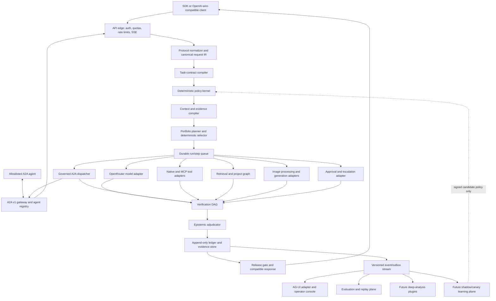
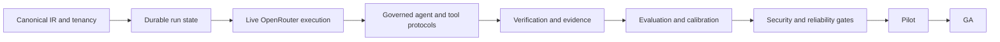

# NoeRelay v1 Product Completion Plan

**Status:** Superseded implementation baseline; retained for historical detail

**Target:** A production-ready `axiovex-agni` virtual model with a complete basic core and governed extension points

**Planning assumption:** Four core engineers, part-time security/product support, approximately 20–22 weeks to general availability

> The authoritative requirements are now [`requirements.md`](requirements.md), with release gates in [`verification-matrix.md`](verification-matrix.md). ADR-0001 replaces the language allocation below: Rust owns release authority, Python supplies bindings/evaluation extensions, and Go is limited to justified protocol/operational adapters.

**Meaning of “100%”:** Every v1 requirement and launch gate in this document is satisfied. It does not mean every future research capability has been implemented.

## 1. Product outcome

NoeRelay v1 is one stable, OpenAI-wire-compatible API that accepts text, vision, tool, and image work; compiles each request into an explicit task contract; chooses the lowest-cost route that meets a calibrated acceptance threshold; executes through explicit non-OpenAI models on OpenRouter or deterministic technologies; verifies the result; and returns both a compatible response and an auditable evidence receipt.

The v1 product must be useful without any future learned router. The deterministic policy kernel remains release authority even after learned ranking, deep-analysis planning, or real-time adaptation is introduced.

### v1 users

- Application developers who want one API instead of model-specific integrations.
- Engineering teams that need traceable model and tool delegation.
- Governed projects that connect requirements, architecture, implementation, tests, and evidence.
- Operators who need budget, latency, routing, privacy, and release controls.
- Evaluation teams that need replayable, cohort-level evidence before model or policy promotion.

### v1 non-goals

- Claiming semantic truth merely because models agree.
- Unbounded autonomous execution or unrestricted computer control.
- Runtime self-modification of production code, policy, prompts, or acceptance thresholds.
- Training a universal foundation model.
- Supporting every model, tool, modality, or workflow engine at launch.
- Replacing official benchmark harnesses with model judgment.
- Full regulated-industry certification at initial general availability.

## 2. Definition of complete

NoeRelay v1 is complete only when all six completion dimensions pass.

| Dimension | Required outcome |
|---|---|
| Functional | Compatible text and streaming APIs, explicit OpenRouter execution, governed agent delegation, tool calling, vision input, image generation, routing, fallbacks, verification, ledger, evidence receipts, and context recovery work end to end. |
| Product | Tenant/project/API-key administration, model and tool registries, run inspection, usage views, documented SDK examples, onboarding, and support procedures exist. |
| Security | Tenant isolation, secret handling, least privilege, tool sandboxing, egress controls, auditability, abuse controls, dependency scanning, threat-model closure, and incident procedures pass review. |
| Reliability | Durable execution, idempotency, retries, cancellation, timeout handling, rate limiting, backup/restore, disaster-recovery exercise, dashboards, alerts, and stated SLOs are validated. |
| Epistemic | Acceptance decisions are reproducible; claims retain evidence and contradiction state; compaction cannot erase authoritative state; every accepted run has a verifiable receipt. |
| Evaluation | Signed, version-pinned benchmark runs demonstrate every launch gate by task, risk, modality, model family, fallback class, and verifier-independence cohort. |

“Code complete” is not product complete. A feature is incomplete until it is documented, observable, secured, evaluated, operable, and included in recovery procedures.

## 3. v1 capability contract

| ID | Capability | v1 acceptance condition |
|---|---|---|
| `NR-API-01` | Virtual model API | `/v1/models`, `/v1/chat/completions`, `/v1/responses`, and evidence-receipt retrieval pass compatibility fixtures for streaming and non-streaming requests. |
| `NR-IAM-01` | Tenancy and API keys | Tenant, project, environment, role, key, quota, and revocation boundaries are enforced server-side and covered by cross-tenant negative tests. |
| `NR-CON-01` | Task-contract compilation | Every request produces a schema-valid contract or a typed clarification/rejection. Missing high-risk acceptance criteria cannot execute autonomously. |
| `NR-REG-01` | Model registry | Every callable model has an explicit OpenRouter ID, capabilities, pricing snapshot, data policy, availability state, benchmark version, and allowed roles. OpenAI model namespaces remain denied. |
| `NR-ROUTE-01` | Deterministic routing | The router filters hard constraints before cost ranking, records every rejection reason, and selects the least expected total cost among admissible plans. |
| `NR-EXEC-01` | Durable model execution | Requests support timeout, cancellation, retry classification, idempotency, provider endpoint fallback, semantic fallback, and measured cost/latency capture. |
| `NR-TOOL-01` | Governed tools | Tools use versioned schemas, scoped credentials, explicit grants, idempotency keys, output limits, egress policy, and audit events. Model output can propose but cannot directly authorize a tool action. |
| `NR-A2A-01` | Governed agent interoperability | NoeRelay can serve and consume A2A v1 tasks through allowlisted, authenticated agents. Every delegation is contract-bound, budgeted, depth-limited, loop-protected, durable, and independently verified before acceptance. |
| `NR-MCP-01` | Standard tool interoperability | MCP tools and resources can be discovered and invoked through isolated, least-privilege client sessions; advertised capability never grants execution authority. |
| `NR-AGUI-01` | User interaction events | Console and compatible clients receive sanitized, resumable run, step, tool, approval, artifact, and terminal events without exposing secrets or hidden reasoning. |
| `NR-MM-01` | Multimodality | Vision understanding, deterministic image processing, image generation, and image editing are separate capabilities with explicit models and artifact provenance. |
| `NR-VER-01` | Verification DAG | Deterministic checks run first; high-risk work requires independent evidence; failed checks trigger bounded repair/fallback or escalation rather than silent acceptance. |
| `NR-EPI-01` | Epistemic state | Facts, requirements, decisions, assumptions, observations, predictions, preferences, and artifacts use their normative states and evidence links. |
| `NR-LED-01` | Evidence ledger | State transitions append hash-linked events; accepted runs produce receipts binding inputs, route, artifacts, verification, cost, unresolved claims, and ledger head. |
| `NR-MEM-01` | Governed memory | L0–L3 memory is persisted; active context is graph-compiled; authoritative state and evidence handles survive compaction; archived evidence remains recoverable. |
| `NR-OPS-01` | Operability | Health, readiness, metrics, traces, structured logs, audit views, alerts, run replay, and administrative kill switches are available. |
| `NR-EVAL-01` | Evaluation and promotion | Dataset revisions, harness versions, policies, prompts, models, environments, and results are pinned and signed. Promotion is cohort-gated and reversible. |
| `NR-UX-01` | Operator console | Operators can inspect runs, routes, failures, claims, evidence, spending, model health, policy versions, and pending approvals without database access. |
| `NR-EXT-01` | Extension contracts | Router, verifier, tool, memory, analysis, event, and workflow interfaces are versioned so deeper analysis and adaptive behavior can be added without replacing the public API. |

## 4. Product architecture

Build v1 as a modular monolith with isolated asynchronous workers. The modules have explicit interfaces and separate database ownership boundaries, but remain in one deployable codebase until measured scale or isolation needs justify extraction.

### 4.1 Recommended implementation baseline

| Area | v1 choice | Reason and future seam |
|---|---|---|
| Production control plane | Rust stable | Owns the API, canonical state, policy, routing, cost/budget authority, verification orchestration, epistemic state, ledger, and release decisions with a memory-safe, explicit authority boundary. |
| Python boundary | PyO3-generated Python bindings plus isolated evaluation/analysis workers | Preserve the existing reference kernel as a conformance oracle; use Python where Hugging Face, evaluation, training, notebooks, or model-specific libraries materially help. Python is not the release-authority hot path. |
| Web and client | TypeScript | Use for the operator console, generated browser/Node SDK, and AG-UI integration. It does not own policy or epistemic authority. |
| Go adapters | Go only where its protocol ecosystem is materially advantageous | Initially reserved for the official A2A client/server adapter. It is an untrusted adapter to Rust authority and does not own policy or ledger acceptance. |
| Internal contracts | Versioned Protocol Buffers plus JSON Schema/OpenAPI projections | Generate Rust, Python, Go, and TypeScript types from one schema lineage. Use gRPC or Connect for isolated internal workers; keep public compatibility at HTTP/JSON/SSE. |
| API | Rust HTTP service with generated OpenAPI fixtures | Supports streaming, cancellation, middleware, compatibility testing, and a compact deployment while keeping framework types outside domain modules. |
| Execution model | Transactional PostgreSQL run/step tables, outbox, leases, and isolated workers | Delivers durable basics with one primary datastore. A `WorkflowEngine` port permits Temporal or another durable engine later. |
| Primary storage | PostgreSQL with JSONB and immutable event tables | Strong transactions for contracts, policy versions, runs, claims, and ledger linkage. |
| Artifact storage | S3-compatible object storage | Stores images, large tool outputs, benchmark bundles, signed receipts, and replay artifacts by content hash. |
| Cache/limits | Redis-compatible cache only where measured | Useful for rate limits, short-lived locks, and stream coordination; never authoritative for epistemic state. |
| Inference | Direct HTTPS OpenRouter adapter | Avoid SDK lock-in. Maintain canonical request/response types and explicit provider controls. |
| Evaluation | Hugging Face Hub acquisition plus Lighteval/custom and official harness adapters | Separates dataset distribution from deterministic promotion authority. |
| Agent interoperability | A2A v1.0 client/server using the official Go SDK; HTTP+JSON/REST first | A2A is the external agent-delegation boundary. NoeRelay maps it into durable internal tasks and retains policy, budget, verification, and release authority. |
| Tool interoperability | MCP client host with one isolated session per server | MCP is the tool/resource boundary, not a substitute for agent delegation or NoeRelay authorization. |
| User interaction | AG-UI event adapter over the authoritative run event stream | Gives the console and clients a standard real-time agent UX without making UI state the system of record. |
| Telemetry | OpenTelemetry traces/metrics/log correlation | Use stable generic attributes and version-pin any evolving GenAI conventions. Model prompts and outputs are opt-in, redacted content. |
| Console | Small web application over the same administrative API | No direct database access. Start with run, policy, registry, cost, and approval views. |
| Packaging | Reproducible containers, lockfiles, SBOM, signed images | Supports cloud deployment while preserving a later on-premises path. |

### 4.2 Language decision

| Criterion | Rust | Go | Python | TypeScript |
|---|---|---|---|---|
| Concurrent API, streaming, cancellation, workers | Excellent | Excellent | Adequate | Good |
| Memory/runtime safety | Strongest, ownership checked | Strong, garbage collected | Runtime checked | Runtime checked |
| Delivery speed for this control plane | Moderate | Excellent | Good initially, weaker under mixed concurrency | Good |
| AI/evaluation ecosystem | Limited | Adequate through HTTP/protocols | Excellent | Good |
| Deployment and idle footprint | Excellent | Excellent | Moderate | Good |
| NoeRelay role | **Primary production and release-authority language** | Narrow protocol/operations adapters | Bindings, reference, eval and research workers | Console and client SDK |

Rust is the primary language because policy, budget, tool authorization, ledger integrity, and release decisions form one trusted computing boundary. Rust provides explicit ownership and a compact memory-safe runtime for that boundary. Python remains first-class without becoming the architectural center: customers receive bindings to the same core, researchers retain the existing executable specification, and evaluation/deep-analysis workers can use the AI ecosystem behind versioned process boundaries. Go is used only for justified adapters such as the official A2A ecosystem.

Rules for keeping the polyglot design coherent:

- Rust owns canonical run state, authorization, task contracts, routing, budgets, verification orchestration, ledger writes, release decisions, and public serving.
- Python workers receive minimum necessary immutable inputs and return typed proposals, measurements, or artifacts. They cannot activate policy or mark a claim accepted.
- TypeScript consumes generated contracts and AG-UI events; browser code never receives provider secrets or authority-bearing internal fields.
- Go services require an ADR, a narrow versioned interface, and an owner. They cannot become a second authority backend.
- One schema lineage generates language bindings. No language may maintain a hand-written competing definition of a task, claim, evidence receipt, or policy decision.

### 4.3 Canonical internal request model

Do not make OpenRouter’s beta Responses representation the internal domain model. Normalize all public API variants into a versioned NoeRelay intermediate representation containing:

- tenant, project, environment, user, session, and idempotency identities;
- ordered multimodal messages and artifact references;
- tool declarations and grants;
- output contract and streaming mode;
- governance constraints and accepted defaults;
- privacy, retention, region, and approval requirements;
- cost, latency, and acceptance ceilings;
- trace and causality identifiers.

Adapters translate the canonical representation to OpenRouter Chat Completions, Responses, image APIs, tools, or future providers. This protects NoeRelay from beta API changes and makes request replay deterministic.

### 4.4 Core persisted entities

The initial schema must include `tenant`, `project`, `environment`, `principal`, `api_key`, `quota`, `policy_bundle`, `model_revision`, `provider_endpoint_snapshot`, `tool_revision`, `agent_revision`, `agent_card_snapshot`, `delegation`, `task_contract`, `run`, `step`, `attempt`, `route_decision`, `claim`, `evidence`, `artifact`, `verification_check`, `approval`, `ledger_event`, `context_capsule`, `evaluation_run`, and `promotion`.

Every mutable administrative object uses immutable revisions plus an active pointer. Runs bind to exact revisions and never read a moving `latest` value after execution starts.

### 4.5 Governed agent and tool communications

Use the three protocols at different boundaries:

| Boundary | Protocol | NoeRelay role |
|---|---|---|
| Agent ↔ agent | A2A v1.0 | Serve NoeRelay as an A2A agent and delegate bounded tasks to allowlisted specialist agents. |
| Agent ↔ tools/data | MCP | Host isolated MCP clients and expose approved tools/resources through the existing deterministic tool authority. |
| Agent ↔ user interface | AG-UI | Project sanitized authoritative run events to the console and compatible clients. |
| Internal durable state | NoeRelay protobuf event and task contracts | Remains the source of truth; external protocol messages are translated at adapters and never replace the ledger. |

The router-facing model may propose decomposition, a specialist agent, an instruction, or a communication response. The deterministic dispatcher performs the actual decision: authenticate the peer, resolve the pinned Agent Card, verify capability and policy, reserve budget, enforce data locality and tool grants, check depth/cycles, persist the delegation, and only then transmit it.

The v1 A2A implementation includes one inbound NoeRelay A2A server and one outbound client/dispatcher. It supports discovery from a configured Agent Card URL, message/send, streaming status, task retrieval, cancellation, artifacts, and explicit version negotiation. HTTP+JSON/REST is the first binding; gRPC can be enabled later behind the same domain adapter. The official A2A technology compatibility kit becomes a CI conformance gate.

Each agent registry revision records the Agent Card and content hash, signature state and trust root, interfaces and protocol versions, authentication method, skills and modalities, owner/trust domain, region and retention promises, allowed data classes, measured cost/latency/quality cohorts, health, concurrency, and artifact limits. Discovery never auto-enables an agent.

Every delegated task carries tenant, project, run, parent-step, causality, idempotency, deadline, remaining budget, risk, data class, artifact contract, and maximum delegation depth. NoeRelay enforces:

- hub-and-spoke communication through the dispatcher; no ungoverned peer side channel;
- maximum depth, fan-out, duration, attempts, cost, and concurrent delegations;
- cycle and duplicate-work detection using task lineage and semantic intent hashes;
- OAuth/OIDC or mTLS credentials out of band; credentials are never placed in A2A messages or forwarded down a chain;
- signed Agent Card verification when configured, TLS, endpoint allowlists, DNS/IP revalidation, SSRF protection, and response size/type limits;
- cancellation and deadline propagation, bounded retry, and reconciliation for disconnected streams;
- malware/content scanning and content-addressing for received files and artifacts;
- independent verification before an agent result affects accepted epistemic state or a client-visible verified response.

A2A messages are communication, not truth or durable delivery. NoeRelay persists any release-relevant statement or status itself, treats remote outputs as untrusted assertions or candidate artifacts, and converts them to evidence only after provenance and verifier checks. MCP tools follow the same proposal-versus-authority rule and use one isolated client session per server with least-privilege, audience-bound credentials. AG-UI receives projections only; it cannot mutate ledger history or bypass approval gates.

## 5. End-to-end execution semantics

1. Authenticate the principal and resolve tenant/project/environment.
2. Validate syntax, size, modalities, tool declarations, and idempotency.
3. Apply deterministic governance defaults and compile the task contract.
4. Reject, clarify, or request approval if authorization or acceptance is missing.
5. Compile a minimal context capsule from authoritative project state and evidence reachability.
6. Query the versioned model/tool registry and build candidate plans.
7. Apply hard constraints: permission, data policy, gateway, capability, risk, calibrated lower bound, independence, budget, and latency.
8. Rank admissible plans by expected total cost, latency, then acceptance lower bound.
9. Persist the route decision before external execution.
10. Execute steps using leases, idempotency, bounded retries, and cancellation propagation.
11. Run the risk-scaled verification DAG and adjudicate every release-relevant claim.
12. Repair or select an explicit semantic fallback only within remaining budget and policy.
13. Append final ledger events, store artifacts, and sign the evidence receipt.
14. Release a compatible response, or a typed clarification, rejection, abstention, or escalation.
15. Emit sanitized events for operations, evaluation, replay, and future learning.

### Streaming rule

Streaming creates a verification boundary. v1 supports two explicit modes:

- `verified`: default for medium, high, and critical risk. Buffer model content until required release checks pass, while streaming status events.
- `provisional`: allowed only by policy for low-risk work. Token events are marked unverified and can never be represented as accepted evidence.

Tool arguments, secrets, hidden evaluator data, and unapproved artifacts must never be streamed to the client.

## 6. Delivery workstreams

### A. Repository and engineering foundation

- Introduce a Go workspace with `cmd/noerelay-api`, `cmd/noerelay-worker`, and `internal` packages for protocol, domain, policy, routing, execution, verification, epistemic state, memory, ledger, storage, telemetry, and administration.
- Add `proto` as the source for internal cross-language contracts, `python` for the SDK/reference/evaluation packages, and `web` for the TypeScript console and SDK.
- Pin Go modules, Python and JavaScript lockfiles; add formatting, linting, typing, unit/integration markers, migration tooling, code generation, and local containers.
- Establish architecture decision records, schema migration rules, compatibility fixtures, release versioning, and deprecation policy.
- Add dependency updates, secret scanning, static analysis, SBOM generation, container scanning, and signed release artifacts.
- Require generated files and benchmark artifacts to record provenance.

**Exit:** A new contributor can run the service, database, workers, tests, and local smoke flow from one documented command sequence.

### B. API edge, tenancy, and administration

- Implement API-key hashing, scoped roles, tenant/project/environment resolution, revocation, rotation, quotas, and rate limits.
- Implement request IDs, idempotency keys, body limits, content-type checks, SSE heartbeat/cancellation, and normalized error envelopes.
- Add compatibility contract tests against stored request/response fixtures.
- Add an administrative API for keys, projects, policies, registries, runs, approvals, and usage.
- Prevent environment credentials and provider keys from appearing in responses, telemetry, or database fields outside the encrypted secret store.

**Exit:** Cross-tenant, revoked-key, quota, malformed-stream, cancellation, and replay tests pass.

### C. Contract compiler and deterministic policy

- Port the reference schemas into domain types with versioned serialization.
- Implement deterministic defaults, risk classification rules, acceptance-criteria validation, and clarification generation.
- Keep the LLM compiler optional: it proposes typed fields; deterministic code validates and supplies policy defaults.
- Implement signed policy bundles with activation time, compatibility range, rollback pointer, and immutable hashes.
- Add policy simulation so operators can compare a candidate policy against historical runs before activation.

**Exit:** The same normalized input, project revision, and policy revision produce the same contract and policy verdict.

### D. Registry, routing, and cost control

- Synchronize OpenRouter model metadata into quarantined snapshots; never auto-enable discovered models.
- Maintain explicit allowlisted model revisions with capability probes and measured cohorts.
- Deny `openai` families, `openai/` IDs, automatic model selectors, and OpenAI upstream providers at schema, policy, adapter, and test layers.
- Implement expected-total-cost accounting, including verification, retry, fallback, tool, infrastructure, and expected human cost.
- Add transport health, circuit breakers, concurrency limits, latency estimates, budget reservation, final reconciliation, and cost anomaly alerts.
- Store complete candidate audits and fallback ordering.

**Exit:** Property tests prove no inadmissible candidate can win by price; replay reproduces route decisions from stored snapshots.

### E. Model, tool, retrieval, and media execution

- Implement OpenRouter Chat Completions first; implement NoeRelay’s public Responses surface over the canonical representation rather than depending on the upstream beta contract.
- Support streaming, structured outputs, tool proposals, reasoning metadata without hidden-chain retention, usage, generation IDs, and sanitized provider errors.
- Build a tool registry with JSON Schema validation, scoped grants, versioned adapters, timeouts, idempotency, payload limits, and result hashing.
- Run code and high-risk tools in isolated sandboxes with read-only inputs, ephemeral filesystems, resource ceilings, and default-deny network access.
- Add retrieval adapters that return source identity, revision, query, timestamp, and content hash.
- Add separate vision, deterministic image-processing, image-generation, and image-editing adapters. Require explicit non-OpenAI image model IDs; never accept a provider default.

**Exit:** Text, streaming, one read-only tool, one sandboxed code tool, vision input, and explicit image generation each complete end to end with ledgered artifacts.

### F. Verification, epistemic state, ledger, and memory

- Implement verification templates by task kind and risk class.
- Add schema, policy, unit/integration, static, hidden, mutation, independent-model, and human checks as pluggable nodes.
- Persist support and refutation separately and block conflicted high-risk dependencies.
- Implement append-only ledger transactions, canonical serialization, hash chains, periodic signed checkpoints, and content-addressed evidence.
- Generate verifiable evidence receipts and a replay endpoint.
- Implement L0–L3 memory, graph reachability, token budgeting, unresolved-claim preservation, summary provenance, and full-fidelity evidence recovery.
- Treat compaction as a versioned, tested, ledgered transformation.

**Exit:** Tampering is detected, accepted runs replay, unresolved evidence survives repeated compaction, and no model assertion is silently promoted to observation.

### G. Evaluation, calibration, and promotion

- Build a manifest runner that resolves Hugging Face datasets to immutable commits and records transformations and licenses.
- Integrate Lighteval for supported/custom tasks and adapters for official SWE-bench, BFCL, image, security, and internal harnesses.
- Store sample-level outcomes, route choices, cost, latency, retries, fallbacks, verifier family, and environment hashes.
- Calibrate acceptance lower bounds by task/risk cohort using held-out environment outcomes.
- Implement candidate comparison, confidence intervals, route regret, regression detection, signed promotion, staged rollout, and one-command rollback.
- Maintain hidden anti-gaming suites outside model-visible context.

**Exit:** No model, prompt, router, verifier, compactor, or policy can become active without a signed promotion record satisfying every applicable cohort gate.

### H. Operations, security, and reliability

- Produce a threat model covering tenant crossover, prompt/tool injection, confused deputy, SSRF, exfiltration, malicious files, sandbox escape, provider spoofing, budget abuse, test gaming, ledger tampering, and operator misuse.
- Add encryption in transit and at rest, managed secret references, rotation, least-privilege service identities, audit logging, and redaction.
- Add health/readiness endpoints, queue depth, worker leases, dead-letter handling, backups, restore drills, migration rollback, and regional recovery documentation.
- Instrument request, contract, route, attempt, tool, verification, adjudication, compaction, and release spans. Do not record prompts or outputs by default because telemetry content can contain sensitive information.
- Add dashboards for SLOs, provider/model health, route mix, cost, acceptance, calibration drift, fallback rates, unresolved claims, and approval queues.
- Add kill switches by tenant, project, model, provider endpoint, tool, policy, and modality.

**Exit:** Security review closes all critical/high findings; load, fault-injection, backup/restore, and incident exercises pass.

### I. Product console, documentation, and support

- Provide onboarding, API-key management, project defaults, policy selection, model/tool registry, run explorer, evidence view, spend dashboards, approvals, and status views.
- Publish quickstarts for cURL, Python, and TypeScript using the NoeRelay endpoint.
- Document error classes, retry behavior, streaming semantics, data retention, provider boundary, model restrictions, tool security, and evidence interpretation.
- Create support severity levels, incident communications, vulnerability intake, data-deletion workflow, and operator runbooks.
- Add usage export and invoice-ready metering even if billing remains manual at launch.

**Exit:** A new pilot tenant can self-onboard with operator approval and diagnose a failed route without engineering database access.

### J. Agent and tool interoperability

- Implement the A2A v1 inbound server and publish a minimal signed NoeRelay Agent Card with only approved skills and interfaces.
- Implement an outbound A2A client/dispatcher, immutable agent registry revisions, card caching/signature checks, explicit allowlisting, version negotiation, and A2A conformance tests.
- Map A2A tasks, status, messages, artifacts, cancellation, and stream reconnection to durable NoeRelay run/step/event records.
- Enforce delegation depth, cycle detection, idempotency, deadline, budget, data classification, trust-domain, endpoint, and artifact constraints before dispatch.
- Implement an MCP host/client layer with isolated server sessions, capability negotiation, scoped OAuth resource tokens, tool grants, and no token passthrough.
- Project sanitized run events through an AG-UI adapter for the operator console; keep NoeRelay events authoritative and support resume from a durable cursor.
- Add a specialist-agent fixture that can be run locally and a protected `Test`-environment smoke flow against an allowlisted remote agent.

**Exit:** An inbound A2A request can be delegated to one approved specialist, use an approved MCP tool, return a verified artifact, survive stream interruption, and produce a complete evidence receipt without bypassing policy or exceeding its envelope.

## 7. Milestone schedule

The durations below assume four core engineers and deliberate overlap between protocol, console, and evaluation work. With two engineers, plan approximately 32–40 weeks. Security review, provider/agent approvals, or benchmark execution may lengthen the critical path.

| Phase | Duration | Deliverable | Exit gate |
|---|---:|---|---|
| 0. Baseline | 1 week | ADRs, package layout, threat-model draft, schemas, local stack, CI quality gates | Architecture and v1 scope approved; service boots locally. |
| 1. Walking skeleton | 2 weeks | Authenticated API → contract → deterministic route → mock execution → ledger → response | One idempotent run survives worker restart and replays. |
| 2. Live core | 3 weeks | OpenRouter adapter, model registry, text/streaming, cost/budget, transport fallback | Non-OpenAI live requests pass compatibility, failure, and accounting tests. |
| 3. Interoperability | 2 weeks | A2A server/client skeleton, agent registry, MCP client host, durable protocol mapping | One governed specialist delegation and one MCP tool complete with cancellation and receipt. |
| 4. Tools and multimodality | 3 weeks | Tool registry/sandbox, retrieval, vision, image processing/generation | Each capability has explicit grants, provenance, limits, and negative security tests. |
| 5. Governed intelligence | 3 weeks | Verification DAG, epistemic state, evidence receipts, project graph, safe compaction | High-risk example completes with independent evidence and lossless authoritative recovery. |
| 6. Productization | 2 weeks | Tenant administration, AG-UI console, quotas, approvals, usage, documentation | Pilot onboarding and operator runbook exercise pass. |
| 7. Evaluation and hardening | 3 weeks | Benchmark runner, calibration, signed promotion, protocol/load/fault/security/DR testing | All beta gates pass; no open critical/high security findings. |
| 8. Pilot and GA | 1 + 1 weeks | Restricted pilot, regression fixes, GA deployment and rollback package | Pilot SLOs and acceptance metrics pass for seven consecutive days; GA checklist signed. |

### Critical path

Tools, media adapters, console work, and documentation can run in parallel after the canonical IR and tenant boundary stabilize.

## 8. Launch quality gates

### Functional gates

- All public API compatibility fixtures pass in streaming and non-streaming modes.
- Every accepted run has a route decision, complete verification state, cost reconciliation, ledger head, and retrievable evidence receipt.
- Transport, capability, semantic, epistemic, policy, and specification failures produce distinct typed outcomes.
- Cancellation and idempotent retry cannot duplicate billable tool effects.
- OpenAI model/provider denial tests pass at configuration, routing, adapter, and end-to-end layers.
- Inbound and outbound A2A tasks pass version/conformance tests; remote artifacts cannot bypass verification or write accepted epistemic state directly.
- MCP and A2A credentials are audience-bound and never transit through model-visible content or downstream agents.

### Reliability objectives

| Metric | GA objective |
|---|---:|
| Monthly API availability, excluding upstream provider failure outside supported fallbacks | 99.9% |
| NoeRelay control-path p95 overhead, excluding provider/tool execution | ≤250 ms |
| Evidence receipt availability after terminal state, p99 | ≤2 seconds |
| Durable run recovery after worker termination | 100% in fault suite |
| Duplicate externally visible side effects under retry | 0 observed |
| Ledger verification and stored-artifact hash match | 100% |
| Successful restore from documented backup | 100% in quarterly exercise |

### Evaluation objectives

- Zero observed unsafe accepts in critical launch suites, with confidence bounds reported rather than interpreted as proof of zero real-world risk.
- `maximum_unsafe_accept_rate`, calibration, selective-risk, replay, context-recall, trace-coverage, tool-success, latency, and route-regret gates pass as defined by the benchmark manifest.
- Every model/harness pair is evaluated; model-name results cannot be transferred to an untested scaffold.
- High-risk cohorts retain 100% authoritative requirement/evidence recovery across compaction tests.
- Cost and latency regressions greater than the configured tolerance block promotion.

### Security gates

- No critical or high unresolved findings from application, API, dependency, container, IaC, sandbox, and tenant-isolation review.
- Secrets never appear in repository history, logs, traces, errors, benchmark bundles, or evidence receipts.
- Default-deny tool egress and capability grants pass adversarial tests.
- Agent spoofing, malicious Agent Cards, recursive delegation, task-flooding, SSRF, poisoned artifacts, and cross-tenant task access pass adversarial tests.
- Public pull-request workflows receive no protected environment secrets.
- Incident response, key rotation, compromised-model disablement, and data-deletion exercises pass.

## 9. Deep-analysis extension points

Deep analysis should be a governed execution mode, not a larger prompt. Add the following stable interfaces in v1 even if advanced implementations arrive later.

### Analysis plan interface

An `AnalysisPlanner` accepts the task contract, active context, risk class, agent registry snapshot, and budget envelope, and proposes a typed DAG of information, execution, specialist-agent delegation, verification, and synthesis steps. Deterministic code validates:

- maximum depth, breadth, wall time, token budget, cost, and tool effects;
- capability and data-policy compatibility;
- required independent branches;
- stopping conditions and evidence requirements;
- which nodes may execute concurrently;
- resumability and cancellation behavior.
- delegation depth, agent trust domain, protocol capabilities, and artifact contracts.

### Analysis strategies

- Decomposition into requirement, architecture, implementation, and verification branches.
- Retrieval expansion based on unresolved claims rather than generic search volume.
- Alternative hypotheses with explicit discriminating tests.
- Formal solver or deterministic computation delegation.
- Independent model-family critique for residual judgment.
- Counterexample, mutation, and adversarial-test generation.
- A2A delegation to independently measured specialist agents with explicit branch-level deliverables.
- Budget-aware iterative refinement with value-of-information stopping.

No strategy can lower policy thresholds, authorize tools, redefine success after seeing failures, or treat model consensus as evidence.

### Pause/resume contract

Every analysis DAG stores node state, inputs, artifact hashes, dependencies, budget consumption, and next admissible actions. A worker restart or human approval pause resumes from committed state instead of regenerating the plan from prose.

## 10. Safe real-time dynamic behavior

Prepare for dynamic behavior through bounded control surfaces. Do not implement unrestricted online self-modification.

### Required v1 hooks

- Versioned event envelope for request, route, attempt, check, claim, cost, latency, feedback, and outcome events.
- Transactional outbox so events cannot diverge from authoritative state.
- Router feature interface with schema version, provenance, freshness, and missing-value semantics.
- Read-only online statistics interface for model/provider health and cohort outcomes.
- Signed policy-bundle interface with constraints, activation, expiry, rollback, and compatibility range.
- Shadow-decision interface that records what a candidate router would have selected without affecting users.
- Feature flags scoped by tenant, project, cohort, and percentage.
- Canary assignment that is deterministic, replayable, budget-limited, and instantly reversible.
- Promotion API that accepts only signed evaluation evidence.

### Adaptation maturity levels

| Level | Behavior | Production authority |
|---|---|---|
| 0 | Static versioned policy and manually measured registry | Deterministic policy |
| 1 | Real-time health, price, latency, and quota inputs update candidate availability | Deterministic bounded rules |
| 2 | Learned ranker supplies a score among already-admissible candidates | Deterministic selector retains final choice and thresholds |
| 3 | Contextual bandit explores only inside an approved canary envelope with hard cost/risk limits | Canary controller plus deterministic policy |
| 4 | Candidate prompts, compactors, calibrators, or router models train offline from ledgered outcomes | Signed evaluation and human promotion |
| 5 | Automated promotion recommendation and rollback triggers | Humans approve normative/high-risk changes; emergency rollback may be automatic |

The active system must never learn directly from thumbs-up signals as if they were truth. Training labels must distinguish user preference, deterministic success, environment outcome, verifier judgment, and human authorization.

### Real-time rollback rules

Automatically disable a candidate or endpoint when any hard trigger fires: policy violation, unsafe accept, cross-tenant event, unexplained cost spike, calibration breach, tool-side-effect duplication, evidence-replay failure, or security alert. Rollback changes the active pointer to a previously signed revision; it never edits the old revision.

## 11. Testing strategy

| Layer | Required tests |
|---|---|
| Domain | Schema round trips, state machines, deterministic policy, epistemic truth tables, ledger canonicalization, compaction invariants |
| Property | No inadmissible route wins; budgets never increase without authorization; retries preserve idempotency; compaction preserves protected nodes |
| Contract | Public API fixtures, protobuf compatibility, OpenRouter fixtures, A2A TCK, MCP capability/auth fixtures, AG-UI events, tool schemas, migrations, receipt verification |
| Integration | PostgreSQL/object store/workers, A2A disconnect/cancel/reconcile, MCP session isolation, SSE/AG-UI resume, sandbox, retrieval, media, approvals |
| End to end | Text, tools, specialist-agent delegation, vision, image, fallback, repair, rejection, clarification, abstention, approval, replay |
| Security | Tenant crossover, injection, SSRF, egress, malicious Agent Cards/files, delegation loops/floods, token forwarding, secret redaction, auth bypass, quota abuse, ledger tampering |
| Reliability | Load, soak, provider latency, rate limits, worker death, duplicate delivery, database failover, object-store outage, restore |
| Evaluation | Cohort benchmarks, calibration, selective risk, route regret, context recall, verifier independence, anti-gaming hidden suites |

Test fixtures must never contain live credentials. Network-dependent tests are manual or scheduled against the protected `Test` environment and have explicit spending ceilings.

## 12. Operational model

### Environments

- `local`: synthetic data, mock providers, disposable storage.
- `test`: protected credentials, non-production data, manual remote smoke and capped integration tests.
- `staging`: production-equivalent topology, anonymized/synthetic workloads, candidate policies and migrations.
- `production`: signed revisions only, least-privilege identities, monitored change windows, automated rollback.

### Release flow

1. Pull request passes unit, schema, type, lint, security, and compatibility checks.
2. Merge creates immutable artifacts, SBOM, provenance, and signed container digest.
3. Staging migration and replay suite pass.
4. Benchmark manifest passes for affected cohorts.
5. Candidate runs in shadow mode, then a bounded canary.
6. Operator approves promotion and records evidence.
7. SLO and epistemic alerts determine continue or rollback.

### Minimum runbooks

- Provider/model outage or degradation.
- Compromised or overspending API key.
- Model, tool, or policy emergency disablement.
- Stuck run, poisoned queue message, or duplicate effect.
- Ledger verification failure.
- Cross-tenant or data-retention incident.
- Database recovery and object-store reconciliation.
- Rollback of service, migration, policy, model, prompt, and compactor.

## 13. Team and ownership

| Role | Primary responsibility |
|---|---|
| Technical/product owner | Scope, acceptance contracts, product tradeoffs, launch sign-off |
| Backend/platform lead | API, tenancy, storage, workers, reliability, release architecture |
| Agent/runtime engineer | contracts, routing, OpenRouter, A2A/MCP, tools, media, verification |
| Evaluation/research engineer | benchmarks, calibration, promotion, deep-analysis and learning hooks |
| Frontend/product engineer | console, onboarding, run/evidence exploration, usage UX |
| Security reviewer, part time | threat model, sandbox, IAM, secrets, incident and launch review |

One person may cover multiple roles, but production changes to normative policy, security controls, and benchmark promotion require independent review.

## 14. Risk register

| Risk | Consequence | Mitigation |
|---|---|---|
| Compatibility surface grows faster than tests | Client breakage | Canonical IR, recorded fixtures, explicit profiles, deprecation windows |
| Provider metadata or pricing changes | Wrong route/cost | Quarantined snapshots, TTL, anomaly detection, budget reservation, replay |
| Upstream Responses API changes | Production breakage | Chat-first adapter and internal canonical representation; treat upstream Responses as optional beta adapter |
| Weak verifier is gamed | Unsafe acceptance | Deterministic checks, hidden/mutation tests, family independence, anti-gaming suites |
| Streaming leaks unverified output | False trust or data leak | Verified/provisional modes, status events, risk policy, output redaction |
| Tool proposal becomes authority | Destructive action | Capability grants, deterministic authorization, idempotency, approval, sandbox |
| Compaction loses a governing fact | Invalid decisions | Protected-node invariants, evidence recovery, differential compaction tests |
| Learned router optimizes proxy metrics | Quality/safety regression | Constraint-first selection, cohort gates, shadow/canary, rollback, no threshold learning |
| Event/ledger volume becomes expensive | Cost/latency pressure | Tiered retention, content-addressing, compression, summaries without deleting authoritative state |
| Early microservices slow delivery | Operational complexity | Modular monolith first; extract only from measured scaling/isolation evidence |
| Polyglot codebase fragments contracts | Divergent behavior and slow delivery | Go authority, generated protobuf types, narrow Python/Rust boundaries, cross-language conformance tests |
| Remote agent lies about capability or identity | Bad route or data exposure | Pinned/signed Agent Cards, trust roots, allowlisting, measured probes, least-privilege data envelopes |
| Recursive agents create loops or cost explosions | Outage and budget loss | Hub-and-spoke dispatch, depth/fan-out/TTL limits, lineage cycle checks, budget reservation, kill switches |
| Protocol event loss is mistaken for durable state | Missing evidence or stuck tasks | Persist before send, idempotent mapping, reconciliation, durable cursor, never treat A2A messages or AG-UI state as authority |
| “100%” becomes moving target | Never ships | Freeze v1 requirements and gates; route later capabilities to versioned roadmap |

## 15. Initial epic backlog

| Epic | Outcome | Depends on |
|---|---|---|
| `NR-001 Foundation` | Typed package, migrations, containers, quality/security CI | — |
| `NR-002 Canonical API` | Authenticated compatible requests, errors, SSE, idempotency | `NR-001` |
| `NR-003 Durable Runs` | Run/step state, outbox, workers, cancellation, recovery | `NR-001` |
| `NR-004 Governance` | Contract compiler, policy bundles, risk and approvals | `NR-002` |
| `NR-005 Registry` | Model/tool/provider snapshots and capability probes | `NR-001` |
| `NR-006 Router` | Constraint filtering, plan pairing, cost ranking, audit | `NR-003`–`005` |
| `NR-007 OpenRouter` | Explicit non-OpenAI execution, streaming, metadata, fallback | `NR-005`, `006` |
| `NR-008 Tools and Retrieval` | Governed adapters and sandbox | `NR-003`, `004` |
| `NR-009 Multimodal` | Vision, image processing, explicit image generation/editing | `NR-005`, `007` |
| `NR-010 Verification` | Risk-scaled DAG, repair, fallback, escalation | `NR-003`, `006`–`009` |
| `NR-011 Evidence` | Claims, ledger, artifacts, receipts, replay | `NR-003`, `010` |
| `NR-012 Memory` | Project graph, context compiler, safe compaction | `NR-004`, `011` |
| `NR-013 Evaluation` | Hub acquisition, harnesses, calibration, promotion | `NR-006`, `010`–`012` |
| `NR-014 Operations` | Telemetry, SLOs, alerts, runbooks, backup/restore | all runtime epics |
| `NR-015 Console` | Onboarding, registry, runs, evidence, cost, approval UX | `NR-002`, `011`, `014` |
| `NR-016 Agent Interoperability` | A2A server/client and registry, MCP host, AG-UI projection, protocol security/conformance | `NR-002`–`006`, `011`, `014` |
| `NR-017 GA` | Security review, load/fault tests, pilot, docs, release | all |

## 16. First ten implementation pull requests

1. Rust workspace and service/worker entry points, schema lineage, PyO3 bindings, Python/TypeScript workspaces, dependency locks, multi-language quality/security CI, and ADR template.
2. PostgreSQL schema and migrations for tenants, projects, contracts, runs, steps, and immutable revisions.
3. API-key authentication, tenant middleware, idempotency, rate-limit interfaces, and negative isolation tests.
4. Canonical request IR plus `/v1/models` and non-streaming `/v1/chat/completions` skeleton.
5. Durable run state machine, worker lease/outbox, mock executor, cancellation, and recovery test.
6. Productionized policy kernel, signed policy revisions, contract compiler boundary, and simulation endpoint.
7. Model registry and OpenRouter catalog snapshot importer with quarantine and OpenAI-denial tests.
8. Live OpenRouter Chat adapter, usage/cost capture, transport fallback, circuit breaker, and sanitized errors.
9. Agent registry plus A2A v1 server/client walking slice with official SDK/TCK, depth/budget controls, and durable task mapping.
10. Verification DAG plus claim/evidence persistence, ledger transaction, first evidence receipt, and verified/provisional SSE status events.

After these ten PRs, NoeRelay should have a production-shaped vertical slice with one controlled model route and one controlled agent delegation. MCP tools, AG-UI, media, full memory, evaluation, console, and hardening then extend a working architecture instead of creating parallel prototypes.

## 17. Final GA checklist

### Product and API

- [ ] v1 scope and non-goals are frozen and documented.
- [ ] Public endpoints, SDK examples, streaming, errors, and compatibility profiles are complete.
- [ ] Tenant onboarding, keys, quotas, usage, approvals, and run/evidence inspection work.
- [ ] Support, status, incident, deletion, and deprecation procedures are published.

### Runtime

- [ ] Explicit non-OpenAI text, tool, vision, image-processing, image-generation, and image-edit routes pass.
- [ ] NoeRelay’s A2A server and outbound dispatcher pass conformance, cancellation, reconnection, depth/cycle, budget, trust, and cross-tenant tests.
- [ ] MCP sessions are isolated and least-privilege; AG-UI projections resume cleanly without becoming authoritative state.
- [ ] Provider and semantic fallbacks are distinct, bounded, and auditable.
- [ ] Cancellation, idempotency, timeout, retry, and budget reconciliation pass fault tests.
- [ ] No route can bypass hard constraints or lower the acceptance threshold.

### Epistemic governance

- [ ] Task contracts, claim states, contradiction handling, and verification DAGs pass conformance tests.
- [ ] Every accepted run has a verifiable receipt and ledger position.
- [ ] Context compaction preserves all authoritative state and evidence handles.
- [ ] Replay reconstructs contract, policy, registry, context, route, checks, and artifacts.

### Security and reliability

- [ ] Threat model approved; no critical/high findings remain.
- [ ] Tenant isolation, secret redaction, tool sandbox, and egress controls pass adversarial tests.
- [ ] SLO dashboards, alerts, kill switches, backups, restore, and rollback exercises pass.
- [ ] Dependencies, containers, SBOM, provenance, and releases are scanned and signed.

### Evaluation and operations

- [ ] All launch cohorts pass signed benchmark and calibration gates.
- [ ] Shadow/canary infrastructure and rollback work even if no learned router is active.
- [ ] Cost, latency, route regret, fallback, acceptance, and context-recall metrics meet targets.
- [ ] Pilot runs for seven consecutive days without an unresolved launch-blocking regression.
- [ ] Product owner, engineering owner, evaluation owner, security reviewer, and operations owner sign the release record.

## 18. Decisions required before Phase 1 ends

1. Initial hosting region and data-residency commitment.
2. Tenant identity model: NoeRelay-issued keys only or external OIDC at launch.
3. Retention defaults and deletion SLA for prompts, outputs, artifacts, telemetry, and evidence.
4. Initial approved non-OpenAI model portfolio by capability and risk cohort.
5. Initial read-only and side-effecting tool set.
6. Sandbox technology and allowed runtime/network profiles.
7. Whether verified streaming may buffer full content or only support post-verification replay for high-risk runs.
8. Pilot customer and representative private benchmark suites.
9. Billing model: internal chargeback, usage export, or external subscription at GA.
10. Availability target and recovery objectives that product pricing will support.
11. Initial A2A trust roots, approved agents, exposed NoeRelay skills, maximum delegation depth/fan-out, and allowed data classes.
12. Initial MCP servers/scopes and whether AG-UI is part of the external v1 compatibility promise or console-only until v1.1.

## 19. Source alignment

- OpenRouter currently supports unified model discovery, streaming, tool calling, provider controls, and dedicated image APIs. NoeRelay must still pin explicit models and provider policy rather than relying on automatic selection: [model discovery](https://openrouter.ai/docs/api/api-reference/models/get-models), [streaming](https://openrouter.ai/docs/api/reference/streaming), [tool calling](https://openrouter.ai/docs/guides/features/tool-calling), [provider routing](https://openrouter.ai/docs/guides/routing/provider-selection), and [image generation](https://openrouter.ai/docs/guides/overview/multimodal/image-generation).
- OpenRouter’s Responses API is currently beta and stateless, so v1 should preserve a NoeRelay canonical representation and treat the upstream Responses adapter as replaceable: [Responses API overview](https://openrouter.ai/docs/api/reference/responses/overview).
- Hugging Face Lighteval supports custom tasks, metrics, API-compatible backends, and detailed result tracking, but NoeRelay promotion remains governed by its own signed manifests and official harnesses: [Lighteval](https://huggingface.co/docs/lighteval/index), [custom tasks](https://huggingface.co/docs/lighteval/adding-a-custom-task), and [Python API](https://huggingface.co/docs/lighteval/using-the-python-api).
- A2A v1.0 is the stable agent-to-agent boundary and defines Agent Cards, stateful tasks, messages, artifacts, streaming, cancellation, and multiple bindings. The official Go SDK provides both client and server support, and the project provides a compatibility kit: [A2A v1.0 specification](https://a2a-protocol.org/latest/specification/), [v1.0 announcement](https://a2a-protocol.org/latest/announcing-1.0/), [official Go SDK](https://github.com/a2aproject/a2a-go), [technology compatibility kit](https://github.com/a2aproject/a2a-tck), and [official project/SDKs](https://github.com/a2aproject/).
- A2A explicitly warns that messages are not a reliable delivery mechanism for critical information, and signed Agent Cards are optional. NoeRelay therefore persists critical state independently and uses configured trust policy rather than equating discovery with trust: [A2A task history and message durability](https://a2a-protocol.org/latest/specification/#task-history) and [Agent Card signing](https://a2a-protocol.org/latest/specification/#agent-card-signing).
- MCP uses a host-client-server model with an isolated stateful client connection per server and capability negotiation. Its HTTP authorization profile uses OAuth resource metadata and audience-bound tokens; NoeRelay must prohibit token passthrough: [MCP architecture](https://modelcontextprotocol.io/specification/2025-11-25/architecture) and [MCP authorization](https://modelcontextprotocol.io/specification/2025-11-25/basic/authorization).
- AG-UI is the complementary agent-to-user, streaming event boundary for lifecycle, text, tool, state, and activity events. NoeRelay projects these events from its durable event stream rather than storing authority in the UI protocol: [AG-UI overview](https://docs.ag-ui.com/introduction) and [AG-UI events](https://docs.ag-ui.com/concepts/events).
- Telemetry content can contain sensitive input/output data. Instrumentation must default to metadata and opt-in redacted content: [OpenTelemetry GenAI attributes](https://opentelemetry.io/docs/specs/semconv/registry/attributes/gen-ai/).
- Provenance and software attestations should remain aligned with [W3C PROV](https://www.w3.org/TR/prov-primer/) and [in-toto](https://github.com/in-toto/docs/blob/master/in-toto-spec.md).

## 20. Plan governance

This document becomes the product baseline when approved. Changes to v1 scope, completion gates, security boundaries, adaptation authority, or SLOs require an architecture decision record and pull-request review. New research features go into a versioned post-v1 roadmap unless they are necessary to pass an existing v1 gate.

The shortest path to a real product is the first production-shaped vertical slice, followed by measured expansion. The safest path to future intelligence is to make every dynamic component advisory until deterministic constraints, signed evidence, canary evaluation, and instant rollback are already operating.
