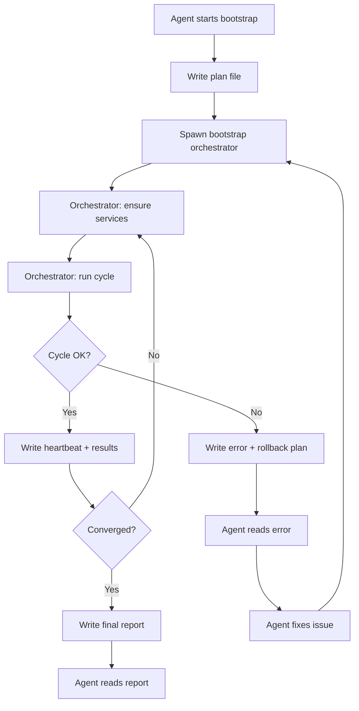

# Bootstrap Self-Improvement + CI/CodeQL Fixes — Plan

**Date**: 2026-09-03  
**Status**: Planning — awaiting approval

---

## Part A: Bootstrap Self-Improvement from the Agent

### Problem

The existing [`noerelay_self_improve.py`](scripts/noerelay_self_improve.py) runs the self-improvement loop but:
1. Requires the gateway to already be running in live mode
2. Has no recovery mechanism if the loop fails mid-cycle
3. Cannot be controlled from within an agent session (no heartbeat, no pause/resume)
4. Service restarts during the loop can break the agent's connection

### Design: Bootstrap Orchestrator with Heartbeat + Recovery



### Key Components

#### 1. Bootstrap Orchestrator (`scripts/bootstrap_improve.py`)

A standalone Python script that:
- Reads a plan file (`evidence/bootstrap/plan.json`) with:
  - `gateway_mode`: "live" or "stub"
  - `max_cycles`: number of cycles to run
  - `cohorts`: which cohorts to benchmark
  - `auto_apply`: whether to auto-apply safe changes
  - `recovery_enabled`: whether to rollback on failure
- Writes a heartbeat file (`evidence/bootstrap/heartbeat.json`) every 5 seconds with:
  - `status`: "running" | "completed" | "failed" | "recovering"
  - `current_cycle`: current cycle number
  - `last_score`: most recent composite score
  - `last_error`: most recent error message (if any)
  - `timestamp`: ISO 8601
- Writes results to `evidence/bootstrap/results/`
- On failure, writes a rollback plan to `evidence/bootstrap/rollback.json`

#### 2. Agent Integration (`scripts/agent_bootstrap.py`)

A thin wrapper that the agent calls:
```python
# Agent calls this to start self-improvement
python scripts/agent_bootstrap.py --mode live --max-cycles 5 --auto-apply

# Agent calls this to check status
python scripts/agent_bootstrap.py --status

# Agent calls this to recover from failure
python scripts/agent_bootstrap.py --recover
```

The agent bootstrap:
1. Writes the plan file
2. Spawns `bootstrap_improve.py` as a subprocess
3. Polls the heartbeat file
4. Reports progress to the agent
5. On failure, reads the error and rollback plan
6. Allows the agent to fix issues and resume

#### 3. Recovery Mechanism

When the orchestrator fails:
1. It writes `evidence/bootstrap/rollback.json` with:
   - `failed_cycle`: which cycle failed
   - `error`: error message
   - `actions_applied_this_cycle`: what was changed
   - `rollback_actions`: how to undo each change
   - `state_snapshot`: orchestrator state before the failed cycle
2. The agent reads the rollback plan
3. The agent applies rollback actions (restart services, revert config)
4. The agent fixes the root cause
5. The agent resumes from the last successful cycle

#### 4. Service Lifecycle Management

The bootstrap orchestrator manages services directly:
- **Gateway**: Start/stop Docker container with correct env vars (live vs stub mode)
- **Ollama**: Already running as a Windows service — just health-check
- **PostgreSQL**: Docker container — start if needed
- **Sidecar**: Start `llmrouter_sidecar.py` if ranking mode is enabled

The orchestrator uses [`ensure-services.ps1`](scripts/ensure-services.ps1) for service management but adds:
- Pre-cycle health check with retry (up to 30s)
- Post-restart health check with retry (up to 60s)
- Timeout detection — if a service doesn't come up, fail gracefully

#### 5. Timeout Protection

Each cycle has a maximum duration (default: 10 minutes). If a cycle exceeds this:
1. The orchestrator kills the benchmark subprocess
2. Records a timeout error
3. Writes rollback plan
4. Exits — the agent can diagnose and resume

### Files to Create

| File | Purpose |
|------|---------|
| `scripts/bootstrap_improve.py` | Standalone bootstrap orchestrator with heartbeat |
| `scripts/agent_bootstrap.py` | Agent-facing wrapper for start/status/recover |
| `evidence/bootstrap/` | Directory for plan, heartbeat, results, rollback |

### Files to Modify

| File | Change |
|------|--------|
| `scripts/noerelay_self_improve.py` | Extract core cycle logic into reusable function |
| `scripts/ensure-services.ps1` | Add `--gateway-mode` flag for live/stub switching |

---

## Part B: CI/CodeQL Fixes

### Current CI Status

| Workflow | Trigger | Jobs |
|----------|---------|------|
| `ci.yml` | push main/develop, PR main | rust (fmt, clippy, audit, test, build wheel), go-a2a, python test, docker |
| `benchmark.yml` | weekly Monday, manual | benchmark (stub mode) |
| `conformance.yml` | PR, push main, manual | Python 3.11 conformance |
| `test-environment-smoke.yml` | ? | Smoke test |

### Missing: CodeQL

No CodeQL workflow exists. Need to create `.github/workflows/codeql.yml` with:
- Language matrix: `python`, `go`, `rust` (or `javascript` if any JS exists)
- Trigger: push to main, PR to main, weekly schedule
- Standard CodeQL analysis steps

### CI Issues to Check

1. **`cargo fmt --all -- --check`** — may fail if any files aren't formatted
2. **`cargo clippy --workspace --all-targets -- -D warnings`** — may have new warnings from our additions
3. **`cargo audit`** — dependency vulnerabilities
4. **Python tests** — `pytest tests/ -v` — may have import issues with new modules
5. **Docker build** — may fail if Dockerfile doesn't include new dependencies

### Files to Create

| File | Purpose |
|------|---------|
| `.github/workflows/codeql.yml` | CodeQL analysis for Python, Go, Rust |

### Files to Fix (if CI is red)

| File | Likely Issue |
|------|-------------|
| `crates/noerelay-core/src/route_target.rs` | Unused import `ModelRevision` |
| `crates/noerelay-gateway/src/lib.rs` | Unused imports from ranking additions |
| Various `.rs` files | `cargo fmt` formatting |
| `rtk/src/lib.rs` | Renamed module may have issues |

---

## Part C: Run Self-Improvement Loop

After the bootstrap orchestrator is built:
1. Start the gateway in live mode
2. Run `agent_bootstrap.py --mode live --max-cycles 5 --auto-apply`
3. Monitor heartbeat
4. If it converges or maxes out, review results
5. If it fails, diagnose, fix, and resume
6. Iterate until satisfied

---

## Execution Order

```
1. Fix CI issues (fmt, clippy, unused imports)
2. Add CodeQL workflow
3. Verify CI is green
4. Build bootstrap orchestrator (bootstrap_improve.py)
5. Build agent wrapper (agent_bootstrap.py)
6. Run self-improvement loop
7. Iterate on failures
8. Commit & push
```

---

## Risk Assessment

| Risk | Mitigation |
|------|------------|
| Service restart kills agent connection | Agent runs in VS Code — persists across terminal restarts. Bootstrap runs as subprocess, agent polls heartbeat file |
| Self-improvement breaks the gateway | Rollback plan records every change; agent can revert |
| Cycle timeout leaves system in bad state | Timeout kills subprocess; rollback plan restores previous state |
| CI is red from our changes | Fix fmt/clippy issues first; verify locally before pushing |
| CodeQL finds vulnerabilities | Triage and fix or suppress with justification |