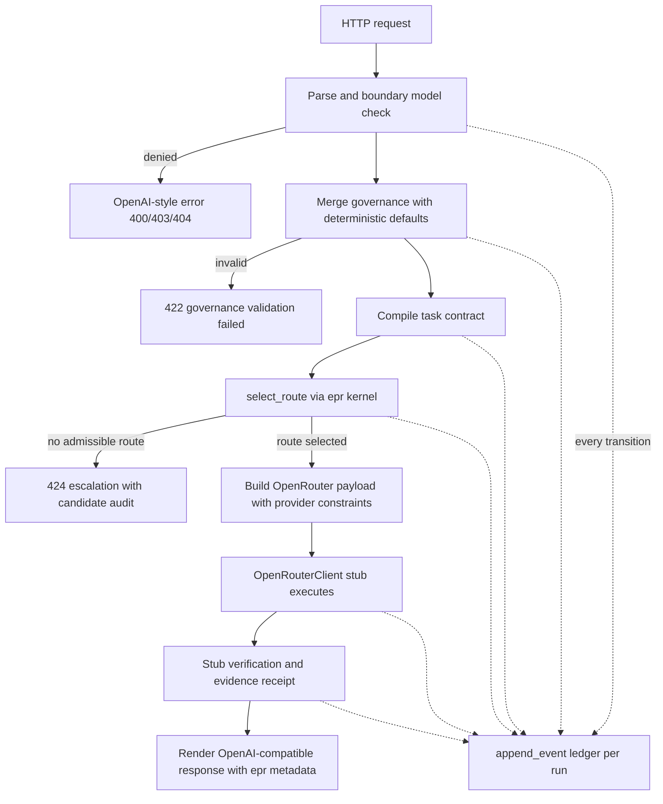

# NoeRelay OpenAI-Wire Gateway Skeleton — Architectural Plan

**Status:** Draft for review — planning artifact only; no code is written by this document.
**Scope:** EPR-API-001, EPR-API-002, EPR-API-003, EPR-API-006, EPR-API-007 (plus supporting EPR-LED-001, EPR-ROUTE-004, and the interface contract for the future verification state machine).
**Non-goals for this skeleton:** live OpenRouter HTTP calls, real verification DAG execution, streaming (SSE), image generation, online learning, persistence across process restarts.

---

## 1. Executive summary

The gateway is a new, additive Python package `reference/gateway/` that wraps the existing `reference/epr/` kernel behind the OpenAI-wire-compatible HTTP surface declared in `spec/openapi.json`. It is implemented with the Python standard library only (`http.server`, `json`, `urllib`, `hashlib`, `uuid`, `threading`), keeping the repository dependency-free. The kernel functions (`select_route()`, `adjudicate_fact()`, `append_event()`, `verify_chain()`, `validate_context_capsule()`) and all files under `spec/` remain unmodified.

The request pipeline is:



---

## 2. Technology choice

### 2.1 Decision: standard library `http.server`

Use `http.server.ThreadingHTTPServer` with a single `BaseHTTPRequestHandler` subclass that dispatches to pure handler functions.

### 2.2 Justification

1. **Dependency-free mandate.** The repository currently has zero runtime dependencies; `jsonschema` is already treated as optional in `tests/test_spec.py`. Adding FastAPI/Flask would add a transitive dependency tree (starlette/anyio/pydantic or werkzeug/click/blinker) that contradicts the project's stated identity ("dependency-free Python reference kernel") and would complicate the secret-free Conformance CI workflow.
2. **Precedent in-repo.** `scripts/remote_service_smoke.py` already performs HTTPS calls with `urllib.request` and sanitized error handling. The gateway mirrors that pattern for its future live OpenRouter client.
3. **The HTTP surface is tiny.** Four routes, one method each, JSON in/JSON out. A full framework buys routing, validation, and serialization that this project intentionally wants to make explicit and auditable. Explicit, inspectable dispatch is a feature for an executable specification.
4. **Testability.** Pure handler functions `handle(route, body, ctx) -> (status, headers, body_dict)` are unit-testable without sockets; the `BaseHTTPRequestHandler` subclass becomes a thin adapter. Integration tests bind an ephemeral port (`port=0`) with `ThreadingHTTPServer` in a thread — a stdlib-only pattern.
5. **Concurrency.** `ThreadingHTTPServer` gives one thread per connection, adequate for a reference skeleton. The run registry is guarded by a `threading.Lock`. Async is rejected: it would add complexity without benefit at this stage and stdlib async HTTP serving is not turnkey.

### 2.3 What is deliberately NOT adopted

- No pydantic/FastAPI/Flask/aiohttp/requests.
- No `python-dotenv`: `docs/environment.md` specifies OS-level environment variables; `.env.example` is a names-only template. Config reads `os.environ` directly.
- No OpenAPI runtime validation dependency: validation is hand-rolled, minimal, and mirrors the schemas; optional `jsonschema`-based response validation appears only in tests, following the existing skip-if-missing pattern.

---

## 3. Module structure

New package, sibling to `reference/epr/`. Nothing under `reference/epr/`, `spec/`, or `examples/` is modified.

```text
reference/gateway/
    __init__.py          # public exports: create_server, GatewayConfig, handle_request
    __main__.py          # `python -m gateway` entry point (sys.path handled like reference/demo.py)
    config.py            # GatewayConfig.from_env(); env loading and defaults
    policy.py            # load_policy(); boundary model check; startup portfolio validation
    governance.py        # DEFAULT_GOVERNANCE; merge_governance(); validate_governance()
    contracts.py         # compile_task_contract() for chat + responses requests
    portfolio.py         # load_portfolio() candidate registry from JSON
    openrouter.py        # OpenRouterClient protocol, StubOpenRouterClient, HttpOpenRouterClient (interface)
    statemachine.py      # VerificationStateMachine (spec-driven transition validator, stub guards)
    runs.py              # RunRegistry: run records, per-run ledger chains, receipt issuance
    pipeline.py          # stage functions + run_inference_pipeline() sequencer
    render.py            # OpenAI-compatible response/error envelope renderers
    handlers.py          # pure handle_* functions: request dict -> (status, headers, body dict)
    server.py            # ThreadingHTTPServer + BaseHTTPRequestHandler adapter (no logic)
tests/
    test_gateway.py      # new; unittest, stdlib-only
docs/
    gateway.md           # new; compatibility profile (documents EPR-API-002 pass-through and the streaming gap)
```

Relationship to existing modules:

- `pipeline.py` imports `select_route` from `epr.kernel` — the only kernel entry point the pipeline needs.
- `runs.py` imports `append_event` / `verify_chain` from `epr.ledger`.
- `adjudicate_fact` and `validate_context_capsule` are not called by the skeleton; their integration points are noted for the verification phase (§8.4).
- `reference/demo.py` remains the CLI example; the gateway does not alter it.

Design rule: **the HTTP layer never touches the kernel directly.** `server.py` → `handlers.py` → `pipeline.py` → `epr`. This keeps the protocol plane (per `docs/architecture.md` §2) separable from the decision plane.

---

## 4. Configuration

### 4.1 Environment variables

Existing (read, never logged — values are secrets):

| Variable | Required for | Default |
|---|---|---|
| `OPENROUTER_API_KEY` | live mode only | — (absent in stub mode) |
| `OPENROUTER_BASE_URL` | live mode only | `https://openrouter.ai/api/v1` |
| `OPENROUTER_HTTP_REFERER` | live mode | `https://github.com/electrohire/noerelay` |
| `OPENROUTER_APP_TITLE` | live mode | `NoeRelay` |
| `NOERELAY_LIVE_TESTS` | tests only | `0` |

New (all non-secret, all with defaults):

| Variable | Default | Meaning |
|---|---|---|
| `NOERELAY_GATEWAY_HOST` | `127.0.0.1` | bind address |
| `NOERELAY_GATEWAY_PORT` | `8080` | bind port |
| `NOERELAY_OPENROUTER_MODE` | `stub` | `stub` or `live`; `live` without `OPENROUTER_API_KEY` fails at startup (fail-closed) |
| `NOERELAY_POLICY_PATH` | `spec/routing-policy.json` | routing policy JSON |
| `NOERELAY_STATE_MACHINE_PATH` | `spec/verification-state-machine.json` | state machine JSON |
| `NOERELAY_PORTFOLIO_PATH` | `examples/candidate-actions.json` | candidate action registry |
| `NOERELAY_DEFAULT_MAX_COST_USD` | `0.25` | governance default (§6) |
| `NOERELAY_DEFAULT_MAX_LATENCY_MS` | `60000` | governance default (§6) |
| `NOERELAY_EXTERNAL_BASE_URL` | `http://127.0.0.1:8080` | used to render `evidence_receipt_url` |

### 4.2 Loading

`GatewayConfig.from_env()` in `config.py` reads `os.environ` once at startup, resolves paths relative to the repository root (same `Path(__file__).resolve().parents[N]` idiom as `reference/demo.py`), validates enums (`NOERELAY_OPENROUTER_MODE`, `NOERELAY_LIVE_TESTS ∈ {0,1}`), and raises a sanitized `ConfigError` on any invalid value. Startup is fail-closed: any config or policy error prevents the server from binding.

---

## 5. Endpoint specifications

All endpoints live behind one dispatch table in `server.py` that delegates to pure, socket-free functions in `handlers.py`:

```text
GET  /v1/models                 -> handle_list_models
POST /v1/chat/completions       -> handle_chat_completions
POST /v1/responses              -> handle_responses
GET  /v1/epr/runs/{run_id}      -> handle_get_run
anything else                   -> 404 OpenAI-style error
wrong method on a known path    -> 405 OpenAI-style error
```

Shared conventions:

- **Error envelope** (all non-2xx): OpenAI-style
  `{"error": {"message": str, "type": str, "param": str|null, "code": str}}`.
  Error `type` values: `invalid_request_error` (400/404/405), `policy_denied_error` (403), `governance_validation_error` (422), `no_admissible_route_error` (424), `server_error` (500).
  422 and 424 responses additionally carry an `"epr"` sibling block with `run_id`, `trace_id`, and `ledger_head_hash`. 424 responses also carry a redacted route-decision summary (`decision_id`, `status`, `explanation`, `required_acceptance_lcb`, and audit counts `candidates_evaluated` / `candidates_admissible`). The full `candidate_audit` contains portfolio internals (model ids, costs, acceptance bounds) and is never sent on the wire; it is preserved in the ledger `route_selected` event payload of the run's hash chain, satisfying EPR-ROUTE-004 without disclosing portfolio internals to callers.
- **ID formats** (all match the `identifier` pattern in `spec/schemas/common.schema.json`): `run-<uuid4hex>`, `trace-<uuid4hex>`, `task-<uuid4hex>`, `chatcmpl-<uuid4hex>`, `resp-<uuid4hex>`, `receipt-<uuid4hex>`. UUIDs are runtime identifiers; determinism requirements apply to policy decisions, not identifiers.
- **Timestamps:** ISO 8601 UTC `...Z` via `datetime.now(timezone.utc)`; `created` fields are epoch seconds.
- **`epr` metadata block** on success responses exactly matches `eprMetadata` in `spec/openapi.json`: `run_id`, `trace_id`, `status`, `route_decision_id`, `evidence_receipt_url`, `ledger_head_hash`, `total_cost_usd`, `provider_fallback_count`, `semantic_fallback_count` (both fallback counts are `0` in the skeleton; EPR-ROUTE-005 reserves the separation).
- **`evidence_receipt_url`** is always an absolute URL: `{NOERELAY_EXTERNAL_BASE_URL}/v1/epr/runs/{run_id}`.

### 5.1 `GET /v1/models`

- No request parsing. Returns HTTP 200:
  ```json
  {"object": "list", "data": [{"id": "noerelay/epr-1", "object": "model", "created": <epoch>, "owned_by": "noerelay"}]}
  ```
- The single advertised model id `noerelay/epr-1` is a module-level constant (`VIRTUAL_MODEL_ID`) in `render.py`.
- No ledger event (no state transition; this is a static protocol-plane response).

### 5.2 `POST /v1/chat/completions`

**Request parsing** (hand-rolled, mirroring `chatRequest` in `spec/openapi.json`):

1. Body must parse as a JSON object → else 400 `invalid_request_error`, code `invalid_json`.
2. `model` (string) and `messages` (non-empty array) required → else 400, code `missing_field`, `param` set.
3. `governance`, if present, must be an object containing only keys from the OpenAPI `governance` schema → else 422 (§6.3).
4. `stream: true` → 400, code `streaming_unsupported` (documented compatibility difference, §11 EPR-API-004 note).
5. All other standard fields (`temperature`, `max_tokens`, `tools`, `tool_choice`, `response_format`, unknown extra fields) are captured verbatim into `passthrough: dict` and never interpreted (EPR-API-002).

**Boundary model check** (§7.2): applied to the `model` string before any other work.

**Pipeline** (§8): governance merge → contract compilation → `select_route()` → OpenRouter stub → receipt issuance → ledgered throughout.

**Response formatting** (200, `chatResponse`-conformant):

```json
{
  "id": "chatcmpl-<uuid>",
  "object": "chat.completion",
  "created": <epoch>,
  "model": "noerelay/epr-1",
  "choices": [{"index": 0, "message": {"role": "assistant", "content": "<stub text>"}, "finish_reason": "stop"}],
  "usage": {"prompt_tokens": 0, "completion_tokens": 0, "total_tokens": 0},
  "epr": { ...eprMetadata... }
}
```

- `model` echoes the requested virtual model id. The selected upstream route is disclosed via `epr.route_decision_id` and the receipt, keeping the virtual-model abstraction honest without leaking into the OpenAI-standard field semantics. Because `eprMetadata` and the evidence-receipt schema are closed (`additionalProperties: false`) and spec files are never modified, the selected upstream `model_id` deliberately never appears in the HTTP response; it is bound into the ledger `route_selected` event payload. `docs/gateway.md` documents that upstream route identity is ledger-bound, not response-bound.
- `choices[0].message.content` comes from the OpenRouter stub (§9.2). Token usage is zeroed by the stub; the field shape is correct so real values drop in later.

**Status codes:** 200 success; 400 malformed/missing fields/streaming; 403 forbidden model (policy); 404 unknown model; 422 governance validation failure; 424 no admissible route.

### 5.3 `POST /v1/responses`

An **adapter** over the same pipeline, per EPR-API-001's "or documented adapter" clause.

**Request parsing** (mirroring `responseRequest`):

1. `model` (string) and `input` (any JSON value) required → 400 otherwise.
2. `input` normalization: a string becomes one user message; an array of Response-API items is mapped to internal messages by extracting `role`/`content` from `message` items; unrecognizable items → 400 `invalid_request_error` code `unsupported_input_item`. `instructions` becomes a leading system message.
3. `governance`, `stream`, and extra-field handling identical to §5.2.

After normalization, the request is the same internal `InferenceRequest` shape as chat completions; `pipeline.run_inference_pipeline()` is shared code.

**Response formatting** (200, `responseObject`-conformant):

```json
{
  "id": "resp-<uuid>",
  "object": "response",
  "created_at": <epoch>,
  "status": "completed",
  "model": "noerelay/epr-1",
  "output": [{"type": "message", "id": "msg-<uuid>", "status": "completed", "role": "assistant",
              "content": [{"type": "output_text", "text": "<stub text>"}]}],
  "usage": {"input_tokens": 0, "output_tokens": 0, "total_tokens": 0},
  "epr": { ...eprMetadata... }
}
```

**Status codes:** identical semantics to §5.2 (OpenAPI declares the same 422/424 pair).

### 5.4 `GET /v1/epr/runs/{run_id}`

- Path parsing: the route regex `^/v1/epr/runs/([A-Za-z0-9][A-Za-z0-9._:/-]{0,127})$` enforces the `identifier` pattern; anything else → 404.
- Lookup in `RunRegistry`. Found → 200 with the stored evidence receipt conforming to `spec/schemas/evidence-receipt.schema.json` (fields: `receipt_id`, `run_id`, `task_id`, `status`, `issued_at`, `policy_version`, `route_decision_id`, `artifact_hashes`, `verification_results`, `unresolved_claim_ids`, `total_cost` as `{currency: "USD", amount: n}`, `trace_id`, `ledger_head_hash`). Not found → 404, code `run_not_found`.
- The skeleton also returns receipts for escalated/rejected runs (OpenAPI: "completed or escalated run"), so 424-producing runs are retrievable by the `run_id` in their error body's `epr` block.

---

## 6. Governance metadata handling (EPR-API-003)

### 6.1 Deterministic default profile

`governance.py` defines `DEFAULT_GOVERNANCE`, a module-level constant documented in `docs/gateway.md`:

| Field | Default | Rationale |
|---|---|---|
| `risk_class` | `"low"` | lowest verification burden; policy `verification.low = [schema, policy]` |
| `data_policy` | `"zdr"` | strictest available; matches policy `openrouter.provider_routing.zdr: true` and `data_collection: "deny"` |
| `max_cost_usd` | `$NOERELAY_DEFAULT_MAX_COST_USD` (0.25) | explicit, configurable ceiling |
| `max_latency_ms` | `$NOERELAY_DEFAULT_MAX_LATENCY_MS` (60000) | explicit, configurable ceiling |
| `required_acceptance_probability` | absent → policy floor for `risk_class` | kernel `_required_lcb()` already takes `max(policy_floor, requested)` |
| `retention_class` | `"ephemeral"` | least retention |
| `return_evidence_receipt` | `true` | OpenAPI default |
| `allowed_provider_families` / `denied_provider_families` | absent | global policy forbids `openai` regardless (kernel-enforced) |

### 6.2 Merge semantics

`merge_governance(request_governance, defaults) -> dict`: per-field override; absent fields take defaults. The merge is pure and deterministic: identical request bytes produce identical contracts (uuid/clock fields aside). `risk_class` absent → `"low"`; the kernel then applies `risk_acceptance_lcb.low = 0.85` as the acceptance floor.

### 6.3 Validation

`validate_governance(merged) -> list[str]` enforces, without dependencies, the OpenAPI `governance` constraints: `risk_class ∈ {low, medium, high, critical}`; `data_policy ∈ {standard, no_training, zdr, local_only}`; `retention_class ∈ {ephemeral, project, regulated}`; `max_cost_usd > 0`; `max_latency_ms` integer `> 0`; `required_acceptance_probability ∈ [0, 1]`; `return_evidence_receipt` boolean; no unknown keys. Any violation → HTTP 422 with all violations listed in `error.message`. The policy's `fail_closed: true` means unknown governance keys are rejected, not ignored.

### 6.4 Contract compilation (deterministic)

`contracts.compile_task_contract(request, merged_governance, ids) -> dict` builds a `task-contract.schema.json`-shaped dict:

- `version: "1.0"`, `task_id: task-<uuid>`, `project_id` from governance or `"project-default"`.
- `goal`: concatenated text of user messages (truncated at 10000 chars per schema), or `"<non-text input>"` placeholder if none.
- `task_kind: "conversation"` (documented default for the wire adapter).
- `risk_class` from merged governance.
- `input_modalities`: `["text"]`, plus `"image"` if any message content part has `type: "image_url"`.
- `required_capabilities`: `["text"]` always; `"tool_calling"` if `tools` present; `"structured_output"` if `response_format`/`text` requests JSON; `"vision"` if image input detected.
- `acceptance_criteria`: one documented default criterion `{"id": "ac-default-response", "description": "A schema-valid response was produced within policy.", "kind": "observable", "mandatory": true}`. This is never `kind: "missing"`, so `_missing_acceptance()` in the kernel is not triggered by default traffic; the policy's `missing_acceptance_behavior` ladder remains exercised by tests that inject missing criteria directly at the kernel level.
- `governance`: the merged dict mapped to the task-contract governance shape (`data_policy`, `max_cost_usd`, `max_latency_ms`, optional provider lists, `required_acceptance_probability`, `human_approval_required` derived from policy `human_approval_required_for` ∩ risk class, `retention_class`).

An LLM-backed contract compiler (EPR-CON-001) is a later phase; the skeleton's compiler is fully deterministic and its defaults are the documented ones above.

---

## 7. OpenAI-exclusion enforcement (EPR-API-006, EPR-API-007)

Three independent layers; each is fail-closed and none trusts the others.

### 7.1 Layer 1 — startup portfolio validation

At server startup, `policy.validate_portfolio_against_policy(portfolio, policy)` re-implements the *same* checks as the kernel's `_inference_policy_reasons()` (read-only reuse of policy JSON: `allowed_gateways`, `explicit_model_id_required`, `forbidden_model_families`, `forbidden_model_prefixes`, `forbidden_model_ids`) over every candidate in the loaded portfolio. Any violation → `ConfigError`, server refuses to start. This guarantees the kernel can never even see a policy-violating candidate from the shipped registry.

### 7.2 Layer 2 — per-request boundary check

`policy.check_requested_model(model, policy) -> list[str]` applies the forbidden lists to the **client-requested `model` string**, lower-cased, before contract compilation:

| Requested `model` | Result |
|---|---|
| `noerelay/epr-1` | allowed → pipeline |
| matches `forbidden_model_families` (family `openai`), starts with `forbidden_model_prefixes` (`openai/`), equals a forbidden id (`openrouter/auto`), or contains an `api.openai.com` host reference | 403 `policy_denied_error`, code `model_denied_by_policy`, message names the policy rule |
| anything else | 404 `invalid_request_error`, code `model_not_found` (only the virtual model is advertised) |

This is defense-in-depth with distinct HTTP semantics: policy denial (403) is distinguishable from "we don't host that model" (404). The boundary check is intentionally a *separate function* from the kernel's `_inference_policy_reasons()` — the kernel operates on portfolio candidates (which carry `provider_family`, `inference_gateway`, `model_id` fields), while the boundary check operates on a raw wire string.

### 7.3 Layer 3 — kernel enforcement (existing, unmodified)

`select_route()` → `_base_reasons()`/`_verifier_reasons()` → `_inference_policy_reasons()` rejects any candidate whose gateway is not allowed, model id is missing, family is forbidden, or id matches forbidden ids/prefixes. Because the gateway always passes the unmodified `spec/routing-policy.json` policy object, `openai`-family/`openai/`-namespace/`openrouter/auto` candidates can never be selected even if a future portfolio loader bug admits them. Existing tests (`test_global_policy_blocks_openai_family_even_if_task_allows_it`, `test_global_policy_blocks_openai_model_namespace`) already pin this behavior; the gateway adds wire-level tests (§10).

### 7.4 Layer 4 — upstream request construction

`openrouter.build_chat_payload()` injects the policy's provider routing block verbatim into every OpenRouter request:

```json
"provider": {"allow_fallbacks": true, "require_parameters": true,
             "data_collection": "deny", "zdr": true, "ignore": ["openai"]}
```

and sets `model` to the explicit `model_id` from the selected plan. Automatic selection is structurally impossible: the payload builder has no code path that emits `openrouter/auto` or omits `model` (it raises otherwise). EPR-API-008 is respected: `allow_fallbacks: true` permits OpenRouter endpoint fallback *for the same explicit model only*; semantic fallback selection remains NoeRelay's job via `fallback_plans` in the route decision.

---

## 8. Pipeline, state machine integration, and ledger wiring

### 8.1 `pipeline.run_inference_pipeline(request, ctx) -> PipelineResult`

`ctx` holds config, policy, portfolio, `OpenRouterClient`, `VerificationStateMachine`, and `RunRegistry`. **Every state transition appends a ledger event before the next step runs** (EPR-LED-001).

The pipeline is decomposed into stage functions so each implementation phase (§11) lands as one independently testable unit:

- `stage_contract(request, ctx)` — governance merge + validation, contract compilation, policy check, context compile (steps 2–5 below)
- `stage_route(contract_result, ctx)` — `select_route()` and escalation handling (step 6)
- `stage_execute(route_result, ctx)` — OpenRouter payload build + client call (step 7)
- `stage_verify(execute_result, ctx)` — stub verification (step 8)
- `stage_receipt(verify_result, ctx)` — acceptance, receipt issuance, response rendering (steps 9–10)

Each stage returns either a stage-result value threaded into the next stage or a `PipelineError(status, body_dict)` that short-circuits the sequencer. `run_inference_pipeline()` is a thin left-to-right composition with no policy logic of its own. Ordered steps:

1. `request_received` — ledger; payload = SHA-256 of the canonical request body bytes (not the body itself, avoiding prompt retention in the ledger).
2. Governance merge + validation (§6) → failure: transition `deny_policy`-equivalent terminal recording (`outcome_rejected`), return 422 result.
3. Contract compilation (§6.4) → state machine `propose_contract` → `validate_contract` (guard: schema-shape self-check passes — the compiler emits schema-conformant dicts by construction; a hand-rolled structural check verifies required keys); ledger `contract_proposed`, `contract_validated`.
4. Policy check → state machine `check_policy`; ledger `policy_checked` with `{allowed: true, policy_version}`. (Boundary denial happened earlier; this event records the contract-level policy gate for audit symmetry with the state machine spec.)
5. Context compile → state machine `compile_context`; ledger `context_compiled` with `capsule_id: null` (L0–L3 memory planes are future work; the transition is preserved so the event vocabulary matches `spec/verification-state-machine.json`).
6. Route: `select_route(contract, portfolio, policy)`.
   - `route_selected` → state machine `select_route`; ledger `route_selected` with the full decision (including `candidate_audit` — EPR-ROUTE-004).
   - `escalation_required` / `clarification_required` / `rejected` → state machine `no_admissible_route` → terminal `reject`; ledger `route_selected` (decision with audit) + `outcome_rejected`; issue receipt with `status: "escalated"` (or `"rejected"`); return 424 result. The receipt for escalated runs is what makes `GET /v1/epr/runs/{run_id}` meaningful after failure.
7. Execute: build OpenRouter payload (§7.4) → state machine `start_action`; ledger `action_started` (model id, gateway); call `OpenRouterClient.create_chat_completion(payload)`; ledger `action_completed` (content hash of upstream response, cost fields).
8. Verify (stub, §8.3) → state machine `record_result` → `start_verification` → `verification_passed`; ledger `evidence_recorded`, `verification_completed` (`verification.low = [schema, policy]` checks recorded as passed; higher layers recorded `not_run` with the reason documented).
9. Accept + receipt: state machine `issue_receipt`; `runs.issue_receipt()` (§8.5); ledger `outcome_accepted` **last**, so the receipt's `ledger_head_hash` covers every prior event including `verification_completed`. Note the ordering subtlety: the receipt is *constructed* after `outcome_accepted` is appended, so its `ledger_head_hash` is the hash of the `outcome_accepted` event — the receipt binds the complete chain.
10. Return `PipelineResult(status=200, chat/response payload + epr metadata)`.

### 8.2 State machine interface (integration point for the future real machine)

`statemachine.py`:

```text
class TransitionError(RuntimeError): ...

class VerificationStateMachine:
    def __init__(self, spec: dict):          # loaded from spec/verification-state-machine.json
    def begin(self, run_id: str) -> str      # returns initial_state ("received")
    def transition(self, run_id: str, event: str, guard_ok: bool) -> str
        # looks up (current_state, event) in spec transitions
        # unknown pair -> TransitionError (fail-closed; a pipeline bug can never
        #                   silently skip a state)
        # guard_ok False -> TransitionError naming the guard
        # returns new state
    def state(self, run_id: str) -> str
    def is_terminal(self, run_id: str) -> bool
```

The skeleton supplies guard booleans from the pipeline (`guard_ok=decision["status"] == "route_selected"`, etc.). The future verification plane replaces the stub guards with real DAG evaluation **without changing the pipeline call sites** — the interface above is the contract. Global invariants from the spec (`every_transition_is_ledgered`, `no_execution_before_policy_check`, …) are enforced structurally: the pipeline raises if a ledger append fails, and the state machine refuses out-of-order events.

### 8.3 Verification stub

`runs.record_stub_verification(contract) -> list[dict]` maps each acceptance criterion to `{"criterion_id": ..., "status": "passed"|"not_run", "evidence_ids": [...]}`. For the skeleton: `observable`/`executable` criteria → `passed` with one stub evidence id (`evidence-<uuid>`, recorded in the ledger `evidence_recorded` payload with producer/activity/timestamp/content-hash fields per EPR-LED-002); nothing is `waived`. This keeps receipts schema-valid while making the stub nature explicit in the evidence payload (`{"stub": true}`).

### 8.4 Deferred kernel hooks (documented, not implemented)

- `adjudicate_fact()` — will gate high-risk acceptance on conflicted claims (EPR-EPI-005) when the epistemic plane lands.
- `validate_context_capsule()` — will guard `compile_context` (spec guard `compaction_invariants_hold`) when L0–L3 memory lands.
Both are called out in `docs/gateway.md` so the stub is not mistaken for the design.

### 8.5 Run registry and ledger

`runs.py`:

```text
class RunRecord: run_id, trace_id, task_id, contract, decision, openrouter_request,
                 openrouter_response, events: list[dict], receipt: dict|None

class RunRegistry:
    def __init__(self): self._runs = {}; self._lock = threading.Lock()
    def begin(self, run_id, trace_id) -> RunRecord
    def ledger(self, run_id, event_type, actor, subject_id, payload) -> dict
        # builds the event per spec/schemas/ledger-event.schema.json,
        # calls epr.ledger.append_event(record.events, event), returns appended event
    def head_hash(self, run_id) -> str   # events[-1]["event_hash"] or "GENESIS"
    def issue_receipt(self, run_id, status, verification_results, total_cost) -> dict
    def get_receipt(self, run_id) -> dict | None
```

- One hash chain **per run** (each run's first event has `previous_event_hash: "GENESIS"`). Per-run chains keep the in-memory skeleton simple and make receipts self-contained; a future global chain is a storage-plane concern.
- `event_type` values come only from the enum in `spec/schemas/ledger-event.schema.json`.
- Actors: `{"id": "noerelay-gateway", "kind": "service", "version": "0.1.0"}` for protocol steps; `{"id": "epr-router", "kind": "service"}` for routing; `{"id": "epr-default-routing-policy", "kind": "policy", "version": policy["version"]}` for the policy check.
- `issue_receipt` builds the `evidence-receipt.schema.json`-conformant dict (§5.4) and stores it. `total_cost` is `{currency: "USD", amount: <selected plan expected_total_cost_usd>}` in the skeleton (stub execution reports zero marginal cost; the planned cost is the auditable number).
- The registry is process-local (documented skeleton limitation; EPR-CTX-005's stable dereferencing holds for process lifetime only).

---

## 9. OpenRouter integration boundary

### 9.1 Interface

`openrouter.py`:

```text
class OpenRouterClient(Protocol):
    def create_chat_completion(self, payload: dict) -> dict: ...
    # payload: full OpenRouter chat-completions request body
    # returns: OpenRouter chat-completions response body (OpenAI-shaped)
```

`build_chat_payload(selected_plan, inference_request, policy, config) -> dict`:

- `model`: `selected_plan["model_id"]` — explicit, never `openrouter/auto`, never absent (raises `ConfigError` otherwise).
- `messages`: from the inference request, verbatim (EPR-API-002).
- Standard pass-through fields (`temperature`, `max_tokens`, `tools`, `tool_choice`, `response_format`): copied verbatim when present.
- `provider`: the policy's `openrouter.provider_routing` block (§7.4).
- `stream`: never set by the skeleton (streaming rejected at the boundary).
- The constructed payload is stored on the `RunRecord` (`openrouter_request`) for audit, so tests can assert exactly what *would* be sent.

### 9.2 Stub implementation (default)

`StubOpenRouterClient`:

- Never touches the network and never reads `OPENROUTER_API_KEY`.
- Validates the payload defensively: explicit non-forbidden model id present (re-runs the forbidden-list check), `provider` block present with `data_collection: "deny"` and `ignore` containing `openai` — mismatch raises, keeping the stub honest about the interface contract.
- Returns a deterministic OpenAI-shaped response: `id: "gen-<uuid>"`, `object: "chat.completion"`, `model: <payload model>`, `choices[0].message.content = "[noerelay stub] <first 200 chars of last user message>"`, `finish_reason: "stop"`, zeroed `usage`. Determinism: same payload → same content modulo the uuid/timestamp fields.
- Replacement path: `config.NOERELAY_OPENROUTER_MODE=live` swaps in `HttpOpenRouterClient` — same constructor signature, implemented with `urllib.request` exactly in the style of `scripts/remote_service_smoke.py` (sanitized `HTTPError`/`URLError` wrapping, 20s timeout, `Authorization`/`HTTP-Referer`/`X-Title` headers, no secret logging). The HTTP client is scaffolded in this phase (class + `create_chat_completion` raising `NotImplementedError` guarded to live mode, or a minimal working implementation — implementer's choice; the stub remains the default and the only path exercised by tests).

### 9.3 What the skeleton explicitly does NOT do

No retries, no provider fallback loops, no rate limiting, no streaming, no cost metering from upstream headers. Each is a labeled extension point in `openrouter.py` docstrings.

---

## 10. Testing strategy

New file `tests/test_gateway.py` — `unittest`, stdlib-only, same import pattern as `tests/test_spec.py` (`sys.path.insert(0, str(ROOT / "reference"))`). Existing tests are untouched. No live network anywhere; live-mode tests, if added later, must be gated on `NOERELAY_LIVE_TESTS=1` like the existing smoke workflow.

### 10.1 Unit tests (no sockets)

| Class | Cases |
|---|---|
| `ConfigTests` | defaults when env absent; `live` without key → `ConfigError`; invalid mode → `ConfigError` |
| `GovernanceTests` | absent governance → documented defaults; per-field override; each invalid enum/range/extra key → 422-producing error list; determinism (same input → same merged dict) |
| `BoundaryModelTests` | `noerelay/epr-1` allowed; `openai/gpt-4o` → denied (prefix); `gpt-4o` with family rule → denied; `openrouter/auto` → denied; `api.openai.com` host reference → denied; `anthropic/claude-x` → not denied by policy but 404 at handler level |
| `ContractTests` | chat request → schema-shaped contract; tools → `tool_calling` capability; image part → `vision`; goal truncation; acceptance default never `missing` |
| `PortfolioStartupTests` | portfolio containing an `openai/` candidate → startup validation raises; shipped example portfolio passes |
| `StubClientTests` | payload contains explicit model id + policy provider block; forbidden model id → raises; response shape is OpenAI-shaped |
| `StateMachineTests` | happy-path walk `received → … → completed`; illegal transition raises; guard failure raises; terminal detection |
| `LedgerWiringTests` | after a pipeline run, `verify_chain(record.events) == (True, "ok")`; tamper one payload → mismatch detected; event types all within the ledger schema enum; ordering: `route_selected` precedes `action_started` |
| `RenderTests` | chat response contains required `chatResponse` fields; responses-API object contains required `responseObject` fields; `epr` block contains all `eprMetadata` required fields; error envelope shape |

### 10.2 Integration tests (ephemeral in-process server)

`setUpClass` starts `ThreadingHTTPServer` on `("127.0.0.1", 0)` in a daemon thread with a fully stubbed context; requests via `urllib.request`.

| Case | Assertion |
|---|---|
| `GET /v1/models` | 200; `data[0].id == "noerelay/epr-1"` |
| chat completion, no governance | 200; OpenAI shape; `model == "noerelay/epr-1"` echo; upstream model id absent from the response body; `epr.status == "accepted"`; defaults applied (risk low → required LCB 0.85 visible in receipt via runs endpoint) |
| chat completion, full governance | 200; merged values reflected in the stored contract |
| chat completion, invalid governance (`risk_class: "extreme"`) | 422; error type `governance_validation_error` |
| `model: "openai/gpt-4o"` | 403; code `model_denied_by_policy` |
| `model: "openrouter/auto"` | 403 |
| `model: "someone/else"` | 404; code `model_not_found` |
| malformed JSON | 400; code `invalid_json` |
| missing `messages` | 400; code `missing_field` |
| `stream: true` | 400; code `streaming_unsupported` |
| empty portfolio (test fixture) | 424; error type `no_admissible_route_error`; `epr` block carries redacted decision summary + audit counts; no portfolio model ids/costs in the body |
| receipt round-trip | POST chat → take `epr.run_id` → `GET /v1/epr/runs/{run_id}` → 200; receipt `run_id` matches; `ledger_head_hash` equals final ledger event hash; `verify_chain` on the stored events passes |
| receipt round-trip after 424 | escalated run's receipt retrievable, `status == "escalated"`; full `candidate_audit` present in the run's ledger `route_selected` payload |
| unknown run id | 404; code `run_not_found` |
| `POST /v1/responses` (string input) | 200; `object == "response"`; `output[0].type == "message"` |
| wrong method (`DELETE /v1/models`) | 405 |
| unknown path | 404 |

### 10.3 Optional schema-level validation

Following `tests/test_spec.py`'s `skipIf(Draft202012Validator is None)` pattern: when `jsonschema` is installed, validate the gateway's receipt output against `spec/schemas/evidence-receipt.schema.json` and route decisions against `spec/schemas/route-decision.schema.json`. Offline CI without `jsonschema` still runs everything else.

### 10.4 Compatibility testing

`docs/gateway.md` includes a manual verification snippet (`curl` against a locally started server) mirroring what an OpenAI SDK client sends (Authorization header ignored by the skeleton; documented). No SDK dependency is added to the repo.

---

## 11. Implementation phases

Each phase is independently testable and lands with its tests. Order matters; phases are sequential.

1. **Package + config.** `reference/gateway/{__init__,config}.py`; `ConfigTests`. Deliverable: `GatewayConfig.from_env()` with all defaults and fail-closed validation.
2. **Governance.** `governance.py`; `GovernanceTests`. Deliverable: deterministic default profile + merge + validation.
3. **Boundary model enforcement.** `policy.py` (policy loader, `check_requested_model`, `validate_portfolio_against_policy`); `BoundaryModelTests`, `PortfolioStartupTests`. Deliverable: EPR-API-007 boundary layer.
4. **Contract compilation.** `contracts.py`; `ContractTests`. Deliverable: chat/responses → task-contract dicts.
5. **Routing integration.** `portfolio.py` + `stage_route` calling `select_route`; unit tests with example portfolio (route selected) and an empty-portfolio fixture (escalation). Deliverable: route decisions with candidate audit from wire input.
6. **OpenRouter stub.** `openrouter.py` (`build_chat_payload`, `StubOpenRouterClient`, `HttpOpenRouterClient` scaffold); `StubClientTests`. Deliverable: auditable payload construction + deterministic stub responses.
7. **Runs, ledger, receipts.** `runs.py` + `statemachine.py`; `StateMachineTests`, `LedgerWiringTests`. Deliverable: per-run hash chains, spec-driven transition validation, schema-conformant receipt issuance.
8. **HTTP surface.** `render.py`, `handlers.py`, `server.py`, `__main__.py`, pipeline wiring in `pipeline.py`; all integration tests except responses-API. Deliverable: `GET /v1/models`, `POST /v1/chat/completions`, `GET /v1/epr/runs/{run_id}` end-to-end.
9. **Responses adapter.** `POST /v1/responses` normalization + rendering; its integration tests. Deliverable: EPR-API-001 complete.
10. **Docs + conformance.** `docs/gateway.md` (compatibility profile: pass-through guarantee, default governance table, streaming gap with EPR-API-004 forward plan, `.env.example` additions for the new non-secret variables); final conformance checklist review (§12). Note: `.env.example` gains the new *non-secret* variable names only; no spec files are modified.

---

## 12. Conformance checklist

| Requirement | Implementation artifacts | Tests |
|---|---|---|
| **EPR-API-001** expose the three endpoints or adapter | `server.py` route table + `handlers.py`; `pipeline.py` stage functions; responses adapter in `contracts.py`/`render.py` | integration: models/chat/responses 200 cases |
| **EPR-API-002** standard fields pass through without reinterpretation | `build_chat_payload()` copies `messages`, `temperature`, `max_tokens`, `tools`, `tool_choice`, `response_format` verbatim; documented profile in `docs/gateway.md` lists the two documented differences (streaming rejected; `model` must be the virtual id) | `StubClientTests` payload-verbatim assertions |
| **EPR-API-003** governance optional; deterministic default policy when absent | `governance.DEFAULT_GOVERNANCE` (§6.1); `merge_governance()`; defaults table in `docs/gateway.md` | `GovernanceTests`; integration no-governance 200 case |
| **EPR-API-004** streaming (forward note) | skeleton rejects `stream: true` with documented 400 `streaming_unsupported`; `docs/gateway.md` records the gap and the requirement that the streaming phase preserve route identity + receipt discoverability (`epr` block in terminal SSE event) | integration streaming 400 case |
| **EPR-API-006** wire compatibility ≠ OpenAI-hosted models | boundary check (§7.2); no `OPENAI_API_KEY` anywhere in config (mirrors `docs/environment.md`); stub default makes zero network calls | `BoundaryModelTests`; `ConfigTests` |
| **EPR-API-007** OpenRouter-only, explicit IDs, OpenAI denied | §7 layers 1–4: startup portfolio validation; `check_requested_model`; unmodified kernel `_inference_policy_reasons` via `select_route`; `provider` block injection with `ignore: ["openai"]`, `data_collection: "deny"`, `zdr: true`; no `openrouter/auto` code path | `BoundaryModelTests`, `PortfolioStartupTests`, `StubClientTests`, integration 403 cases, existing kernel tests |
| **EPR-API-008** (supporting) NoeRelay-managed semantic fallback | `fallback_plans` retained in route decision + ledger payload; `semantic_fallback_count` field in `epr` metadata; stub performs no fallback | `RenderTests`; `LedgerWiringTests` |
| **EPR-LED-001** (supporting) every transition ledgered | `RunRegistry.ledger()` wraps `append_event`; pipeline appends before every state machine transition | `LedgerWiringTests` incl. tamper detection |
| **EPR-LED-004** (supporting) accepted outcomes produce receipts | `issue_receipt()`; `GET /v1/epr/runs/{run_id}` | receipt round-trip integration cases + optional jsonschema validation |
| **EPR-ROUTE-004** (supporting) rejected-candidate reasons preserved | `candidate_audit` from `select_route` stored in the ledger `route_selected` payload; 424 body carries redacted summary + audit counts only (portfolio internals never on the wire) | integration 424 case |

---

## 13. Explicit limitations of the skeleton (documented in `docs/gateway.md`)

1. In-memory run registry; receipts do not survive restart.
2. Stub execution: no real model output; content is an echo marker.
3. Stub verification: `schema`/`policy` layers only; no deterministic acceptance tests, independent review, or human approval execution (interfaces defined, §8.2–8.3).
4. No streaming (400 with documented code).
5. No authentication/authorization on the gateway itself (loopback bind default; deployment concern).
6. Contract compilation is deterministic-default only; LLM-assisted compilation (EPR-CON-001) is a later phase and must remain non-authoritative.
7. `adjudicate_fact()` / `validate_context_capsule()` integration deferred (§8.4).
