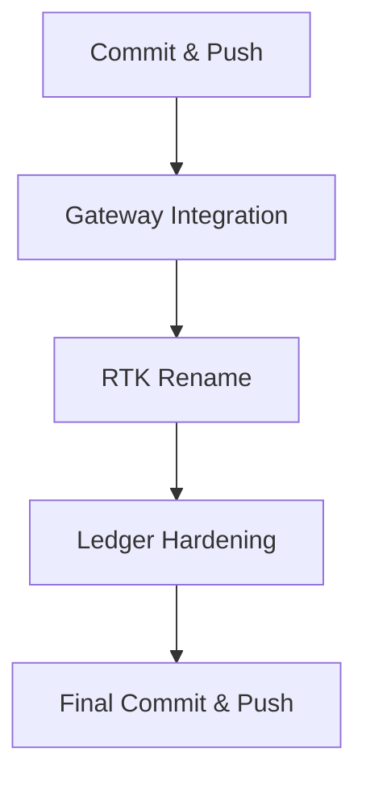

# Production Hardening Plan — NoeRelay Integration Mission

**Date**: 2026-09-03  
**Status**: Planning — awaiting approval before implementation  
**Prerequisite**: Milestones 1-17 designed/documented (160 tests, 0 failures)

---

## Overview

Four workstreams to production-harden the integration mission deliverables:



---

## Workstream 1: Commit & Push Current Work

**Files to commit** (all new/modified since last push):

| Category | Files |
|----------|-------|
| Rust modules (6 new) | `ranking.rs`, `evaluator_ingestion.rs`, `route_target.rs`, `agent_dispatch.rs`, `tool_execution.rs`, `analytics.rs` |
| Rust modified (3) | `lib.rs`, `routing.rs`, `evidence.rs` |
| Python (1 new) | `llmrouter_sidecar.py` |
| Docs (7 new) | `learned-routing-architecture.md`, ADRs 0003-0005, `milestone-1-4-checkpoint.md`, `compliance-registry.md`, `final-implementation-report.md` |

**Steps**:
1. `git add -A`
2. `git commit -m "feat: integration mission M1-M17 — ranking, evaluator ingestion, route targets, agent dispatch, RTK, analytics, compliance docs"`
3. `git push`

---

## Workstream 2: Gateway Integration — Wire StagedRouter + RankingAdvice

### Current State

The gateway at [`crates/noerelay-gateway/src/lib.rs:299`](crates/noerelay-gateway/src/lib.rs:299) calls:
```rust
staged.prepare(request, &self.config.candidates, constraints, now_unix_ms())?
```

This internally uses `Router::select()` — the single-stage deterministic router. The new `StagedRouter::select_with_ranking()` exists in `noerelay-core` but is not wired into the gateway.

### Target State

The gateway's `prepare_run()` method should:
1. Accept optional ranking configuration (mode, sidecar URL)
2. Build `RankingContext` from the request features
3. Call `StagedRouter::select_with_ranking()` instead of `Router::select()`
4. Record `RankingProvenance` in the route decision
5. Expose ranking provenance in the EPR response envelope

### Implementation Steps

#### 2.1 Add ranking configuration to `GatewayConfig`

```rust
pub struct GatewayConfig {
    // ... existing fields ...
    pub ranking_mode: RankingMode,        // disabled | shadow | advisory
    pub ranker_sidecar_url: Option<String>, // http://127.0.0.1:9878
}
```

Environment variables:
- `NOERELAY_RANKING_MODE` — `disabled` (default), `shadow`, or `advisory`
- `NOERELAY_RANKER_SIDECAR_URL` — URL of the LLMRouter sidecar

#### 2.2 Add ranker client to `AppState`

```rust
pub struct AppState {
    // ... existing fields ...
    ranker_client: Option<RankerClient>,  // HTTP client for sidecar
}
```

`RankerClient` wraps `reqwest::Client` with:
- `POST /rank` — sends `RankingContext` + admissible candidates, receives `RankingAdvice`
- Timeout: 5s (configurable)
- Circuit breaker: 3 consecutive failures → open for 30s

#### 2.3 Implement `AdvisoryRanker` for `RankerClient`

```rust
impl AdvisoryRanker for RankerClient {
    fn rank(&self, context: &RankingContext, candidates: &[AdmissibleCandidate])
        -> Result<Option<RankingAdvice>, RankerError>;
}
```

This calls the sidecar's `POST /rank` endpoint, validates the response against the `RankingAdvice` schema, and returns it.

#### 2.4 Update `prepare_run()` to use `StagedRouter`

In [`crates/noerelay-gateway/src/lib.rs:292-304`](crates/noerelay-gateway/src/lib.rs:292):

```rust
async fn prepare_run(
    &self,
    request: &CanonicalRequest,
    constraints: &Constraints,
) -> Result<noerelay_core::PreparedRun, AuthorityError> {
    let mut authority = self.runtime.lock().await;
    let mut staged = authority.clone();
    
    // NEW: Use StagedRouter with optional ranking
    let router = StagedRouter::new();
    let context = self.build_ranking_context(request);
    let decision = router.select_with_ranking(
        &self.config.candidates,
        constraints,
        self.ranker_client.as_ref().map(|c| c as &dyn AdvisoryRanker),
        self.config.ranking_mode,
        context.as_ref(),
    );
    
    // Convert StagedRouteDecision back to the format GovernanceRuntime expects
    let prepared = staged.prepare_with_decision(request, &decision, now_unix_ms())?;
    // ... rest unchanged
}
```

#### 2.5 Add ranking provenance to EPR response

The EPR (Evidence-Protected Response) envelope should include `ranking_provenance` when ranking was consulted.

#### 2.6 Tests

- `ranking_disabled_produces_identical_routes` — verify backward compatibility
- `shadow_mode_records_advice_without_affecting_routes`
- `advisory_mode_reorders_by_ranker_scores`
- `ranker_unavailable_falls_back_to_deterministic`
- `ranker_timeout_does_not_block_routing`
- `invalid_advice_is_discarded_and_logged`

### Files Modified

| File | Change |
|------|--------|
| `crates/noerelay-gateway/src/lib.rs` | Add ranking config, ranker client, StagedRouter integration |
| `crates/noerelay-gateway/Cargo.toml` | May need `tokio` features for circuit breaker |

---

## Workstream 3: RTK Crate Rename → `noerelay-compact`

### Current State

The `rtk/` crate is named `noerelay-rtk` and exports a Python module `noerelay_rtk`. Per mission §9, this internal concept must be renamed before integrating the external Rust Token Killer.

### Target State

- Crate: `noerelay-compact`
- Python module: `noerelay_compact`
- All references updated

### Implementation Steps

#### 3.1 Rename crate

| File | Change |
|------|--------|
| `rtk/Cargo.toml` | `name = "noerelay-rtk"` → `name = "noerelay-compact"` |
| `rtk/Cargo.toml` | `[lib] name = "noerelay_rtk"` → `name = "noerelay_compact"` |
| `rtk/pyproject.toml` | `name = "noerelay-rtk"` → `name = "noerelay-compact"` |
| `rtk/src/lib.rs` | `#[pymodule] fn noerelay_rtk` → `fn noerelay_compact` |
| `rtk/src/lib.rs` | Doc comment: `import noerelay_rtk` → `import noerelay_compact` |

#### 3.2 Update Python references

Search for `noerelay_rtk` and `noerelay-rtk` across the repository and update all imports.

#### 3.3 Verify

- `cargo build -p noerelay-compact` succeeds
- Python `import noerelay_compact` works
- All existing tests pass

### Files Modified

| File | Change |
|------|--------|
| `rtk/Cargo.toml` | Rename package + lib |
| `rtk/pyproject.toml` | Rename project |
| `rtk/src/lib.rs` | Rename pymodule + doc |
| Any Python files importing `noerelay_rtk` | Update imports |

---

## Workstream 4: Ledger Event Envelope Hardening

### Current State

The existing [`Ledger`](crates/noerelay-core/src/ledger.rs) has:
- SHA-256 hash chaining ✅
- Sequence continuity verification ✅
- Tamper detection ✅
- Genesis hash ✅

Missing per ADR-0005:
- Rich event envelope (ledger_schema_version, event_id, tenant_id, contract_id, epistemic_kind, epistemic_status, subject_refs, actor, policy_revision, payload_schema, payload_hash)
- Ed25519 signatures on events
- Merkle proofs for batch verification
- Checkpoints with anchoring
- Partition support (tenant/project)

### Target State

Extend the existing `Ledger` type with additive fields — no breaking changes to the existing API.

### Implementation Steps

#### 4.1 Add `LedgerEventV2` with enriched envelope

```rust
pub struct LedgerEventV2 {
    // Existing fields (preserved)
    pub sequence: u64,
    pub occurred_at_unix_ms: u64,
    pub organization_id: String,
    pub project_id: String,
    pub run_id: String,
    pub kind: LedgerEventKind,
    pub payload: Value,
    pub previous_hash: String,
    pub event_hash: String,
    
    // NEW: Enriched envelope fields
    pub ledger_schema_version: String,       // "2.0"
    pub event_id: Uuid,
    pub tenant_id: String,
    pub contract_id: Option<Uuid>,
    pub epistemic_kind: EpistemicKind,       // observation | inference | decision | ...
    pub epistemic_status: EpistemicStatus,   // unknown | supported | refuted | conflicted
    pub subject_refs: Vec<String>,
    pub actor: ActorIdentity,
    pub policy_revision: String,
    pub payload_schema: String,
    pub payload_hash: String,                // SHA-256 of canonical payload bytes
    pub signature: Option<EventSignature>,   // Ed25519
}
```

#### 4.2 Add supporting types

```rust
pub enum EpistemicKind { Observation, Inference, Prediction, Decision, Preference, Artifact, Requirement, Assumption }

pub enum EpistemicStatus { Unknown, Supported, Refuted, Conflicted }

pub struct ActorIdentity { pub kind: String, pub id: String, pub revision: String }

pub struct EventSignature { pub key_id: String, pub algorithm: String, pub value: String }
```

#### 4.3 Add Merkle proof support

```rust
pub struct MerkleProof {
    pub root_hash: String,
    pub leaf_index: u64,
    pub siblings: Vec<String>,  // Hashes for Merkle path verification
}

impl Ledger {
    pub fn merkle_root(&self) -> String;
    pub fn prove(&self, sequence: u64) -> Option<MerkleProof>;
    pub fn verify_proof(&self, proof: &MerkleProof, event_hash: &str) -> bool;
}
```

#### 4.4 Add checkpoint support

```rust
pub struct Checkpoint {
    pub ledger_id: String,
    pub sequence_start: u64,
    pub sequence_end: u64,
    pub head_hash: String,
    pub merkle_root: String,
    pub signature: EventSignature,
    pub created_at_unix_ms: u64,
}
```

#### 4.5 Add signature support

Reuse the existing `ReceiptSigner` (Ed25519) for event signing:

```rust
impl Ledger {
    pub fn sign_event(&mut self, sequence: u64, signer: &ReceiptSigner) -> Result<(), LedgerError>;
    pub fn verify_signatures(&self, verifier: &ReceiptVerifier) -> Result<(), LedgerError>;
}
```

#### 4.6 Tests

- `event_envelope_serializes_correctly`
- `epistemic_status_transitions_are_valid`
- `merkle_proof_verifies_for_valid_event`
- `merkle_proof_rejects_tampered_event`
- `checkpoint_covers_correct_sequence_range`
- `signature_verification_detects_tampering`
- `unsigned_events_are_backward_compatible`
- `existing_ledger_tests_still_pass`

### Files Modified

| File | Change |
|------|--------|
| `crates/noerelay-core/src/ledger.rs` | Add LedgerEventV2, EpistemicKind, EpistemicStatus, ActorIdentity, EventSignature, MerkleProof, Checkpoint, sign/verify methods |
| `crates/noerelay-core/src/lib.rs` | Add new exports |

---

## Execution Order & Dependencies

```
1. Commit & Push (no dependencies)
       ↓
2. Gateway Integration (depends on ranking.rs, route_target.rs from M2-M7)
       ↓
3. RTK Rename (independent, can run in parallel with #2)
       ↓
4. Ledger Hardening (depends on receipt.rs for Ed25519 signing)
       ↓
5. Final Commit & Push
```

## Risk Assessment

| Risk | Mitigation |
|------|------------|
| Gateway integration breaks existing routes | `RankingMode::Disabled` produces identical output; all existing gateway tests must pass |
| RTK rename breaks Python imports | Search all `.py` files for `noerelay_rtk`; update all references |
| Ledger hardening breaks existing ledger | Additive changes only; `LedgerEvent` unchanged; `LedgerEventV2` is a new type |
| Sidecar unavailable in production | Circuit breaker + deterministic fallback; ranking failure never blocks routing |

## Acceptance Criteria

1. `cargo test -p noerelay-core` → all 160+ tests pass
2. `cargo test -p noerelay-gateway` → all existing tests pass
3. `cargo build -p noerelay-compact` succeeds
4. Gateway with `NOERELAY_RANKING_MODE=disabled` produces identical routes to current behavior
5. Gateway with `NOERELAY_RANKING_MODE=shadow` records advice without affecting routes
6. Ledger `verify()` still works for existing chains
7. New ledger events support signatures and Merkle proofs
8. All changes committed and pushed