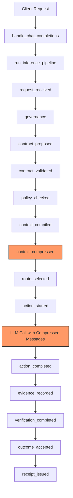

# RTK (Rust Token Killer) Integration Design

## 1. Pipeline Analysis

### 1.1 Current Pipeline Stages

The NoeRelay pipeline in [`pipeline.py`](reference/gateway/pipeline.py) executes these stages in order:

```
request_received → governance → contract_proposed → contract_validated
→ policy_checked → context_compiled → route_selected → action_started
→ action_completed → evidence_recorded → verification_completed
→ outcome_accepted/rejected → receipt_issued
```

Key observations from the code:

1. **Contract compilation** ([`contracts.py`](reference/gateway/contracts.py)) extracts the `goal` from user messages and builds a task contract. It operates on the raw `messages` array.

2. **Context compilation** ([`context.py`](reference/gateway/context.py)) builds a `ContextPackage` from the contract, epistemic state, and ledger events. It does NOT modify the messages sent to the LLM — it builds a separate context structure for the pipeline's internal use.

3. **Route selection** ([`pipeline.py:stage_route`](reference/gateway/pipeline.py:161)) calls `select_route(contract, portfolio, policy)` from the EPR kernel. The router sees the contract (which contains the goal extracted from messages) but NOT the raw messages.

4. **Action execution** ([`pipeline.py:_call_openrouter`](reference/gateway/pipeline.py:243)) builds the upstream payload via `build_chat_payload(plan, request, ctx.policy, ctx.config)` and sends it to OpenRouter or a local model. The `request` dict contains the original `messages` array.

5. **Token counting** happens in `_call_openrouter` at lines 284-287, where `usage` from the upstream response is recorded. The `prompt_tokens` reflect whatever was actually sent to the LLM.

### 1.2 Where Compression Fits

Compression must occur **after contract compilation** (so the contract sees the original intent) but **before action execution** (so the LLM receives compressed input). The optimal insertion point is:

```
contract_validated → policy_checked → context_compiled → [COMPRESSION] → route_selected → action_started
```

Specifically, compression should happen **between context compilation and route selection**, or **between route selection and action execution**. The recommended point is **after route selection, before action execution**, because:

- The router should see the original token count for accurate cost estimation
- The selected plan's `expected_total_cost_usd` is based on the original request
- Compression is an execution-time optimization, not a routing decision factor

However, there's a strong argument for compressing **before route selection**: if compression significantly reduces tokens, the router might select a different (cheaper) model. But this creates a feedback loop problem — the router's cost estimate would need to account for compression, which hasn't happened yet.

**Recommended approach**: Compress after route selection, before action execution. Record both original and compressed token counts in the ledger. The router continues to see original counts; the cost model records actual (compressed) counts.

### 1.3 Data Structure for Compression

Compression should operate on the **`messages` array** within the `request` dict. This is the standard OpenAI chat completions format:

```python
request = {
    "model": "noerelay/epr-1",
    "messages": [
        {"role": "system", "content": "..."},
        {"role": "user", "content": "..."},
        # ... more messages
    ],
    "governance": {...},
    "passthrough": {...},
}
```

The compression module should:
1. Accept the `messages` array
2. Return a compressed `messages` array (same structure, reduced content)
3. Return metadata: original token count, compressed token count, compression ratio, method used

## 2. Compression Interface Design

### 2.1 Rust Module API

The Rust compression module should expose a simple, deterministic API:

```rust
// rtk/src/lib.rs
pub struct CompressionResult {
    pub compressed_messages: Vec<Message>,
    pub original_tokens: usize,
    pub compressed_tokens: usize,
    pub compression_ratio: f64,
    pub method: String,
    pub duration_ms: u64,
}

pub struct Message {
    pub role: String,
    pub content: String,
}

pub fn compress_messages(
    messages: Vec<Message>,
    config: CompressionConfig,
) -> Result<CompressionResult, CompressionError>;

pub struct CompressionConfig {
    pub max_tokens: Option<usize>,
    pub strategy: CompressionStrategy,
    pub preserve_system: bool,
    pub preserve_last_n: usize,
}

pub enum CompressionStrategy {
    Dedup,        // Remove duplicate content
    Prune,        // Remove low-value messages
    Summarize,    // LLM-based summarization (requires model)
    Hybrid,       // Dedup + Prune + optional Summarize
}
```

### 2.2 Python Wrapper Interface

```python
# reference/gateway/compression.py
from dataclasses import dataclass
from typing import Any

@dataclass
class CompressionResult:
    compressed_messages: list[dict[str, Any]]
    original_tokens: int
    compressed_tokens: int
    compression_ratio: float
    method: str
    duration_ms: int

class TokenCompressor:
    """Compresses message arrays to reduce token count."""
    
    def __init__(self, config: CompressionConfig) -> None:
        self._config = config
        self._rtk = self._load_rtk()  # Load Rust module
    
    def compress(
        self,
        messages: list[dict[str, Any]],
    ) -> CompressionResult:
        """Compress messages, returning compressed array + metadata."""
        ...
```

## 3. Rust↔Python Bridge Evaluation

### 3.1 Options Analysis

| Bridge | Performance | Complexity | Packaging | Windows | Maintenance |
|--------|-------------|------------|-----------|---------|-------------|
| **PyO3 + Maturin** | Excellent (native) | Medium | Good (wheel) | Good | Low |
| **subprocess CLI** | Poor (spawn overhead) | Low | Simple | Good | Low |
| **ctypes/cffi FFI** | Good (shared lib) | High | Complex | Medium | High |
| **PyOxidizer** | N/A (wrong direction) | Very High | Complex | Medium | High |

### 3.2 Recommendation: PyO3 + Maturin

**Rationale:**

1. **Performance**: PyO3 creates a native Python extension module. Call overhead is ~100ns vs ~10ms for subprocess. For a gateway processing many requests, this matters.

2. **Type safety**: PyO3 handles Python↔Rust type marshalling automatically. No manual memory management.

3. **Packaging**: Maturin builds standard Python wheels (`rtk-0.1.0-cp311-cp311-win_amd64.whl`). Distribution via PyPI or local wheel is straightforward.

4. **Windows compatibility**: PyO3 + Maturin work well on Windows. The Rust toolchain (`rustup`) is fully supported.

5. **Maintenance**: The PyO3 ecosystem is mature. Version upgrades are handled by Cargo.

**Alternative considered**: subprocess CLI is simpler for prototyping but adds 5-15ms per request (process spawn + IPC). For a gateway, this is unacceptable overhead.

### 3.3 PyO3 Implementation Sketch

```rust
// rtk/src/lib.rs
use pyo3::prelude::*;

#[pyclass]
struct PyCompressionResult {
    #[pyo3(get)]
    compressed_messages: Vec<PyMessage>,
    #[pyo3(get)]
    original_tokens: usize,
    #[pyo3(get)]
    compressed_tokens: usize,
    #[pyo3(get)]
    compression_ratio: f64,
    #[pyo3(get)]
    method: String,
    #[pyo3(get)]
    duration_ms: u64,
}

#[pyclass]
#[derive(Clone)]
struct PyMessage {
    #[pyo3(get, set)]
    role: String,
    #[pyo3(get, set)]
    content: String,
}

#[pyfunction]
fn compress_messages(
    messages: Vec<PyMessage>,
    max_tokens: Option<usize>,
    strategy: &str,
) -> PyResult<PyCompressionResult> {
    // Call into Rust compression logic
    let config = CompressionConfig {
        max_tokens,
        strategy: parse_strategy(strategy)?,
        preserve_system: true,
        preserve_last_n: 2,
    };
    
    let rust_messages: Vec<Message> = messages.into_iter().map(Into::into).collect();
    let result = rtk::compress(rust_messages, config)
        .map_err(|e| PyErr::new::<pyo3::exceptions::PyRuntimeError, _>(e.to_string()))?;
    
    Ok(result.into())
}

#[pymodule]
fn rtk(_py: Python, m: &PyModule) -> PyResult<()> {
    m.add_function(wrap_pyfunction!(compress_messages, m)?)?;
    m.add_class::<PyCompressionResult>()?;
    m.add_class::<PyMessage>()?;
    Ok(())
}
```

## 4. Configuration Design

### 4.1 Environment Variables

Add to [`config.py`](reference/gateway/config.py):

```python
# Compression settings
compression_enabled = _parse_bool(env, "NOERELAY_COMPRESSION_ENABLED", False)
compression_strategy = _value(env, "NOERELAY_COMPRESSION_STRATEGY", "hybrid")
compression_max_tokens = _parse_int(env, "NOERELAY_COMPRESSION_MAX_TOKENS", 0, minimum=0)  # 0 = no limit
compression_min_savings = _parse_float(env, "NOERELAY_COMPRESSION_MIN_SAVINGS", 0.1, minimum=0.0)  # 10% minimum
```

### 4.2 Per-Request Override

Via `passthrough` in the request body:

```json
{
  "model": "noerelay/epr-1",
  "messages": [...],
  "compression": {
    "enabled": true,
    "strategy": "dedup",
    "max_tokens": 4000
  }
}
```

### 4.3 Policy-Based Control

Add to routing policy JSON:

```json
{
  "compression": {
    "enabled_by_default": false,
    "allowed_strategies": ["dedup", "prune", "hybrid"],
    "max_compression_ratio": 0.5,
    "require_original_preservation": true
  }
}
```

## 5. EPR/Ledger Integration

### 5.1 New Ledger Event

Add a `context_compressed` event between `context_compiled` and `route_selected`:

```python
ctx.registry.ledger(
    run_id,
    "context_compressed",
    GATEWAY_ACTOR,
    subject_id,
    {
        "original_tokens": result.original_tokens,
        "compressed_tokens": result.compressed_tokens,
        "compression_ratio": result.compression_ratio,
        "method": result.method,
        "duration_ms": result.duration_ms,
        "messages_original": len(original_messages),
        "messages_compressed": len(compressed_messages),
    },
)
```

### 5.2 EPR Metadata Extension

Extend [`render_epr_metadata`](reference/gateway/render.py) to include compression info:

```python
epr = render_epr_metadata(
    # ... existing params ...
    compression={
        "enabled": True,
        "original_tokens": 15000,
        "compressed_tokens": 8000,
        "ratio": 0.53,
        "method": "hybrid",
    },
)
```

### 5.3 Evidence Record

Compression produces `derived` evidence (EPR-EPI-004):

```python
compression_evidence = {
    "evidence_id": f"ev-compression-{uuid.uuid4().hex}",
    "kind": "derived",
    "strength": 0.9,  # High confidence in compression
    "content": f"Compressed {original} tokens to {compressed} tokens ({ratio:.1%})",
    "premise_evidence_ids": [original_request_evidence_id],
    "metadata": {
        "original_tokens": original,
        "compressed_tokens": compressed,
        "method": method,
    },
}
```

## 6. Cost Model Impact

### 6.1 Token Count Recording

In [`pipeline.py:_call_openrouter`](reference/gateway/pipeline.py:243), the `usage` block from upstream reflects the **compressed** token count (since that's what was sent). The `record.prompt_tokens` will be the compressed count.

For accurate cost tracking, record both:

```python
record.original_prompt_tokens = compression_result.original_tokens
record.prompt_tokens = compression_result.compressed_tokens  # What was actually sent
```

### 6.2 Cost Calculation

The `_estimate_cost` function uses `prompt_tokens` from usage. With compression, this is the compressed count — which is correct for actual cost. The **savings** should be tracked separately:

```python
record.compression_savings_usd = (
    (original_tokens - compressed_tokens) / 1000.0
) * prompt_rate
```

### 6.3 True Cost Model

The [`cost_model.py`](reference/gateway/cost_model.py) `TrueCostModel` should account for compression:

- `tokens_per_case` should use **compressed** tokens (actual cost)
- Add `compression_ratio` as a model stat to track which models benefit most from compression
- Compression may reduce `rework_rate` if it improves model focus

## 7. Routing Preservation

### 7.1 Router Sees Original

The router (`select_route`) receives the `contract`, which contains the `goal` extracted from **original** messages. This is correct — routing decisions should be based on the full intent, not the compressed version.

### 7.2 Cost Estimation

The router's `expected_total_cost_usd` is based on the original request. This is conservative (overestimates cost) but safe. After compression, the actual cost is lower.

### 7.3 No Disruption to Policy/Portfolio

- [`policy.py`](reference/gateway/policy.py): No changes needed. Compression is orthogonal to model allow/deny lists.
- [`portfolio.py`](reference/gateway/portfolio.py): No changes needed. Candidate selection is unaffected.

## 8. Testing Strategy

### 8.1 Unit Tests

- `test_compression.py`: Test compression logic with various message arrays
- `test_compression_bridge.py`: Test PyO3 bridge with mock Rust module
- `test_compression_config.py`: Test env var parsing and validation

### 8.2 Integration Tests

- `test_pipeline_compression.py`: End-to-end pipeline with compression enabled
- Verify ledger events include compression metadata
- Verify cost calculations use compressed tokens
- Verify routing decisions unchanged

### 8.3 Benchmark Tests

- Measure compression ratio on benchmark datasets
- Measure latency overhead of compression (should be <5ms for PyO3)
- Measure cost savings across model portfolio

## 9. Implementation Phases

### Phase 1: Foundation (No Rust)
- Add `compression.py` with Python-only dedup/prune
- Add config env vars
- Add ledger event recording
- Add EPR metadata extension
- Unit tests

### Phase 2: Rust Bridge
- Create `rtk/` Rust crate with PyO3 bindings
- Implement core compression algorithms in Rust
- Maturin build configuration
- Integration tests with real Rust module

### Phase 3: Advanced Compression
- Add LLM-based summarization (optional, requires model call)
- Add compression strategy selection based on request characteristics
- Add compression quality metrics (semantic similarity preservation)

### Phase 4: Optimization
- Profile and optimize hot paths
- Add compression caching (same messages → same compressed output)
- Add adaptive compression (learn optimal strategy per model/task type)

## 10. Risks and Mitigations

| Risk | Impact | Mitigation |
|------|--------|------------|
| Compression loses critical context | High | Preserve system messages and last N messages; validate compressed output |
| Rust build failures on Windows | Medium | Provide pre-built wheels; fallback to Python implementation |
| Compression adds latency | Medium | PyO3 overhead <1ms; set timeout; async compression |
| Compressed output fails verification | High | Track compression in ledger; allow disabling per-request |
| Token count mismatch | Medium | Use tiktoken for accurate counting; validate against upstream usage |

## 11. Architecture Diagram



## 12. Summary

RTK compression integrates into NoeRelay as a **pipeline stage between context compilation and route selection**, operating on the `messages` array. The **PyO3 + Maturin** bridge provides the best balance of performance, maintainability, and Windows compatibility. Compression is **optional and configurable** via env vars, per-request overrides, and policy controls. The EPR ledger records compression metadata as a first-class event, and the cost model tracks both original and compressed token counts for accurate accounting.
